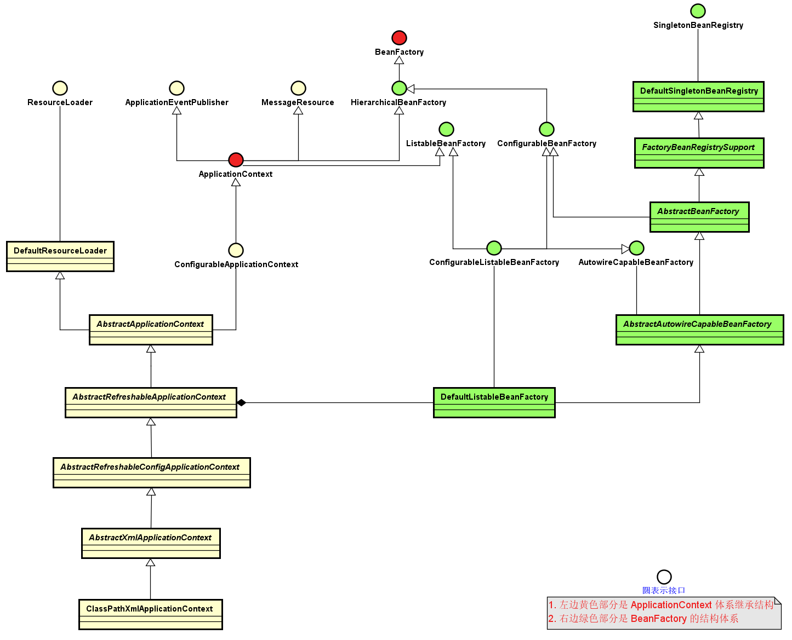
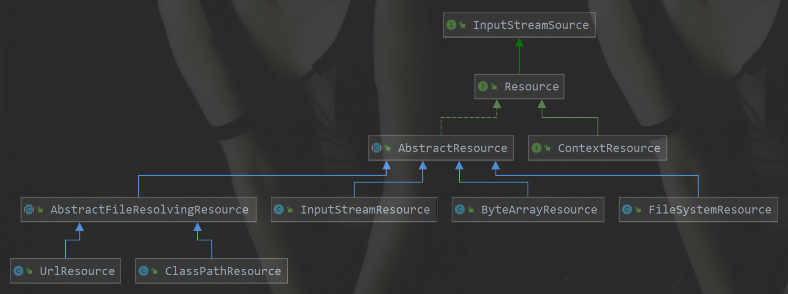
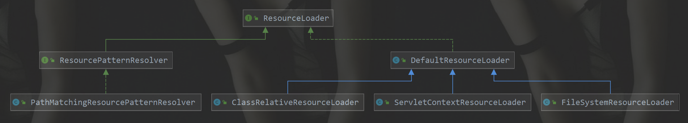
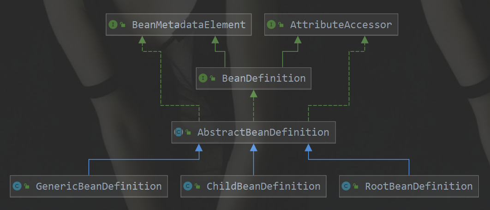
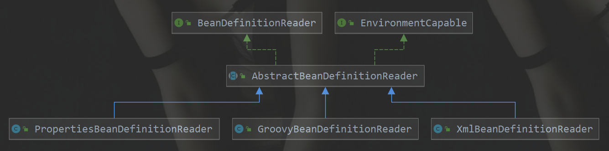
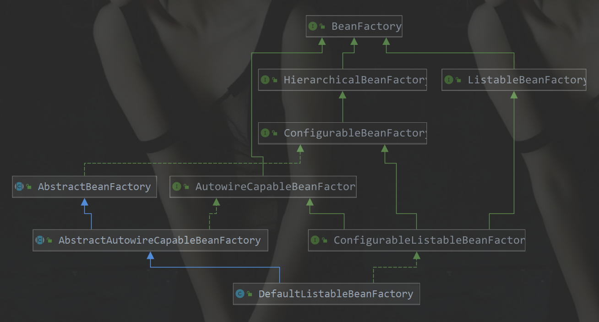

> 参考网址:<http://cmsblogs.com/?p=2652>

#### 目录

* [1. IoC理论](#1)
* [2. 依赖对象注入](#2)
    * [2.1 构造器注入](#2.1)
    
    * [2.2 setter方法注入](#2.2)
    
    * [2.3 接口方式注入](#2.3)
* [3. 体系结构详解](#3)
    * [3.1 Resource体系](#3.1)
        * [3.1.1  ResourceLoader 体系](#3.1.1)
    * [3.2 BeanDefinition体系](#3.2)
    * [3.3 BeanDefinitionReader体系](#3.3)
    * [3.4 BeanFactory体系](#3.4)
    * [3.5 ApplicationContext体系](#3.5)
* [4. 总结](#4)

****

<span id="1"></span>

# 1. IoC理论

&nbsp;&nbsp; `IoC` 全称为 `Inversion of Control`，译为**控制反转** ，它还有一个别名为`DI`(`Dependency Injection`)，即**依赖注入**。

&nbsp;&nbsp; `IoC`定义如下:
> 所谓Ioc，就是有Spring IoC 容器来负责对象的生命周期和对象之间的关系。

&nbsp;&nbsp; 理解**控制反转**需要知道下面四个问题：

1. 谁控制谁
2. 控制什么
3. 为什么是反转
4. 哪些方面反转了

&nbsp;&nbsp; 在回答这四个问题前我们先看一个例子：

&nbsp;&nbsp; 已找女朋友为例。一般情况下我们怎么找女朋友呢？首先根据我们的要求（漂亮、身材、性格）找一个妹子，然后打听到她的各种信息（微信、电话、兴趣爱好），之后就开始各种疯狂的追求，最后成功追到手。

```java
/**
 * 年轻小伙子
 */
public class YoungMan {
    private BeautifulGirl beautifulGirl;

    YoungMan(){
        // 可能你比较牛逼，指腹为婚
        // beautifulGirl = new BeautifulGirl();
    }

    public void setBeautifulGirl(BeautifulGirl beautifulGirl) {
        this.beautifulGirl = beautifulGirl;
    }

    public static void main(String[] args){
        YoungMan you = new YoungMan();
        BeautifulGirl beautifulGirl = new BeautifulGirl("你的各种条件");
        beautifulGirl.setxxx("疯狂追求");

        // 然后你有女票了
        you.setBeautifulGirl(beautifulGirl);
    }
}
```

&nbsp;&nbsp; 这就是我们通常的编码方式，如果我们需要某个对象，都是采用直接创建的方式（`new YoungMan()`）,这个过程复杂且繁琐，而且我们必须面对每个环节，完成之后还要负责销毁它，这种情况下**我们的对象就和它所依赖的对象耦合在一起了**。

&nbsp;&nbsp; 其实我们需要思考一个问题？我们每次用到自己依赖的对象真的需要自己去创建吗？我们知道，**我们依赖对象其实并不是依赖该对象本身，而是依赖它所提供的服务**，只要在我们需要它的时候，它能够及时提供服务即可，至于它是我们主动去创建的还是别人送给我们的，其实并不是那么重要。再说了，相比于自己千辛万苦去创建它还要管理、善后而言，直接有人送过来是不是显得更加好呢？

&nbsp;&nbsp; 这个给我们送东西的“人” 就是`IoC`，在上面的例子中，它就相当于一个婚介公司，作为一个婚介公司它管理着很多男男女女的资料，当我们需要一个女朋友的时候，直接跟婚介公司提出我们的需求，婚介公司则会根据我们的需求提供一个妹子给我们，我们只需要负责谈恋爱，生猴子就行了。你看，这样是不是很简单明了。

&nbsp;&nbsp; 诚然，作为婚介公司的`IoC` 帮我们省略了找女朋友的繁杂过程，将原来的主动寻找变成了现在的被动接受（符合我们的要求），更加简洁轻便。你想啊，原来你还得鞍马前后，各种巴结，什么东西都需要自己去亲力亲为，现在好了，直接有人把现成的送过来，多么美妙的事情啊。所以，简单点说，**IoC 的理念就是让别人为你服务**，如下图：

.<center></center>

&nbsp;&nbsp; 在没有引入 `IoC` 的时候，**被注入的对象直接依赖于被依赖的对象**，有了 `IoC` 后，**两者及其他们的关系都是通过 Ioc Service Provider 来统一管理维护的**。被注入的对象需要什么，直接跟 `IoC Service Provider` 打声招呼，后者就会把相应的被依赖对象注入到被注入的对象中，从而达到 `IOC Service Provider` 为被注入对象服务的目的。所以 IoC 就是这么简单！原来是需要什么东西自己去拿，现在是需要什么东西让别人（`IOC Service Provider`）送过来。

&nbsp;&nbsp; 上面那四个问题的答案已经呼之欲出了：

1. **谁控制谁**：在传统的开发模式下，我们都是采用直接 `new` 一个对象的方式来创建对象，也就是说你依赖的对象直接由你自己控制，但是有了 `IoC` 容器后，则直接由 `IoC` 容器来控制。所以“谁控制谁”，当然是 **IoC 容器控制对象**。
2. **控制什么**：控制对象。
3. **为什么是反转**：没有 `IoC` 的时候我们都是在**自己对象中主动去创建被依赖的对象，这是正转**。但是有了 `IoC` 后，所依赖的对象直接由 `IoC` 容器创建后注入到被注入的对象中，**依赖的对象由原来的主动获取变成被动接受，所以是反转**。
4. **哪些方面反转了**：所依赖对象的获取被反转了。

<span id="2"></span>
# 2. 依赖对象注入

&nbsp;&nbsp; 妹子有了，但是如何拥有妹子呢？这也是一门学问。

1. 可能你比较牛逼，刚刚出生的时候就指腹为婚了。
2. 大多数情况我们还是会考虑自己想要什么样的妹子，所以还是需要向婚介公司打招呼的。
3. 还有一种情况就是，你根本就不知道自己想要什么样的妹子，直接跟婚介公司说，我就要一个这样的妹子。

&nbsp;&nbsp; `IOC Service Provider` 为被注入对象提供被依赖对象也有如下几种方式：**构造方法注入、setter方法注入、接口注入**。

<span id="2.1"></span>
## 2.1 构造器注入

&nbsp;&nbsp; **构造器注入**，顾名思义就是**被注入的对象通过在其构造方法中声明依赖对象的参数列表，让外部知道它需要哪些依赖对象**。

```java
public class YoungMan {
    public YoungMan(BeautifulGirl beautifulGirl){
            this.beautifulGirl = beautifulGirl;
    }
}
```

&nbsp;&nbsp; 构造器注入方式比较直观，对象构造完毕后就可以直接使用，这就好比你出生你家里就给你指定了你媳妇。

<span id="2.2"></span>
## 2.2 setter方法注入

&nbsp;&nbsp; 对于 `JavaBean` 对象而言，我们一般都是通过 `getter` 和 `setter` 方法来**访问和设置对象的属性**。所以，当前对象只需要为其所依赖的对象提供相对应的 `setter` 方法，就可以通过该方法将相应的依赖对象设置到被注入对象中。

```java
public class YoungMan {
    private BeautifulGirl beautifulGirl;

    public void setBeautifulGirl(BeautifulGirl beautifulGirl) {
        this.beautifulGirl = beautifulGirl;
    }
}
```

&nbsp;&nbsp; 相比于**构造器注入**，**setter 方法注入**会显得比较宽松灵活些，它可以在任何时候进行注入（当然是在使用依赖对象之前），这就好比你可以先把自己想要的妹子想好了，然后再跟婚介公司打招呼，你可以要林志玲款式的，赵丽颖款式的，甚至凤姐哪款的，随意性较强。

<span id="2.3"></span>
## 2.3 接口方式注入

&nbsp;&nbsp; **接口方式注入**显得比较霸道，因为它需要**被依赖的对象实现不必要的接口**，带有**侵入性**。一般都不推荐这种方式。

<span id="3"></span>

# 3. 体系结构详解

&nbsp;&nbsp;  下图为 `ClassPathXmlApplicationContext` 的类继承体系结构，虽然只有一部分，但是它基本上包含了 `IoC` 体系中大部分的核心类和接口。 

.<center></center>

&nbsp;&nbsp;  上图左边黄色部分是 `ApplicationContext` 体系继承结构，右边是 `BeanFactory` 的结构体系,两个结构是典型模板方法设计模式的使用。 

&nbsp;&nbsp; 从该继承体系可以看出： 

1.  **`BeanFactory` 是一个 `bean` 工厂的最基本定义**，里面包含了一个 `bean` 工厂的几个最基本的方法， **getBean(…) 、 containsBean(…)** 等 ,是一个很纯粹的`bean`工厂，不关注**资源、资源位置、事件**等。 **`ApplicationContext` 是一个容器的最基本接口定义**，它继承了 `BeanFactory`, 拥有工厂的基本方法。同时继承了 `ApplicationEventPublisher` 、 `MessageSource` 、 `ResourcePatternResolver` 等接口，使其 定义了一些额外的功能，如**资源、事件**等这些额外的功能。 

2.  `AbstractBeanFactory` 和 `AbstractAutowireCapableBeanFactory` 是两个模板抽象工厂类。 `AbstractBeanFactory` 提供了 `bean` 工厂的抽象基类，同时提供了 `ConfigurableBeanFactory` 的完整实现。 `AbstractAutowireCapableBeanFactory` 是继承了 `AbstractBeanFactory` 的抽象工厂，里面提供了 `bean` 创建的支持，包括 **`bean` 的创建、依赖注入、检查**等等功能，是一个核心的 `bean` 工厂基类。 

3.  `ClassPathXmlApplicationContext`之所以拥有 `bean` 工厂的功能是通过持有一个真正的 `bean` 工厂 `DefaultListableBeanFactory` 的实例，并通过 **代理该工厂**完成。

4.  `ClassPathXmlApplicationContext` 的初始化过程是对本身容器的初始化同时也是对其持有的 `DefaultListableBeanFactory` 的初始化。

   &nbsp;&nbsp; 上图可拆分为以下几个体系:

   1.  **`Resource`体系  ： 对资源的抽象**
   2.  **`Beandefinition` 体系  ： 抽象和描述一个具体`bean`对象。是描述一个`bean`对象的基本数据结构**
   3.  **`BeandefinitionReader`体系  ： 将外部资源对象描述的`bean`定义统一转化为统一的内部数据结构`BeanDefinition`** 
   4.  **`BeanFactory` 体系  ：  定义一个纯粹的 `bean` 容器，它是 `IoC`容器必备的数据结构**
   5.  **`ApplicationContext`体系  ： 继承 `BeanFactory`，它是 `BeanFactory` 的扩展升级版** 
   

<span id="3.1"></span>

## 3.1 Resource体系

&nbsp;&nbsp;  `Resource(org.springframework.core.io.Resource)`，对资源的抽象，它的每一个实现类都代表了一种资源的访问策略，如`ClasspathResource` 、 `URLResource` ，`FileSystemResource` 等。 每一个资源类型都封装了对某一种特定资源的访问策略，由`AbstractResource` 提供默认实现。它是`Spring`资源访问策略的一个基础实现  。

.<center></center>

<span id="3.1.1"></span>

### 3.1.1  ResourceLoader 体系

&nbsp;&nbsp;  资源有了，就应该有资源加载，`Spring` 利用 `ResourceLoader(org.springframework.core.io.ResourceLoader)`来进行统一资源加载，由`DefaultResourceLoader`提供默认实现，类图如下

.<center></center>

<span id="3.2"></span>
## 3.2 BeanDefinition体系

&nbsp;&nbsp;  `BeanDefinition(org.springframework.beans.factory.config.BeanDefinition)` 用来描述 `Spring` 中的 `Bean` 对象，是描述一个`bean`对象的**基本数据结构** 。由`AbstractBeanDefinition`提供默认实现。

.<center></center>

<span id="3.3"></span>
## 3.3 BeanDefinitionReader体系

&nbsp;&nbsp;  `BeanDefinitionReader(org.springframework.beans.factory.support.BeanDefinitionReader)` 的作用是读取 `Spring` 的配置文件的内容，并将其转换成` Ioc` 容器内部的数据结构：`BeanDefinition`。 

&nbsp;&nbsp; 不同的描述需要有不同的`Reader`。如`XmlBeanDefinitionReader`用来读取`xml`描述配置的`bean`对象。由`AbstractBeanDefinitionReader`提供默认实现。  

.<center></center>

<span id="3.4"></span>
## 3.4 BeanFactory体系

 &nbsp;&nbsp; `BeanFactory(org.springframework.beans.factory.BeanFactory)` 是一个非常纯粹的 `bean` 容器，它是 `IoC` 必备的数据结构，其中 `BeanDefinition` 是它的基本结构，它内部维护着一个 **BeanDefinition map** ，并可根据 `BeanDefinition` 的描述进行 `bean` 的**创建和管理**。 

&nbsp;&nbsp;  `BeanFacoty` 有三个直接子类 `ListableBeanFactory`、`HierarchicalBeanFactory` 和 `AutowireCapableBeanFactory`

&nbsp;&nbsp; `DefaultListableBeanFactory` 为最终默认实现，它实现了所有接口。 

.<center></center>

<span id="3.5"></span>
## 3.5 ApplicationContext体系

&nbsp;&nbsp; `ApplicationContext(org.springframework.context.ApplicationContext)` ，这个就是大名鼎鼎的 `Spring` 容器，它叫做应用上下文，与我们应用息息相关。它继承 `BeanFactory` ，所以它是 `BeanFactory` 的扩展升级版，如果`BeanFactory` 是屌丝的话，那么 `ApplicationContext` 则是名副其实的高富帅。由于 `ApplicationContext` 的结构就决定了它与 `BeanFactory` 的不同，其主要区别有：

1. 继承 `org.springframework.context.MessageSource` 接口，提供国际化的标准访问策略。
2. 继承 `org.springframework.context.ApplicationEventPublisher` 接口，提供强大的**事件**机制。
3. 扩展 `ResourceLoader` ，可以用来加载多种 `Resource` ，可以灵活访问不同的资源。
4. 对 Web 应用的支持。

.<center></center>

<span id="4"></span>
# 4. 总结

&nbsp;&nbsp; 上面五个体系可以说是 `Spring IoC` 中最核心的部分，代表了`Ioc`容器的一个最基本组成，而组件的组合是放在`ApplicationContext`的实现这一层来完成。