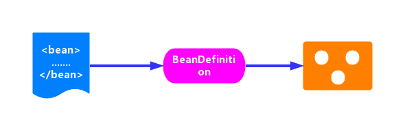
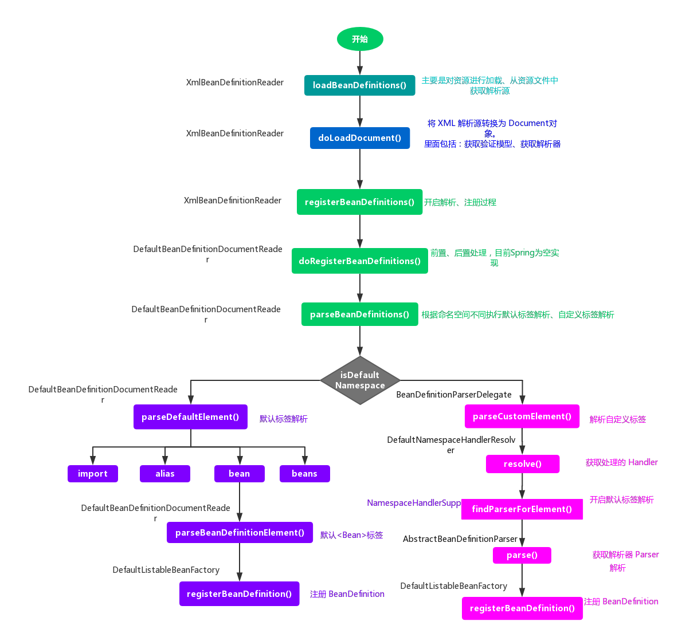

> 参考网址：<http://cmsblogs.com/?p=todo>

#### 目录

* [1. Resource 定位](#1)
* [2. BeanDefinition 的载入和解析](#2)
  * [2.1 转换为 Document 对象](#2.1)
  * [2.2 注册 BeanDefinition 流程](#2.2)
    * [2.2.1 对 Document 对象的解析](#2.2.1)
      * [2.2.1.1 默认标签解析](#2.2.1.1)
      * [2.2.1.2 自定义标签解析](#2.2.1.2)
    * [2.2.2 注册 BeanDefinition](#2.2.2)
* [3. 总结](#3)

****

&nbsp;&nbsp;  在前面的分析中，`IoC` **容器的初始化过程分为三步骤**：

1. `Resource` 定位
2. `BeanDefinition` 的载入和解析
3. `BeanDefinition` 注册 

.<center></center>

* **`Resource` 定位**。我们一般用**外部资源来描述 `Bean` 对象**，所以在初始化 `IoC` 容器的第一步就是需要定位这个外部资源。见[《【Spring 5.0.x】—— 2. IoC 之 Spring 统一资源加载策略》]()
* **`BeanDefinition` 的装载和解析**。装载就是 `BeanDefinition` 的载入。`BeanDefinitionReader` 读取、解析 `Resource` 资源，也就是将用户定义的 `Bean` 表示成 `IoC` **容器的内部数据结构：`BeanDefinition`**
  *  在 `IoC` 容器内部维护着一个 **`BeanDefinition` `Map` 的数据结构** 
  *  在配置文件中每一个 `<bean>` 都对应着一个 `BeanDefinition` 对象 
* **`BeanDefinition` 注册**。向 `IoC` 容器注册在第二步解析好的 `BeanDefinition`，这个过程是通过 `BeanDefinitionRegistry` 接口来实现的。在 `IoC` 容器内部其实是将第二个过程解析得到的 `BeanDefinition` 注入到一个 `HashMap` 容器中，`IoC` 容器通过这个 `HashMap` 来维护这些 `BeanDefinition` 
  *  在这里需要注意的一点是**这个过程并没有完成依赖注入（`Bean` 创建）**，`Bean` 创建是发生在应用第一次调用 `#getBean(...)` 方法，向容器索要 `Bean` 时 
  *  我们可以通过设置预处理，即对某个 `Bean` 设置 `lazyinit = false` 属性，那么这个 `Bean` 的依赖注入就会在容器初始化的时候完成 

 &nbsp;&nbsp; 在 [《【Spring 5.0.x】—— 3. IoC 之加载 BeanDefinition》]() 中提供的一段代码吗？这里我们同样也以这段代码作为我们研究 `IoC` 初始化过程的开端

```java
ClassPathResource resource = new ClassPathResource("bean.xml"); // <1>
DefaultListableBeanFactory factory = new DefaultListableBeanFactory(); // <2>
XmlBeanDefinitionReader reader = new XmlBeanDefinitionReader(factory); // <3>
reader.loadBeanDefinitions(resource); // <4>
```

*  `ClassPathResource resource = new ClassPathResource("bean.xml");` ： 根据 `Xml` 配置文件创建 `Resource` 资源对象。`ClassPathResource` 是 `Resource` 接口的子类，`bean.xml` 文件中的内容是我们定义的 `Bean` 信息 
*  `DefaultListableBeanFactory factory = new DefaultListableBeanFactory();` ：创建一个 `BeanFactory` 。`DefaultListableBeanFactory` 是 `BeanFactory` 的一个子类，**`BeanFactory` 作为一个接口**，其实它本身是不具有独立使用的功能的，而 `DefaultListableBeanFactory` 则是真正可以独立使用的 `IoC` 容器，它是整个 `Spring IoC` 的始祖
*  `XmlBeanDefinitionReader reader = new XmlBeanDefinitionReader(factory);` ：创建 `XmlBeanDefinitionReader` 读取器，用于载入 `BeanDefinition` 
*  `reader.loadBeanDefinitions(resource);`：开始 `BeanDefinition` 的载入和注册进程，完成后的 `BeanDefinition` 放置在 `IoC `容器中   

<span id = "1"></span>
# 1. Resource 定位

 &nbsp;&nbsp; `Spring` 为了解决资源定位的问题，提供了两个接口：**`Resource`、`ResourceLoader `**

*  `Resource` 接口是 `Spring` 统一资源的抽象接口 
*  `ResourceLoader` 则是 `Spring` 资源加载的统一抽象 

 &nbsp;&nbsp; `Resource`、`ResourceLoader` 的解析见 [《【Spring 5.0.x】—— 2. IoC 之 Spring 统一资源加载策略》]() 

 &nbsp;&nbsp; `Resource` 资源的定位需要 `Resource` 和 `ResourceLoader` 两个接口互相配合，在上面那段代码中 `new ClassPathResource("bean.xml")` 为我们定义了资源，那么 `ResourceLoader` 则是在什么时候初始化的呢？看 `XmlBeanDefinitionReader` 构造方法 

```java
// org.springframework.beans.factory.xml.XmlBeanDefinitionReader.java

public XmlBeanDefinitionReader(BeanDefinitionRegistry registry) {
	super(registry);
}
```

&nbsp;&nbsp;  直接调用父类 `AbstractBeanDefinitionReader` 构造方法 

```java
// org.springframework.beans.factory.support.AbstractBeanDefinitionReader.java

protected AbstractBeanDefinitionReader(BeanDefinitionRegistry registry) {
	Assert.notNull(registry, "BeanDefinitionRegistry must not be null");
	this.registry = registry;
	// Determine ResourceLoader to use.
	if (this.registry instanceof ResourceLoader) {
		this.resourceLoader = (ResourceLoader) this.registry;
	}	else {
		this.resourceLoader = new PathMatchingResourcePatternResolver();
	}

	// Inherit Environment if possible
	if (this.registry instanceof EnvironmentCapable) {
		this.environment = ((EnvironmentCapable) this.registry).getEnvironment();
	} else {
		this.environment = new StandardEnvironment();
	}
}
```

 &nbsp;&nbsp; 核心在于设置 `resourceLoader` 这段，如果设置了 `ResourceLoader` 则用设置的，否则使用 `PathMatchingResourcePatternResolver` ，该类是一个集大成者的 `ResourceLoader`

<span id = "2"></span>
# 2. BeanDefinition 的载入和解析

 &nbsp;&nbsp; `reader.loadBeanDefinitions(resource);` 代码段，开启 `BeanDefinition` 的解析过程

```java
// org.springframework.beans.factory.xml.XmlBeanDefinitionReader.java

@Override
public int loadBeanDefinitions(Resource resource) throws BeanDefinitionStoreException {
	return loadBeanDefinitions(new EncodedResource(resource));
}
```

&nbsp;&nbsp;  在这个方法会将资源 `resource` 包装成一个 `EncodedResource` 实例对象，然后调用 `#loadBeanDefinitions(EncodedResource encodedResource)` 方法。而将 `Resource` 封装成 `EncodedResource` 主要是为了对 `Resource` 进行编码，**保证内容读取的正确性**

 ```java
// org.springframework.beans.factory.xml.XmlBeanDefinitionReader.java

public int loadBeanDefinitions(EncodedResource encodedResource) throws BeanDefinitionStoreException {
	Assert.notNull(encodedResource, "EncodedResource must not be null");
	if (logger.isInfoEnabled()) {
		logger.info("Loading XML bean definitions from " + encodedResource);
	}

	// <1> 获取当前正在加载的资源
	Set<EncodedResource> currentResources = this.resourcesCurrentlyBeingLoaded.get();
	if (currentResources == null) {
		currentResources = new HashSet<>(4);
		this.resourcesCurrentlyBeingLoaded.set(currentResources);
	}
	
	// 将当前资源加入记录中。如果已存在，抛出异常(避免死循环)
	if (!currentResources.add(encodedResource)) {
		throw new BeanDefinitionStoreException(
				"Detected cyclic loading of " + encodedResource + " - check your import definitions!");
	}
	try {
		// <2> 从 EncodedResource 获取封装的 Resource ，并从 Resource 中获取其中的 InputStream
		InputStream inputStream = encodedResource.getResource().getInputStream();
		try {
			// InputSource这个类不是来自Spring,它的全路径是org.xml.sax.InputSource
			InputSource inputSource = new InputSource(inputStream);
			if (encodedResource.getEncoding() != null) {
				// 设置编码
				inputSource.setEncoding(encodedResource.getEncoding());
			}
			// 核心逻辑部分，执行加载 BeanDefinition
			return doLoadBeanDefinitions(inputSource, encodedResource.getResource());
		}
		finally {
			// 关闭输入流
			inputStream.close();
		}
	}
	catch (IOException ex) {
		throw new BeanDefinitionStoreException(
				"IOException parsing XML document from " + encodedResource.getResource(), ex);
	}
	finally {
		// <3> 从缓存中剔除该资源
		currentResources.remove(encodedResource);
		if (currentResources.isEmpty()) {
			this.resourcesCurrentlyBeingLoaded.remove();
		}
	}
}
 ```

&nbsp;&nbsp;  从 `encodedResource` 源中获取 `xml` 的解析源，然后调用 `#doLoadBeanDefinitions(InputSource inputSource, Resource resource)` 方法，执行具体的解析过程 

```java
// org.springframework.beans.factory.xml.XmlBeanDefinitionReader.java

protected int doLoadBeanDefinitions(InputSource inputSource, Resource resource)
		throws BeanDefinitionStoreException {
	try {
		// <1> 获取 XML Document 实例
		Document doc = doLoadDocument(inputSource, resource);
		// <2> 根据 Document 实例，注册 BeanDefinition 信息
		return registerBeanDefinitions(doc, resource);
	}
	catch (BeanDefinitionStoreException ex) {
		throw ex;
	}
	catch (SAXParseException ex) {
		throw new XmlBeanDefinitionStoreException(resource.getDescription(),
				"Line " + ex.getLineNumber() + " in XML document from " + resource + " is invalid", ex);
	}
	catch (SAXException ex) {
		throw new XmlBeanDefinitionStoreException(resource.getDescription(),
				"XML document from " + resource + " is invalid", ex);
	}
	catch (ParserConfigurationException ex) {
		throw new BeanDefinitionStoreException(resource.getDescription(),
				"Parser configuration exception parsing XML from " + resource, ex);
	}
	catch (IOException ex) {
		throw new BeanDefinitionStoreException(resource.getDescription(),
				"IOException parsing XML document from " + resource, ex);
	}
	catch (Throwable ex) {
		throw new BeanDefinitionStoreException(resource.getDescription(),
				"Unexpected exception parsing XML document from " + resource, ex);
	}
}
```

 &nbsp;&nbsp; 在该方法中主要做两件事 

*  根据 `xml` 解析源获取相应的 `Document` 对象。见 [「2.1 转换为 Document 对象」](#2.1) 
*  调用 `#registerBeanDefinitions(Document doc, Resource resource)` 方法，开启 `BeanDefinition` 的解析注册过程。见 [「2.2 注册 BeanDefinition」](#2.2) 

<span id = "2.1"></span>
## 2.1 转换为 Document 对象

 &nbsp;&nbsp; 调用 `#doLoadDocument(InputSource inputSource, Resource resource)` 方法，会将 `Bean` 定义的资源转换为 `Document` 对象 

```java
// org.springframework.beans.factory.xml.XmlBeanDefinitionReader.java

/**
 * 获取 XML Document 实例
 */
protected Document doLoadDocument(InputSource inputSource, Resource resource) throws Exception {
	// #getValidationModeForResource()获取指定资源(xml)的验证模式
	return this.documentLoader.loadDocument(inputSource, getEntityResolver(), this.errorHandler,
			getValidationModeForResource(resource), isNamespaceAware());
}
```

 &nbsp;&nbsp; 该方法接受五个参数 

*  `inputSource` ：加载 `Document` 的 `Resource` 源 
*  `entityResolver` ：**解析文件的解析器** 
  *  【重要】，见 [《【Spring 5.0.x】—— 5. IoC 之获取 Document 对象》]() 
*  `errorHandler` ：处理加载 `Document` 对象的过程的错误
*  `validationMode` ：验证模式 
  *  【重要】，见 [《【Spring 5.0.x】—— 4. IoC 之获取验证模型》]() 
*  `namespaceAware` ：**命名空间支持**。如果要提供对 `XML` 名称空间的支持，则为 `true`  

&nbsp;&nbsp;  `#loadDocument(InputSource inputSource, EntityResolver entityResolver, ErrorHandler errorHandler, int validationMode, boolean namespaceAware)` 方法，在类 `DefaultDocumentLoader `中提供了实现 

```java
// org.springframework.beans.factory.xml.DefaultDocumentLoader.java

@Override
public Document loadDocument(InputSource inputSource, EntityResolver entityResolver,
		ErrorHandler errorHandler, int validationMode, boolean namespaceAware) throws Exception {

	// <1> 创建 DocumentBuilderFactory
	DocumentBuilderFactory factory = createDocumentBuilderFactory(validationMode, namespaceAware);
	if (logger.isDebugEnabled()) {
		logger.debug("Using JAXP provider [" + factory.getClass().getName() + "]");
	}
	// <2> 创建 DocumentBuilder
	DocumentBuilder builder = createDocumentBuilder(factory, entityResolver, errorHandler);
	// <3> 解析 XML InputSource 返回 Document 对象
	return builder.parse(inputSource);
}
```

<span id = "2.2"></span>
## 2.2 注册 BeanDefinition 流程

 &nbsp;&nbsp; 到这里，就已经将定义的 `Bean` 资源文件，载入并转换为 `Document` 对象了。那么，下一步就是如何将其解析为 `SpringIoC` 管理的 `BeanDefinition` 对象，并将其**注册到容器**中。这个过程由方法 `#registerBeanDefinitions(Document doc, Resource resource)` 方法来实现 

```java
// org.springframework.beans.factory.xml.XmlBeanDefinitionReader.java

/**
 * 注册 BeanDefinitions
 */
public int registerBeanDefinitions(Document doc, Resource resource) throws BeanDefinitionStoreException {
	// <1> 使用 DefaultBeanDefinitionDocumentReader 创建 BeanDefinitionDocumentReader 对象
	BeanDefinitionDocumentReader documentReader = createBeanDefinitionDocumentReader();
	// <2> 获取已注册的 BeanDefinition 数量
	int countBefore = getRegistry().getBeanDefinitionCount();
	// <3> 创建 XmlReaderContext 对象(#createReaderContext(resource))
	// <4> 注册 BeanDefinition
	documentReader.registerBeanDefinitions(doc, createReaderContext(resource));
	// <5> 计算新注册的 BeanDefinition 数量
	return getRegistry().getBeanDefinitionCount() - countBefore;
}
```

*  首先，创建 `BeanDefinition` 的解析器 `BeanDefinitionDocumentReader` 
*  然后，调用该 `BeanDefinitionDocumentReader` 的 `#registerBeanDefinitions(Document doc, XmlReaderContext readerContext)` 方法，开启解析过程，这里使用的是**委派模式**，具体的实现由子类 `DefaultBeanDefinitionDocumentReader` 完成 

```java
// org.springframework.beans.factory.xml.DefaultBeanDefinitionDocumentReader.java

@Override
public void registerBeanDefinitions(Document doc, XmlReaderContext readerContext) {
	this.readerContext = readerContext;
	logger.debug("Loading bean definitions");
	// 获得 XML Document Root Element
	Element root = doc.getDocumentElement();
	// 执行注册 BeanDefinition
	doRegisterBeanDefinitions(root);
}
```

<span id = "2.2.1"></span>
### 2.2.1 对 Document 对象的解析

 &nbsp;&nbsp; 从 `Document` 对象中获取根元素 `root`，然后调用 ``#doRegisterBeanDefinitions(Element root)` 方法，开启真正的解析过程。

```java
// org.springframework.beans.factory.xml.DefaultBeanDefinitionDocumentReader.java

/**
 * 注册BeanDefinition
 */
protected void doRegisterBeanDefinitions(Element root) {
	// 记录老的 BeanDefinitionParserDelegate 对象
	BeanDefinitionParserDelegate parent = this.delegate;
	// <1> 创建 BeanDefinitionParserDelegate 对象，并进行设置到 delegate
	this.delegate = createDelegate(getReaderContext(), root, parent);

	// <2> 检查 <beans /> 根标签的命名空间是否为空，或者是 http://www.springframework.org/schema/beans
	if (this.delegate.isDefaultNamespace(root)) {
		// <2.1> 处理 profile 属性。
		String profileSpec = root.getAttribute(PROFILE_ATTRIBUTE);
		if (StringUtils.hasText(profileSpec)) {
			// <2.2> 使用分隔符切分，可能有多个 profile
			String[] specifiedProfiles = StringUtils.tokenizeToStringArray(
					profileSpec, BeanDefinitionParserDelegate.MULTI_VALUE_ATTRIBUTE_DELIMITERS);
			// <2.3> 如果所有 profile 都无效，则不进行注册
			if (!getReaderContext().getEnvironment().acceptsProfiles(specifiedProfiles)) {
				if (logger.isInfoEnabled()) {
					logger.info("Skipped XML bean definition file due to specified profiles [" + profileSpec +
							"] not matching: " + getReaderContext().getResource());
				}
				return;
			}
		}
	}
	// <3> 解析前处理
	preProcessXml(root);
	// <4> 解析
	parseBeanDefinitions(root, this.delegate);
	// <5> 解析后处理
	postProcessXml(root);

	// 设置 delegate 回老的 BeanDefinitionParserDelegate 对象
	this.delegate = parent;
}
```

*  `#preProcessXml(Element root)`、`#postProcessXml(Element root)` 为前置、后置增强处理，目前 `Spring` 中都是空实现
*  `#parseBeanDefinitions(Element root, BeanDefinitionParserDelegate delegate)` 是对根元素 `root` 的解析注册过程  

```java
// org.springframework.beans.factory.xml.DefaultBeanDefinitionDocumentReader.java

protected void parseBeanDefinitions(Element root, BeanDefinitionParserDelegate delegate) {
	// <1> 如果根节点使用默认命名空间，执行默认解析
	if (delegate.isDefaultNamespace(root)) {
		// 遍历子节点
		NodeList nl = root.getChildNodes();
		for (int i = 0; i < nl.getLength(); i++) {
			Node node = nl.item(i);
			if (node instanceof Element) {
				Element ele = (Element) node;
				if (delegate.isDefaultNamespace(ele)) {
					// <1> 如果该节点使用默认命名空间，执行默认解析
					parseDefaultElement(ele, delegate);
				}else {
					// 如果该节点非默认命名空间，执行自定义解析
					delegate.parseCustomElement(ele);
				}
			}
		}
	}else {
		// <2> 如果根节点非默认命名空间，执行自定义解析
		delegate.parseCustomElement(root);
	}
}
```

*  迭代 `root` 元素的所有子节点，对其进行判断 

  *  若**节点为默认命名空间**，则调用 `#parseDefaultElement(Element ele, BeanDefinitionParserDelegate delegate)` 方法，开启默认标签的解析注册过程。见 [「2.2.1.1 默认标签解析」](#2.2.1.1)

  *  若**节点不为默认命名空间**，调用 `BeanDefinitionParserDelegate#parseCustomElement(Element ele)` 方法，开启自定义标签的解析注册过程。见 [「2.2.1.2 自定义标签解析」](#2.2.1.2)

<span id = "2.2.1.1"></span>
#### 2.2.1.1 默认标签解析

 &nbsp;&nbsp; 若定义的元素节点使用的是 `Spring` **默认命名空间**，则调用 `#parseDefaultElement(Element ele, BeanDefinitionParserDelegate delegate)` 方法，进行**默认标签解析** 

```java
// org.springframework.beans.factory.xml.DefaultBeanDefinitionDocumentReader.java

private void parseDefaultElement(Element ele, BeanDefinitionParserDelegate delegate) {
	if (delegate.nodeNameEquals(ele, IMPORT_ELEMENT)) {
		// 对 <import> 标签进行处理
		importBeanDefinitionResource(ele);
	}
	else if (delegate.nodeNameEquals(ele, ALIAS_ELEMENT)) {
		// 对 <alias> 标签进行处理
		processAliasRegistration(ele);
	}
	else if (delegate.nodeNameEquals(ele, BEAN_ELEMENT)) {
		// 对 <bean> 标签进行处理
		processBeanDefinition(ele, delegate);
	}
	else if (delegate.nodeNameEquals(ele, NESTED_BEANS_ELEMENT)) {
		// 对 <beans> 标签进行处理
		doRegisterBeanDefinitions(ele);
	}
}
```

 对四大标签：` <import> `、` <alias> `、` <bean> `、` <beans> ` 进行解析。**其中 `<bean>` 标签的解析为核心工作**。关于各个标签的解析过程，见

* [《【Spring 5.0.x】—— 7. IoC 之注册 BeanDefinitions：解析 bean 标签》]()

* [《【Spring 5.0.x】—— 8. IoC 之注册 BeanDefinitions：解析 import、alias、beans 标签》]()

<span id = "2.2.1.2"></span>
#### 2.2.1.2 自定义标签解析

 &nbsp;&nbsp; 对于**自定义标签**则由 `parseCustomElement(Element ele)` 方法，负责解析 

```java
// org.springframework.beans.factory.xml.BeanDefinitionParserDelegate.java

@Nullable
public BeanDefinition parseCustomElement(Element ele) {
	return parseCustomElement(ele, null);
}

@Nullable
public BeanDefinition parseCustomElement(Element ele, @Nullable BeanDefinition containingBd) {
	// <1> 获取 namespaceUri
	String namespaceUri = getNamespaceURI(ele);
	if (namespaceUri == null) {
		return null;
	}
	// <2> 根据 namespaceUri 获取相应的 Handler
	NamespaceHandler handler = this.readerContext.getNamespaceHandlerResolver().resolve(namespaceUri);
	if (handler == null) {
		error("Unable to locate Spring NamespaceHandler for XML schema namespace [" + namespaceUri + "]", ele);
		return null;
	}
	// 调用自定义的 Handler 处理
	return handler.parse(ele, new ParserContext(this.readerContext, this, containingBd));
}
```

&nbsp;&nbsp; 获取节点的 `namespaceUri`，然后根据该 `namespaceUri` 获取相对应的 `NamespaceHandler`，最后调用 `NamespaceHandler` 的 `#parse(Element element, ParserContext parserContext)` 方法，即完成自定义标签的解析和注入。[《【Spring 5.0.x】—— 9. IoC 之注册 BeanDefinitions：解析 自定义 标签》]()

<span id = "2.2.2"></span>
### 2.2.2 注册 BeanDefinition

 &nbsp;&nbsp; 经过上面的解析，则将 `Document` 对象里面的 `Bean` 标签解析成了一个个的 `BeanDefinition` ，下一步则是将这些 `BeanDefinition` 注册到 `IoC` 容器中。动作的触发是在解析 `Bean` 标签完成后 

```java
// org.springframework.beans.factory.xml.DefaultBeanDefinitionDocumentReader.java

/**
 * 进行 bean 标签解析
 */
protected void processBeanDefinition(Element ele, BeanDefinitionParserDelegate delegate) {
	/*
	 * <1> 委托BeanDefinitionParserDelegate进行解析
	 * 如果解析成功，则返回 BeanDefinitionHolder 对象。BeanDefinitionHolder 包含了配置文件配置的各种属性（id,name,class,alias）
	 * 如果解析失败，则返回 null
	 */
	BeanDefinitionHolder bdHolder = delegate.parseBeanDefinitionElement(ele);
	if (bdHolder != null) {
		// <2> 进行自定义标签处理
		bdHolder = delegate.decorateBeanDefinitionIfRequired(ele, bdHolder);
		try {
			// <3> 进行 BeanDefinition 的注册
			BeanDefinitionReaderUtils.registerBeanDefinition(bdHolder, getReaderContext().getRegistry());
		}
		catch (BeanDefinitionStoreException ex) {
			getReaderContext().error("Failed to register bean definition with name '" +
					bdHolder.getBeanName() + "'", ele, ex);
		}
		// <4> 发出响应事件，通知相关的监听器，已完成该 Bean 标签的解析。
		getReaderContext().fireComponentRegistered(new BeanComponentDefinition(bdHolder));
	}
}
```

 &nbsp;&nbsp; 调用 `BeanDefinitionReaderUtils.registerBeanDefinition()` 方法，来进行注册。其实，这里面也是调用 `BeanDefinitionRegistry` 的 `#registerBeanDefinition(String beanName, BeanDefinition beanDefinition)` 方法，来注册 `BeanDefinition` 。不过，最终的实现是在 `DefaultListableBeanFactory` 中实现 

```java
// org.springframework.beans.factory.support.DefaultListableBeanFactory.java

@Override
public void registerBeanDefinition(String beanName, BeanDefinition beanDefinition)
		throws BeanDefinitionStoreException {

	// 校验 beanName 与 beanDefinition 非空
	Assert.hasText(beanName, "Bean name must not be empty");
	Assert.notNull(beanDefinition, "BeanDefinition must not be null");

	// <1> 校验 BeanDefinition 。
	// 这是注册前的最后一次校验了，主要是对属性 methodOverrides 进行校验。
	if (beanDefinition instanceof AbstractBeanDefinition) {
		try {
			((AbstractBeanDefinition) beanDefinition).validate();
		}
		catch (BeanDefinitionValidationException ex) {
			throw new BeanDefinitionStoreException(beanDefinition.getResourceDescription(), beanName,
					"Validation of bean definition failed", ex);
		}
	}

	// <3> 如果已经存在
	BeanDefinition existingDefinition = this.beanDefinitionMap.get(beanName);

	if (existingDefinition != null) {
		// <3> 如果已经存在


		if (!isAllowBeanDefinitionOverriding()) {
			// 如果存在但是不允许覆盖，抛出异常
			throw new BeanDefinitionStoreException(beanDefinition.getResourceDescription(), beanName,
					"Cannot register bean definition [" + beanDefinition + "] for bean '" + beanName +
					"': There is already [" + existingDefinition + "] bound.");
		}else if (existingDefinition.getRole() < beanDefinition.getRole()) {
			// 覆盖 beanDefinition 大于 被覆盖的 beanDefinition 的 ROLE ，打印 info 日志
			if (logger.isWarnEnabled()) {
				logger.warn("Overriding user-defined bean definition for bean '" + beanName +
						"' with a framework-generated bean definition: replacing [" +
						existingDefinition + "] with [" + beanDefinition + "]");
			}
		}else if (!beanDefinition.equals(existingDefinition)) {
			// 覆盖 beanDefinition 与 被覆盖的 beanDefinition 不相同，打印 debug 日志
			if (logger.isInfoEnabled()) {
				logger.info("Overriding bean definition for bean '" + beanName +
						"' with a different definition: replacing [" + existingDefinition +
						"] with [" + beanDefinition + "]");
			}
		}else {
			// 其它，打印 debug 日志
			if (logger.isDebugEnabled()) {
				logger.debug("Overriding bean definition for bean '" + beanName +
						"' with an equivalent definition: replacing [" + existingDefinition +
						"] with [" + beanDefinition + "]");
			}
		}
		// 允许覆盖，直接覆盖原有的 BeanDefinition 到 beanDefinitionMap 中。
		this.beanDefinitionMap.put(beanName, beanDefinition);
	}else {
		// <4> 如果未存在

		// 检测创建 Bean 阶段是否已经开启，如果开启了则需要对 beanDefinitionMap 进行并发控制
		if (hasBeanCreationStarted()) {
			// beanDefinitionMap 为全局变量，避免并发情况
			synchronized (this.beanDefinitionMap) {
				// 添加到 BeanDefinition 到 beanDefinitionMap 中。
				this.beanDefinitionMap.put(beanName, beanDefinition);
				// 添加 beanName 到 beanDefinitionNames 中
				List<String> updatedDefinitions = new ArrayList<>(this.beanDefinitionNames.size() + 1);
				updatedDefinitions.addAll(this.beanDefinitionNames);
				updatedDefinitions.add(beanName);
				this.beanDefinitionNames = updatedDefinitions;
				// 从 manualSingletonNames 移除 beanName
				if (this.manualSingletonNames.contains(beanName)) {
					Set<String> updatedSingletons = new LinkedHashSet<>(this.manualSingletonNames);
					updatedSingletons.remove(beanName);
					this.manualSingletonNames = updatedSingletons;
				}
			}
		}else {
			// 添加到 BeanDefinition 到 beanDefinitionMap 中
			this.beanDefinitionMap.put(beanName, beanDefinition);
			// 添加 beanName 到 beanDefinitionNames 中
			this.beanDefinitionNames.add(beanName);
			// 从 manualSingletonNames 移除 beanName
			this.manualSingletonNames.remove(beanName);
		}
		this.frozenBeanDefinitionNames = null;
	}

	// <5> 重新设置 beanName 对应的缓存
	if (existingDefinition != null || containsSingleton(beanName)) {
		resetBeanDefinition(beanName);
	}
	else if (isConfigurationFrozen()) {
		clearByTypeCache();
	}
}
```

&nbsp;&nbsp;  这段代码最核心的部分是这句 `this.beanDefinitionMap.put(beanName, beanDefinition)` 代码段。所以，注册过程也不是那么的高大上，就是利用一个 `Map` 的集合对象来存放：`key` 是 `beanName` ，`value` 是 `BeanDefinition` 对象。见 [《【Spring 5.0.x】—— 10. IoC之注册解析的 BeanDefinitions》]()  

<span id = "3"></span>

# 3. 总结

 &nbsp;&nbsp; 至此，整个 `IoC` 的初始化过程就已经完成了，从 `Bean` 资源的定位，转换为 `Document` 对象，接着对其进行解析，最后注册到 `IoC` 容器中，都已经完美地完成了。现在 `IoC` 容器中已经建立了整个 `Bean` 的配置信息，这些 `Bean` 可以被检索、使用、维护，他们是控制反转的基础，是后面注入 `Bean` 的依赖。

.<center></center>