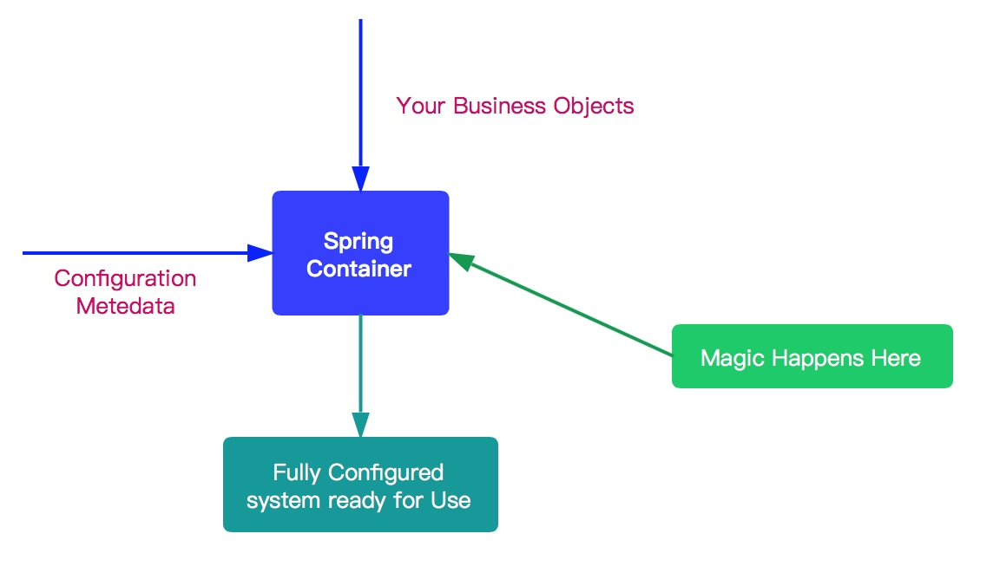

> 参考网址：<http://cmsblogs.com/?p=2806>

#### 目录

* [1. getBean](#1)
* [2. doGetBean](#2)
  * [2.1 获取 beanName](#2.1)
  * [2.2 从单例 Bean 缓存中获取 Bean](#2.2)
    * [2.2.1  FactoryBean](#2.2.1)
  * [2.3 原型模式依赖检查](#2.3)
  * [2.4 从 parentBeanFactory 获取 Bean](#2.4)
  * [2.5 指定的 Bean 标记为已经创建或即将创建](#2.5)
  * [2.6 获取 BeanDefinition](#2.6)
  * [2.7 依赖 Bean 处理](#2.7)
  * [2.8 不同作用域的 Bean 实例化](#2.8)
  * [2.9 类型转换](#2.9)
* [3. 总结](#3)

****

.<center></center>

&nbsp;&nbsp; `Spring IoC` 容器所起的作用如上图所示，它会以**某种方式加载 `Configuration Metadata`，将其解析注册到容器内部，然后回根据这些信息绑定整个系统的对象，最终组装成一个可用的基于轻量级容器的应用系统**。

&nbsp;&nbsp; `Spring` 在实现上述功能中，将整个流程分为两个阶段：**容器初始化阶段和加载`bean` 阶段**。

1.  **容器初始化阶段**： 
   * 首先，通过某种方式加载 `Configuration Metadata` (主要是依据 `Resource`、`ResourceLoader` 两个体系) 。
   * 然后，容器会对加载的 `Configuration MetaData` 进行解析和分析，并将分析的信息组装成 `BeanDefinition` 。
   * 最后，将 `BeanDefinition` 保存注册到相应的 `BeanDefinitionRegistry` 中。
   * 至此，`Spring IoC` 的初始化工作完成。
   
2.   **加载 Bean 阶段**： 

    * 经过容器初始化阶段后，应用程序中定义的 `bean` 信息已经全部加载到系统中了，当我们显示或者隐式地调用 `BeanFactory#getBean(...)` 方法时，则会触发加载 `Bean` 阶段。
    * 在这阶段，容器会首先检查所请求的对象是否已经初始化完成了，如果没有，则会根据注册的 `Bean` 信息实例化请求的对象，并为其注册依赖，然后将其返回给请求方。
    * 至此第二个阶段也已经完成

<span id = "1"></span>
# 1. getBean

&nbsp;&nbsp; 当我们显示或者隐式地调用 `BeanFactory#getBean(String name)` 方法时，则会触发加载 `Bean` 阶段

```java
// org.springframework.beans.factory.support.AbstractBeanFactory.java

@Override
public Object getBean(String name) throws BeansException {
	return doGetBean(name, null, null, false);
}
```

*  内部调用 `doGetBean(String name, final Class requiredType, Object[] args, boolean typeCheckOnly)` 方法，其接受四个方法参数 

  *  `name` ：要获取 `Bean` 的名字 

  *  `requiredType` ：要获取 `Bean` 的类型

  *  `args` ：创建 `Bean` 时传递的参数。这个参数仅限于创建 `Bean` 时使用

  *  `typeCheckOnly` ：是否为类型检查 

<span id = "2"></span>
# 2. doGetBean

&nbsp;&nbsp;  `#doGetBean(String name, final Class requiredType, Object[] args, boolean typeCheckOnly)` 方法 

```java
// org.springframework.beans.factory.support.AbstractBeanFactory.java

protected <T> T doGetBean(
		String name, @Nullable Class<T> requiredType, @Nullable Object[] args, boolean typeCheckOnly)
		throws BeansException {
	/*
	 * <1> 返回 bean 名称
	 * 		剥离工厂引用前缀,如果出入&beanName,则去掉&,结果为beanName
	 * 		如果 name 是 alias ，则获取对应映射的 beanName
	 */
	String beanName = transformedBeanName(name);
	Object bean;

	// 从缓存中或者实例工厂中获取 Bean 对象
	Object sharedInstance = getSingleton(beanName);
	if (sharedInstance != null && args == null) {
		if (logger.isDebugEnabled()) {
			if (isSingletonCurrentlyInCreation(beanName)) {
				logger.debug("Returning eagerly cached instance of singleton bean '" + beanName +
						"' that is not fully initialized yet - a consequence of a circular reference");
			}
			else {
				logger.debug("Returning cached instance of singleton bean '" + beanName + "'");
			}
		}
		// <2> 完成 FactoryBean 的相关处理，并用来获取 FactoryBean 的处理结果
		bean = getObjectForBeanInstance(sharedInstance, name, beanName, null);
	}else {
		// <3> 因为 Spring 只解决单例模式下得循环依赖，在原型模式下如果存在循环依赖则会抛出异常
		if (isPrototypeCurrentlyInCreation(beanName)) {
			throw new BeanCurrentlyInCreationException(beanName);
		}

		// <4> 如果容器中没有找到，则从父类容器中加载
		BeanFactory parentBeanFactory = getParentBeanFactory();

		// parentBeanFactory 不为空且 beanDefinitionMap 中不存该 name 的 BeanDefinition
		if (parentBeanFactory != null && !containsBeanDefinition(beanName)) {
			// 确定原始 beanName
			String nameToLookup = originalBeanName(name);
			if (parentBeanFactory instanceof AbstractBeanFactory) {
				// 如果，父类容器为 AbstractBeanFactory ，直接递归查找
				return ((AbstractBeanFactory) parentBeanFactory).doGetBean(
						nameToLookup, requiredType, args, typeCheckOnly);
			}else if (args != null) {
				// 用明确的 args 从 parentBeanFactory 中，获取 Bean 对象
				return (T) parentBeanFactory.getBean(nameToLookup, args);
			}else {
				// 用明确的 requiredType 从 parentBeanFactory 中，获取 Bean 对象
				return parentBeanFactory.getBean(nameToLookup, requiredType);
			}
		}

		// <5> 如果不是仅仅做类型检查则是创建bean，这里需要记录
		if (!typeCheckOnly) {
			markBeanAsCreated(beanName);
		}

		try {
			// <6> 从容器中获取 beanName 相应的 GenericBeanDefinition 对象，并将其转换为 RootBeanDefinition 对象
			RootBeanDefinition mbd = getMergedLocalBeanDefinition(beanName);
			// 检查给定的合并的 BeanDefinition
			checkMergedBeanDefinition(mbd, beanName, args);

			// <7> 处理所依赖的 bean
			String[] dependsOn = mbd.getDependsOn();
			if (dependsOn != null) {
				for (String dep : dependsOn) {
					// 若给定的依赖 bean 已经注册为依赖给定的 bean
					// 循环依赖的情况
					if (isDependent(beanName, dep)) {
						throw new BeanCreationException(mbd.getResourceDescription(), beanName,
								"Circular depends-on relationship between '" + beanName + "' and '" + dep + "'");
					}
					// 缓存依赖调用
					registerDependentBean(dep, beanName);
					try {
						getBean(dep);
					}
					catch (NoSuchBeanDefinitionException ex) {
						throw new BeanCreationException(mbd.getResourceDescription(), beanName,
								"'" + beanName + "' depends on missing bean '" + dep + "'", ex);
					}
				}
			}

			// <8> bean 实例化
			if (mbd.isSingleton()) {
				/* 单例模式 */

				sharedInstance = getSingleton(beanName, () -> {
					try {
						return createBean(beanName, mbd, args);
					}
					catch (BeansException ex) {
						// 显式从单例缓存中删除 Bean 实例
						// 因为单例模式下为了解决循环依赖，可能他已经存在了，所以销毁它。
						destroySingleton(beanName);
						throw ex;
					}
				});
				bean = getObjectForBeanInstance(sharedInstance, name, beanName, mbd);
			}else if (mbd.isPrototype()) {
				/* 原型模式 */

				Object prototypeInstance = null;
				try {
					// <1> 加载前置处理
					beforePrototypeCreation(beanName);
					// <2> 创建 Bean 对象
					prototypeInstance = createBean(beanName, mbd, args);
				}finally {
					// <3> 加载后置处理
					afterPrototypeCreation(beanName);
				}
				bean = getObjectForBeanInstance(prototypeInstance, name, beanName, mbd);
			}else {
				/* 从指定的 scope 下创建 bean */

				String scopeName = mbd.getScope();
				if (!StringUtils.hasLength(scopeName)) {
					throw new IllegalStateException("No scope name defined for bean ´" + beanName + "'");
				}
				Scope scope = this.scopes.get(scopeName);
				if (scope == null) {
					throw new IllegalStateException("No Scope registered for scope name '" + scopeName + "'");
				}
				try {
					// 从指定的 scope 下创建 bean
					Object scopedInstance = scope.get(beanName, () -> {
						// 加载前置处理
						beforePrototypeCreation(beanName);
						try {
							// 创建 Bean 对象
							return createBean(beanName, mbd, args);
						}finally {
							// 加载后置处理
							afterPrototypeCreation(beanName);
						}
					});
					// 从 Bean 实例中获取对象
					bean = getObjectForBeanInstance(scopedInstance, name, beanName, mbd);
				}
				catch (IllegalStateException ex) {
					throw new BeanCreationException(beanName,
							"Scope '" + scopeName + "' is not active for the current thread; consider " +
							"defining a scoped proxy for this bean if you intend to refer to it from a singleton",
							ex);
				}
			}
		}
		catch (BeansException ex) {
			cleanupAfterBeanCreationFailure(beanName);
			throw ex;
		}
	}

	// <9> 检查需要的类型是否符合 bean 的实际类型
	if (requiredType != null && !requiredType.isInstance(bean)) {
		try {
			// 执行转换
			T convertedBean = getTypeConverter().convertIfNecessary(bean, requiredType);
			if (convertedBean == null) {
				// 转换失败，抛出 BeanNotOfRequiredTypeException 异常
				throw new BeanNotOfRequiredTypeException(name, requiredType, bean.getClass());
			}
			return convertedBean;
		}
		catch (TypeMismatchException ex) {
			if (logger.isDebugEnabled()) {
				logger.debug("Failed to convert bean '" + name + "' to required type '" +
						ClassUtils.getQualifiedName(requiredType) + "'", ex);
			}
			throw new BeanNotOfRequiredTypeException(name, requiredType, bean.getClass());
		}
	}
	return (T) bean;
}
```

&nbsp;&nbsp;  处理逻辑如下

* `<1>` 处，见 [「2.1 获取 beanName」](#2.1) 
* `<2>` 处，见 [「2.2 从单例 Bean 缓存中获取 Bean」](#2.2) 
* `<3>` 处，见 [「2.3 原型模式依赖检查」](#2.3) 
* `<4>` 处，见 [「2.4 从 parentBeanFactory 获取 Bean」](#2.4) 
* `<5>` 处，见 [「2.5 指定的 Bean 标记为已经创建或即将创建」](#2.5) 
* `<6>` 处，见 [「2.6 获取 BeanDefinition」](#2.6) 
* `<7>` 处，见 [「2.7 依赖 Bean 处理」](#2.7) 
* `<8>` 处，见 [「2.8 不同作用域的 Bean 实例化」](#2.8) 
* `<9>` 处，见 [「2.9 类型转换」](#2.9)

<span id = "2.1"></span>
## 2.1 获取 beanName

&nbsp;&nbsp;  对应代码如下 

```java
// org.springframework.beans.factory.support.AbstractBeanFactory.java

String beanName = transformedBeanName(name);
```

&nbsp;&nbsp;  这里传递的 `name` ，不一定就是 `beanName`，可能是 `aliasName` ，也有可能是 `FactoryBean` ，所以这里需要调用 `#transformedBeanName(String name)` 方法，对 `name` 进行一番转换 

```java
// org.springframework.beans.factory.support.AbstractBeanFactory.java

protected String transformedBeanName(String name) {
	return canonicalName(BeanFactoryUtils.transformedBeanName(name));
}
```

&nbsp;&nbsp;  调用 `BeanFactoryUtils#transformedBeanName(String name)` 方法，去除 `FactoryBean` 的修饰符(`&`) 

```java
// org.springframework.beans.factory.BeanFactoryUtils.java

/**
 * 去除 FactoryBean 的修饰符 &
 * 		如果 name 以 “&” 为前缀，那么会去掉该 "&"
 * 		例如，name = "&studentService" ，则会是 name = "studentService"
 */
public static String transformedBeanName(String name) {
	Assert.notNull(name, "'name' must not be null");
	String beanName = name;
	while (beanName.startsWith(BeanFactory.FACTORY_BEAN_PREFIX)) {
		// 以“&”开头，截取之后的字符
		beanName = beanName.substring(BeanFactory.FACTORY_BEAN_PREFIX.length());
	}
	return beanName;
}
```

&nbsp;&nbsp;  逻辑比较简单，就是去除传入 `name` 参数的 `"&"` 的前缀 

>  假设配置了一个 `FactoryBean` 的名字为 `"abc"` ，那么获取 `FactoryBean` 创建的 `Bean` 时，使用 `"abc"` ，如果获取 `FactoryBean` 本身，使用 `"&abc"` 。`&`定义位于 `BeanFactory.FACTORY_BEAN_PREFIX = "&"` 

&nbsp;&nbsp;  调用 `#canonicalName(String name)` 方法，取指定的 `alias` 所表示的最终 `beanName`

```java 
// org.springframework.core.SimpleAliasRegistry.java

/**
 * 别名Map
 * 	key: alias
 * 	value: beanName
 */
private final Map<String, String> aliasMap = new ConcurrentHashMap<>(16);

public String canonicalName(String name) {
	String canonicalName = name;
	// Handle aliasing...
	String resolvedName;
	// 循环，从 aliasMap 中，获取到最终的 beanName
	do {
		resolvedName = this.aliasMap.get(canonicalName);
		if (resolvedName != null) {
			canonicalName = resolvedName;
		}
	}
	while (resolvedName != null);
	return canonicalName;
}
```

&nbsp;&nbsp; 主要是一个**循环获取 `beanName` 的过程**，例如，别名 A 指向名称为 B 的 bean 则返回 B，若 别名 A 指向别名 B，别名 B 指向名称为 C 的 bean，则返回 C

<span id = "2.2"></span>
## 2.2 从单例 Bean 缓存中获取 Bean

&nbsp;&nbsp;  对应代码如下  

```java
// org.springframework.beans.factory.support.AbstractBeanFactory.java

// 从缓存中或者实例工厂中获取 Bean 对象
Object sharedInstance = getSingleton(beanName);
if (sharedInstance != null && args == null) {
	if (logger.isDebugEnabled()) {
		if (isSingletonCurrentlyInCreation(beanName)) {
			logger.debug("Returning eagerly cached instance of singleton bean '" + beanName +
					"' that is not fully initialized yet - a consequence of a circular reference");
		}
		else {
			logger.debug("Returning cached instance of singleton bean '" + beanName + "'");
		}
	}
	// <2> 完成 FactoryBean 的相关处理，并用来获取 FactoryBean 的处理结果
	bean = getObjectForBeanInstance(sharedInstance, name, beanName, null);
}
```

*  **单例模式的 `Bean` 在整个过程中只会被创建一次**。第一次创建后会将该 `Bean` 加载到缓存中。后面，在获取 `Bean` 就会直接从单例缓存中获取 
*  `<2>` 处，如果从缓存中得到了 `Bean` 对象，则需要调用 `#getObjectForBeanInstance(Object beanInstance, String name, String beanName, RootBeanDefinition mbd)` 方法，对 `Bean` 进行实例化处理。因为，**缓存中记录的是最原始的 `Bean` 状态，我们得到的不一定是我们最终想要的 `Bean`** 

&nbsp;&nbsp;  详细解析，见 [《【Spring 5.0.x】—— 13. IoC 之 Bean 的加载：从单例缓存中获取单例Bean》]() 

<span id = "2.2.1"></span>

### 2.2.1  FactoryBean

&nbsp;&nbsp;  一般情况下，**`Spring` 通过反射机制利用 `bean` 的 `class` 属性指定实现类来实例化 `bean`** 。某些情况下，**实例化 `bean` 过程比较复杂，如果按照传统的方式，则需要提供大量的配置信息，配置方式的灵活性是受限的，这时采用编码的方式可能会得到一个简单的方案**。`Spring` 为此提供了一个 `FactoryBean` 的工厂类接口，用户可以通过实现该接口定制实例化 `bean` 的逻辑 

>  `FactoryBean` 接口对于 `Spring` 框架来说占有重要的地位，`Spring` 自身就提供了 70 多个 `FactoryBean` 的实现。它们隐藏了实例化一些复杂 `bean` 的细节，给上层应用带来了便利 

<span id = "2.3"></span>
## 2.3 原型模式依赖检查

&nbsp;&nbsp;  对应代码如下

 ```java
// org.springframework.beans.factory.support.AbstractBeanFactory.java

// <3> 因为 Spring 只解决单例模式下得循环依赖，在原型模式下如果存在循环依赖则会抛出异常
if (isPrototypeCurrentlyInCreation(beanName)) {
	throw new BeanCurrentlyInCreationException(beanName);
}
 ```

&nbsp;&nbsp;  `Spring` 只处理单例模式下得循环依赖，对于原型模式的循环依赖直接抛出异常。主要原因还是在于，**和 Spring 解决循环依赖的策略有关** 

*  对于**单例( Singleton )模式**， `Spring` 在创建 `Bean` 的时候并不是等 `Bean` 完全创建完成后才会将 `Bean` 添加至缓存中，而是不等 `Bean` 创建完成就会将创建 `Bean` 的 **`ObjectFactory` 提早加入到缓存**中，这样一旦下一个 `Bean` 创建的时候需要依赖 `Bean` 时则直接使用 `ObjectFactroy `

*  但是**原型( Prototype )模式**，我们知道是没法使用缓存的，所以 `Spring` 对原型模式的循环依赖处理策略则是不处理 

  &nbsp;&nbsp;  详细解析，见 [《【Spring 5.0.x】—— 14. IoC 之 Bean 的加载：parentBeanFactory 与依赖处理》]() 

<span id = "2.4"></span>
## 2.4 从 parentBeanFactory 获取 Bean

&nbsp;&nbsp;  对应代码如下 

```java
// org.springframework.beans.factory.support.AbstractBeanFactory.java

// <4> 如果容器中没有找到，则从父类容器中加载
BeanFactory parentBeanFactory = getParentBeanFactory();

// parentBeanFactory 不为空且 beanDefinitionMap 中不存该 name 的 BeanDefinition
if (parentBeanFactory != null && !containsBeanDefinition(beanName)) {
	// 确定原始 beanName
	String nameToLookup = originalBeanName(name);
	if (parentBeanFactory instanceof AbstractBeanFactory) {
		// 如果，父类容器为 AbstractBeanFactory ，直接递归查找
		return ((AbstractBeanFactory) parentBeanFactory).doGetBean(
				nameToLookup, requiredType, args, typeCheckOnly);
	}else if (args != null) {
		// 用明确的 args 从 parentBeanFactory 中，获取 Bean 对象
		return (T) parentBeanFactory.getBean(nameToLookup, args);
	}else {
		// 用明确的 requiredType 从 parentBeanFactory 中，获取 Bean 对象
		return parentBeanFactory.getBean(nameToLookup, requiredType);
	}
}
```

&nbsp;&nbsp; 如果**当前**容器缓存中没有相对应的 `BeanDefinition` 对象，则会尝试从父类工厂（`parentBeanFactory`）中加载，然后再去递归调用 `#getBean(...)` 方法 

&nbsp;&nbsp; 详细解析，见 [《【Spring 5.0.x】—— 14. IoC 之 Bean 的加载：parentBeanFactory 与依赖处理》]()

<span id = "2.5"></span>
## 2.5 指定的 Bean 标记为已经创建或即将创建

&nbsp;&nbsp;  对应代码如下 

```java
// org.springframework.beans.factory.support.AbstractBeanFactory.java

// <5> 如果不是仅仅做类型检查则是创建bean，这里需要记录
if (!typeCheckOnly) {
	markBeanAsCreated(beanName);
}
```

&nbsp;&nbsp; 详细解析，见 [《【Spring 5.0.x】—— 14. IoC 之 Bean 的加载：parentBeanFactory 与依赖处理》]()

<span id = "2.6"></span>
## 2.6 获取 BeanDefinition

&nbsp;&nbsp;  对应代码如下 

```java
// org.springframework.beans.factory.support.AbstractBeanFactory.java

// <6> 从容器中获取 beanName 相应的 GenericBeanDefinition 对象，并将其转换为 RootBeanDefinition 对象
RootBeanDefinition mbd = getMergedLocalBeanDefinition(beanName);
// 检查给定的合并的 BeanDefinition
checkMergedBeanDefinition(mbd, beanName, args);
```

&nbsp;&nbsp; **从 `XML` 配置文件中读取到的 `Bean` 信息是存储在`GenericBeanDefinition` 中的**。但是，所有的 `Bean` 后续处理都是针对于 `RootBeanDefinition` 的，所以这里需要进行一个转换。转换的同时，**如果父类 `Bean` 不为空的话，则会一并合并父类的属性**

&nbsp;&nbsp; 详细解析，见 [《【Spring 5.0.x】—— 14. IoC 之 Bean 的加载：parentBeanFactory 与依赖处理》]()

<span id = "2.7"></span>
## 2.7 依赖 Bean 处理

&nbsp;&nbsp;  对应代码如下 

```java
// org.springframework.beans.factory.support.AbstractBeanFactory.java

// <7> 处理所依赖的 bean
String[] dependsOn = mbd.getDependsOn();
if (dependsOn != null) {
	for (String dep : dependsOn) {
		// 若给定的依赖 bean 已经注册为依赖给定的 bean
		// 循环依赖的情况
		if (isDependent(beanName, dep)) {
			throw new BeanCreationException(mbd.getResourceDescription(), beanName,
					"Circular depends-on relationship between '" + beanName + "' and '" + dep + "'");
		}
		// 缓存依赖调用
		registerDependentBean(dep, beanName);
		try {
			// 递归处理依赖 Bean
			getBean(dep);
		}
		catch (NoSuchBeanDefinitionException ex) {
			throw new BeanCreationException(mbd.getResourceDescription(), beanName,
					"'" + beanName + "' depends on missing bean '" + dep + "'", ex);
		}
	}
}
```

*  每个 `Bean` 都不是单独工作的，它会依赖其他 `Bean`，其他 `Bean` 也会依赖它 
*  对于依赖的 `Bean` ，它会**优先加载**，所以，在 `Spring` 的加载顺序中，在初始化某一个 `Bean` 的时候，**首先会初始化这个 `Bean` 的依赖** 

&nbsp;&nbsp; 详细解析，见 [《【Spring 5.0.x】—— 14. IoC 之 Bean 的加载：parentBeanFactory 与依赖处理》]()

<span id = "2.8"></span>

## 2.8 不同作用域的 Bean 实例化

&nbsp;&nbsp;  对应代码如下 

```java
// org.springframework.beans.factory.support.AbstractBeanFactory.java

// <8> bean 实例化
if (mbd.isSingleton()) {
	/* 单例模式 */

	sharedInstance = getSingleton(beanName, () -> {
		try {
			return createBean(beanName, mbd, args);
		}
		catch (BeansException ex) {
			// 显式从单例缓存中删除 Bean 实例
			// 因为单例模式下为了解决循环依赖，可能他已经存在了，所以销毁它
			destroySingleton(beanName);
			throw ex;
		}
	});
	bean = getObjectForBeanInstance(sharedInstance, name, beanName, mbd);
}else if (mbd.isPrototype()) {
	/* 原型模式 */

	Object prototypeInstance = null;
	try {
		// <8.1> 加载前置处理
		beforePrototypeCreation(beanName);
		// <8.2> 创建 Bean 对象
		prototypeInstance = createBean(beanName, mbd, args);
	}finally {
		// <8.3> 加载后置处理
		afterPrototypeCreation(beanName);
	}
	bean = getObjectForBeanInstance(prototypeInstance, name, beanName, mbd);
}else {
	/* 从指定的 scope 下创建 bean */

	String scopeName = mbd.getScope();
	if (!StringUtils.hasLength(scopeName)) {
		throw new IllegalStateException("No scope name defined for bean ´" + beanName + "'");
	}
	Scope scope = this.scopes.get(scopeName);
	if (scope == null) {
		throw new IllegalStateException("No Scope registered for scope name '" + scopeName + "'");
	}
	try {
		// 从指定的 scope 下创建 bean
		Object scopedInstance = scope.get(beanName, () -> {
			// 加载前置处理
			beforePrototypeCreation(beanName);
			try {
				// 创建 Bean 对象
				return createBean(beanName, mbd, args);
			}finally {
				// 加载后置处理
				afterPrototypeCreation(beanName);
			}
		});
		// 从 Bean 实例中获取对象
		bean = getObjectForBeanInstance(scopedInstance, name, beanName, mbd);
	}
	catch (IllegalStateException ex) {
		throw new BeanCreationException(beanName,
				"Scope '" + scopeName + "' is not active for the current thread; consider " +
				"defining a scoped proxy for this bean if you intend to refer to it from a singleton",
				ex);
	}
}
```

*  `Spring Bean` 的作用域默认为 `singleton` 。当然，还有其他作用域，如 `prototype`、`request`、`session` 等 
*  不同的作用域会有不同的初始化策略 

&nbsp;&nbsp; 详细解析，见 [《【Spring 5.0.x】—— 15. IoC 之 Bean 的加载：分析各 scope 的 Bean 创建》]()

<span id = "2.9"></span>
## 2.9 类型转换

&nbsp;&nbsp; 对应代码如下

```java
// org.springframework.beans.factory.support.AbstractBeanFactory.java

// <9> 检查需要的类型是否符合 bean 的实际类型
if (requiredType != null && !requiredType.isInstance(bean)) {
	try {
		// 执行转换
		T convertedBean = getTypeConverter().convertIfNecessary(bean, requiredType);
		if (convertedBean == null) {
			// 转换失败，抛出 BeanNotOfRequiredTypeException 异常
			throw new BeanNotOfRequiredTypeException(name, requiredType, bean.getClass());
		}
		return convertedBean;
	}
	catch (TypeMismatchException ex) {
		if (logger.isDebugEnabled()) {
			logger.debug("Failed to convert bean '" + name + "' to required type '" +
					ClassUtils.getQualifiedName(requiredType) + "'", ex);
		}
		throw new BeanNotOfRequiredTypeException(name, requiredType, bean.getClass());
	}
}
```

*  在调用 `#doGetBean(...)` 方法时，有一个 `requiredType` 参数。该参数的功能就是将返回的 `Bean` 转换为 `requiredType` 类型 
*  一般情况下，我们是不需要进行类型转换的，也就是 `requiredType` 为空（比如 `#getBean(String name)` 方法）。但是，可能会存在这种情况，比如我们返回的 `Bean` 类型为 `String` ，我们在使用的时候需要将其转换为 `Integer`，那么这个时候 `requiredType` 就有用武之地了。

<span id = "3"></span>

# 3. 总结

&nbsp;&nbsp;   `BeanFactory#getBean(...)` 方法的过程讲解完了。后面将会对该过程进行拆分，更加详细的说明，弄清楚其中的来龙去脉。拆分主要是分为**三个部分** 

1.  分析从缓存中获取单例 `Bean` ，以及对 `Bean` 的实例中获取对象 
2.  如果从单例缓存中获取 `Bean` ，`Spring `是怎么加载的呢？所以第二部分是分析 `Bean` 加载，以及 `Bean` 的依赖处理 
3.  `Bean` 已经加载了，依赖也处理完毕了，第三部分则分析各个作用域的 `Bean` 初始化过程 