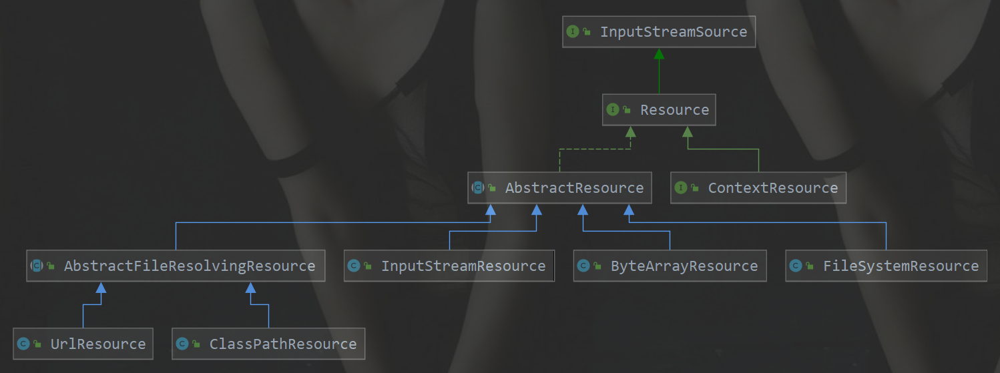

> 参考网址：<http://cmsblogs.com/?p=2656>

#### 目录

* [1. 统一资源：Resource](#1)
  * [1.1 Resource体系结构](#1.1)
  * [1.2 AbstractResource](#1.2)
* [2. 统一资源加载(定位)：ResourceLoader](#2)
  * [2.1 ResourceLoader体系结构](#2.1)
  * [2.2 DefaultResourceLoader](#2.2)
    * [2.2.1 构造函数](#2.2.1)
    * [2.2.2 getResource 方法](#2.2.2)
    * [2.2.3 ProtocolResolver](#2.2.3)
  * [2.3 FileSystemResourceLoader](#2.3)
    * [2.3.1 FileSystemContextResource](#2.3.1)
  * [2.4 ResourcePatternResolver](#2.4)
  * [2.5 PathMatchingResourcePatternResolver](#2.5)
    * [2.5.1 构造函数](#2.5.1)
    * [2.5.2 getResource](#2.5.2)
    * [2.5.3 getResources](#2.5.3)
    * [2.5.4 findAllClassPathResources](#2.5.4)
    * [2.5.5 findPathMatchingResources](#2.5.5)
      * [2.5.5.1 determineRootDir](#2.5.5.1)
      * [2.5.5.2 doFindPathMatchingXXXResources](#2.5.5.2)
* [3. 总结](#3)

****

&nbsp;&nbsp; 在`Java` 中有一个标准类 `java.net.URL`，该类在 `Java` 中的定位为**统一资源定位器**（`Uniform Resource Locator`）。但是我们知道它的实现基本**只限于网络形式发布的资源的查找和定位**。然而，实际上资源的定义比较广泛，除了**网络形式的资源，还有以二进制形式存在的、以文件形式存在的、以字节流形式存在**的等等。而且它可以存在于任何场所，比如**网络、文件系统、应用程序**中。所以 `java.net.URL` 的局限性迫使 `Spring` 必须实现自己的**资源加载策略**，该资源加载策略需要满足如下要求：

1. **职能划分清楚**。**资源的定义和资源的加载**应该要有一个清晰的**界限**；
2. **统一的抽象**。**统一的资源定义和资源加载策略**。资源加载后要返回**统一的抽象**给客户端，客户端要对资源进行怎样的处理，应该由抽象资源接口来界定。

<span id ="1"></span>
# 1. 统一资源：Resource

&nbsp;&nbsp; `Resource(org.springframework.core.io.Resource)` 是 `Spring` 框架所有**资源的抽象和访问接口**，它继承 `org.springframework.core.io.InputStreamSource`接口。作为所有资源的**统一抽象**，`Resource` 定义了一些通用的方法，由子类 `AbstractResource` 提供统一的默认实现。定义如下：

```java
// org.springframework.core.io.InputStreamSource

public interface InputStreamSource {

	/**
	 * 返回资源的InputStream
	 */
	InputStream getInputStream() throws IOException;

}

// org.springframework.core.io.Resource

public interface Resource extends InputStreamSource {

	/**
	 * 资源是否存在
	 */
	boolean exists();

	/**
	 * 资源是否可读
	 */
	default boolean isReadable() {
		return true;
	}

	/**
	 * 资源是否被打开了
	 */
	default boolean isOpen() {
		return false;
	}

	/**
	 * 资源是否为File
	 */
	default boolean isFile() {
		return false;
	}

	/**
	 * 返回资源的 URL
	 */
	URL getURL() throws IOException;

	/**
	 * 返回资源的 URI
	 */
	URI getURI() throws IOException;

	/**
	 * 返回资源的 File
	 */
	File getFile() throws IOException;

	/**
	 * 返回 ReadableByteChannel
	 */
	default ReadableByteChannel readableChannel() throws IOException {
		return Channels.newChannel(getInputStream());
	}

	/**
	 * 资源内容的长度
	 */
	long contentLength() throws IOException;

	/**
	 * 资源最后的修改时间
	 */
	long lastModified() throws IOException;

	/**
	 * 根据资源的相对路径创建新资源
	 */
	Resource createRelative(String relativePath) throws IOException;

	/**
	 * 返回资源的文件名
	 */
	@Nullable
	String getFilename();

	/**
	 * 资源的描述
	 */
	String getDescription();

}

```

<span id ="1.1"></span>
## 1.1 Resource体系结构

&nbsp;&nbsp; `Spring` 把其**资源做了一个抽象**，底层使用统一的资源访问接口(`Resource`)来访问 `Spring` 的所有资源。对不同来源的资源文件都有相应的`Resource`实现： `ClassPath资源（ClasspathResource）` 、 `URL资源（URLResource）` 、`文件（FileSystemResource）`、`InputStream资源（InputStreamResource）`、`Byte数组（ByteArrayResource）`等。类图如下:

.<center></center>

&nbsp;&nbsp; 从上图可以看出：

1. `InputStreamSource` 封装任何返回 `InputStream` 的类，比如 `File`，`Classpath` 下的资源和 `Byte`，`Array` 等。
2. `Resource`接口抽象了所有`Spring` 内部使用到的底层资源：`File`，`URL`，`Classpath` 等。
3. `AbstractResource` 为 `Resource` 的默认实现。
4. `ClassPathResource` 用来加载 `classpath` 类型资源的实现。使用给定的 `ClassLoader` 或者给定的 `Class` 来加载资源。
5. `ByteArrayResource` 对字节数组提供的数据的封装。
6. `UrlResource`  对 `java.net.URL`类型资源的封装。内部委派 `URL` 进行具体的资源操作。
7.  `InputStreamResource` 将给定的 `InputStream` 作为一种资源的 `Resource` 的实现类。 
8. `FileSystemResource`  对 `java.io.File` 类型资源的封装，只要是跟 `File` 打交道的，基本上与 `FileSystemResource` 也可以打交道。支持**文件和 `URL`** 的形式。

<span id ="1.2"></span>
## 1.2 AbstractResource

&nbsp;&nbsp; `org.springframework.core.io.AbstractResource` ，为 `Resource` 接口的**默认抽象**实现。它实现了 `Resource` 接口的**大部分的公共实现**，作为 `Resource` 接口中的重中之重，其定义如下： 

```java
// org.springframework.core.io.AbstractResource

public abstract class AbstractResource implements Resource {

	/**
	 * 判断文件是否存在，若判断过程产生异常（因为会调用SecurityManager来判断），就关闭对应的流
	 */
	@Override
	public boolean exists() {
		try {
			// 基于 File 进行判断
			return getFile().exists();
		}
		catch (IOException ex) {
			try {
				// 基于 InputStream 进行判断
				getInputStream().close();
				return true;
			}
			catch (Throwable isEx) {
				return false;
			}
		}
	}

	/**
	 * 直接返回true，表示可读
	 */
	@Override
	public boolean isReadable() {
		return true;
	}

	/**
	 * 直接返回 false，表示未被打开
	 */
	@Override
	public boolean isOpen() {
		return false;
	}

	/**
	 * 直接返回false，表示不为 File
	 */
	@Override
	public boolean isFile() {
		return false;
	}

	/**
	 * 抛出 FileNotFoundException 异常，交给子类实现
	 */
	@Override
	public URL getURL() throws IOException {
		throw new FileNotFoundException(getDescription() + " cannot be resolved to URL");
	}

	/**
	 * 基于 getURL() 返回的 URL 构建 URI
	 */
	@Override
	public URI getURI() throws IOException {
		URL url = getURL();
		try {
			return ResourceUtils.toURI(url);
		}
		catch (URISyntaxException ex) {
			throw new NestedIOException("Invalid URI [" + url + "]", ex);
		}
	}

	/**
	 * 抛出 FileNotFoundException 异常，交给子类实现
	 */
	@Override
	public File getFile() throws IOException {
		throw new FileNotFoundException(getDescription() + " cannot be resolved to absolute file path");
	}

	/**
	 * 根据 getInputStream() 的返回结果构建 ReadableByteChannel
	 */
	@Override
	public ReadableByteChannel readableChannel() throws IOException {
		return Channels.newChannel(getInputStream());
	}

	/**
	 * 获取资源的长度
	 *
	 * 这个资源内容长度实际就是资源的字节长度，通过全部读取一遍来判断
	 */
	@Override
	public long contentLength() throws IOException {
		InputStream is = getInputStream();
		try {
			long size = 0;
			// 每次最多读取 256 字节
			byte[] buf = new byte[256];
			int read;
			while ((read = is.read(buf)) != -1) {
				size += read;
			}
			return size;
		}
		finally {
			try {
				is.close();
			}
			catch (IOException ex) {
			}
		}
	}

	/**
	 * 返回资源最后的修改时间
	 */
	@Override
	public long lastModified() throws IOException {
		File fileToCheck = getFileForLastModifiedCheck();
		long lastModified = fileToCheck.lastModified();
		if (lastModified == 0L && !fileToCheck.exists()) {
			throw new FileNotFoundException(getDescription() +
					" cannot be resolved in the file system for checking its last-modified timestamp");
		}
		return lastModified;
	}

	protected File getFileForLastModifiedCheck() throws IOException {
		return getFile();
	}

	/**
	 * 抛出 FileNotFoundException 异常，交给子类实现
	 */
	@Override
	public Resource createRelative(String relativePath) throws IOException {
		throw new FileNotFoundException("Cannot create a relative resource for " + getDescription());
	}

	/**
	 * 获取资源名称，默认返回 null ，交给子类实现
	 */
	@Override
	@Nullable
	public String getFilename() {
		return null;
	}


	@Override
	public boolean equals(Object other) {
		return (this == other || (other instanceof Resource &&
				((Resource) other).getDescription().equals(getDescription())));
	}

	@Override
	public int hashCode() {
		return getDescription().hashCode();
	}

	/**
	 * 返回资源的描述
	 */
	@Override
	public String toString() {
		return getDescription();
	}

}

```

&nbsp;&nbsp;  如果我们想要实现自定义的 `Resource` ，记住不要实现 `Resource` 接口，而应该继承 `AbstractResource` 抽象类，然后根据当前的具体资源特性覆盖相应的方法即可。 

<span id ="2"></span>
# 2. 统一资源加载(定位)：ResourceLoader

&nbsp;&nbsp; `Spring` 将**资源的定义和资源的加载**区分开了，**`Resource` 定义了统一的资源，资源的加载则由 `ResourceLoader` 来统一定义**。

&nbsp;&nbsp; `org.springframework.core.io.ResourceLoader` 为 `Spring` 资源加载的统一抽象，具体的资源加载则由相应的实现类来完成，所以我们可以将 `ResourceLoader` 称作为统一资源定位器。

> `ResourceLoader`，定义资源加载器，主要应用于根据给定的资源文件地址，返回对应的 `Resource` 。 

```java
// org.springframework.core.io.ResourceLoader

public interface ResourceLoader {

	/** 用于从类路径加载的 CLASSPATH URL前缀。默认为"classpath:" */
	String CLASSPATH_URL_PREFIX = ResourceUtils.CLASSPATH_URL_PREFIX;

	/**
	 * 根据所提供资源的路径 location 返回 Resource
	 */
	Resource getResource(String location);

	/**
	 * 返回 ClassLoader 实例，对于想要获取 ResourceLoader
	 * 使用的 ClassLoader 用户来说，可以直接调用该方法来获取
	 */
	@Nullable
	ClassLoader getClassLoader();

}
```

* `#getResource(String location)`  方法，根据所提供资源的路径 location 返回 `Resource` 实例，返回的`Resource`实例，**根据实现不同而不同**。但是它不确保该 `Resource` 一定存在，需要调用`Resource`#`exist()`方法来判断。
  * 该方法支持以下模式的资源加载
  * `URL`位置资源，如 `"file:C:/test.dat"` 
  * `ClassPath`位置资源，如 `"classpath:test.dat` 
  * 相对路径资源，如 `"WEB-INF/test.dat"` 
  * 该方法的主要实现是在其子类 `DefaultResourceLoader` 中实现

* `#getClassLoader()` 方法，返回 `ClassLoader` 实例，对于想要获取 `ResourceLoader` 使用的 `ClassLoader` 用户来说，可以直接调用该方法来获取。在`Resource` 中有一个类 `ClassPathResource` ，这个类是可以根据指定的 `ClassLoader` 来加载资源。

<span id ="2.1"></span>
## 2.1 ResourceLoader体系结构

&nbsp;&nbsp; 作为 `Spring` 统一的资源加载器，它**提供了统一的抽象，具体的实现则由相应的子类来负责实现**，其类的类结构图如下： 

.<center></center>

> 由`DefaultResourceLoader`提供默认实现

<span id ="2.2"></span>
## 2.2 DefaultResourceLoader

&nbsp;&nbsp;  与 `AbstractResource` 相似，`org.springframework.core.io.DefaultResourceLoader` 是 `ResourceLoader` 的默认实现。 

<span id ="2.2.1"></span>
### 2.2.1 构造函数

&nbsp;&nbsp;  它接收 `ClassLoader` 作为构造函数的参数，或者使用不带参数的构造函数。

* 在使用**不带参数**的构造函数时，使用的 `ClassLoader` 为默认的 `ClassLoader`（ `Thread.currentThread()#getContextClassLoader()` ）。
* 在使用**带参数**的构造函数时，可以通过 `ClassUtils#getDefaultClassLoader()`获取。

```java
// org.springframework.core.io.DefaultResourceLoader.java	

@Nullable
private ClassLoader classLoader;

/**
 * 无参构造函数
 */
public DefaultResourceLoader() {
	this.classLoader = ClassUtils.getDefaultClassLoader();
}

/**
 * 带 ClassLoader 参数的构造函数
 */
public DefaultResourceLoader(@Nullable ClassLoader classLoader) {
	this.classLoader = classLoader;
}


/**
 * 设置 ClassLoader
 */
public void setClassLoader(@Nullable ClassLoader classLoader) {
	this.classLoader = classLoader;
}

/**
 * 获取ClassLoader（为空时默认为ClassUtils#getDefaultClassLoader()）
 */
@Override
@Nullable
public ClassLoader getClassLoader() {
	return (this.classLoader != null ? this.classLoader : ClassUtils.getDefaultClassLoader());
}
```

>  后续可以调用 `#setClassLoader()` 方法进行设置。 

<span id ="2.2.2"></span>
### 2.2.2 getResource 方法

&nbsp;&nbsp; `ResourceLoader` 中最核心的方法为 `#getResource(String location)` ，它根据提供的资源路径 location 返回相应的 `Resource` 。而 `DefaultResourceLoader` 对该方法提供了**核心实现**（子类没有覆盖方法，所以`ResourceLoader` 的资源加载策略封装在 `DefaultResourceLoader` 中)

 ```java
// org.springframework.core.io.DefaultResourceLoader.java	

/**
 * 获取Resource
 */
@Override
public Resource getResource(String location) {
	Assert.notNull(location, "Location must not be null");

	/*
	 * 首先
	 * 看有没有自定义的ProtocolResolver（用户自定义协议资源解决策略）
	 * 如果有则先根据自定义的ProtocolResolver解析资源路径location得到Resource
	 * 如果无则跳过
	 */
	for (ProtocolResolver protocolResolver : this.protocolResolvers) {
		Resource resource = protocolResolver.resolve(location, this);
		if (resource != null) {
			return resource;
		}
	}

	if (location.startsWith("/")) {
        /*
	 	 * 其次
	 	 * 以 / 开头，调用#getResourcePath()返回 ClassPathContextResource 类型的资源
	 	 * ClassPathContextResource 是 DefaultResourceLoader 的内部类
	 	 */
		return getResourceByPath(location);
	}else if (location.startsWith(CLASSPATH_URL_PREFIX)) {
		// 再次，以 classpath: 开头，返回 ClassPathResource 类型的资源
		return new ClassPathResource(location.substring(CLASSPATH_URL_PREFIX.length()), getClassLoader());
	}else {
		// 然后，根据是否为文件 URL ，是则返回 FileUrlResource 类型的资源，否则返回 UrlResource 类型的资源
		try {
			URL url = new URL(location);
			return (ResourceUtils.isFileURL(url) ? new FileUrlResource(url) : new UrlResource(url));
		}
		catch (MalformedURLException ex) {
			/*
			 * 最后
			 * 如果上面都没匹配上，则调用#getResourcePath()返回 ClassPathContextResource 类型的资源(与以 / 开头调用的方法相同)
			 * #getResourcePath()，这个是一个 protected 的方法，默认的实现是得到一个 ClassPathContextResource
			 * 这个方法常常会用子类来实现，例如: FileSystemXmlApplicationContext#getResourceByPath()
			 */
			return getResourceByPath(location);
		}
	}
}
 ```

我们来分析 一下获取`Resource`的过程

* 首先，看有没有自定义的`ProtocolResolver`（**用户自定义协议资源解决策略**）,如果有则先根据自定义的`ProtocolResolver`解析资源路径location得到`Resource`,如果无则跳过
* 其次， 若 `location` 以 `"/"` 开头 ，调用`#getResourcePath()`返回 `ClassPathContextResource `类型的资源，`ClassPathContextResource` 是 `DefaultResourceLoader` 的内部类

```java
// org.springframework.core.io.DefaultResourceLoader.java	

/**
 * 根据资源路径返回Resource
 */
protected Resource getResourceByPath(String path) {
	return new ClassPathContextResource(path, getClassLoader());
}

// org.springframework.core.io.DefaultResourceLoader.java -> ClassPathContextResource

/**
 * 通过实现ContextResource接口 明确表示下文相关路径的ClassPathResource，此方法重点在于实现ContextResource
 */
protected static class ClassPathContextResource extends ClassPathResource implements ContextResource {

	/**
	 * 通过调用父类的构造方法创建
	 */
	public ClassPathContextResource(String path, @Nullable ClassLoader classLoader) {
		super(path, classLoader);
	}

	@Override
	public String getPathWithinContext() {
		return getPath();
	}

	@Override
	public Resource createRelative(String relativePath) {
		String pathToUse = StringUtils.applyRelativePath(getPath(), relativePath);
		return new ClassPathContextResource(pathToUse, getClassLoader());
	}
}
```

*  再次，若 `location` 以 `"classpath:"` 开头，则构造 `ClassPathResource` 类型资源并返回。在构造该资源时，通过 `#getClassLoader()` 获取当前的 `ClassLoader`。 
*  然后，构造 `URL` ，尝试通过它进行资源定位，若没有抛出 `MalformedURLException `异常，则判断是否为 `FileURL` , 如果是则构造` FileUrlResource` 类型的资源，否则构造 `UrlResource` 类型的资源。
*  最后，若在加载过程中抛出 `MalformedURLException` 异常，则委派 `#getResourceByPath()` 方法，实现资源定位加载。  (这个方法与以 `/` 开头调用的方法相同)

<span id ="2.2.3"></span>

### 2.2.3 ProtocolResolver

&nbsp;&nbsp; `org.springframework.core.io.ProtocolResolver` ，**用户自定义协议资源解决策略**，作为 `DefaultResourceLoader` 的 **`SPI`**：它允许用户自定义资源加载协议，而不需要继承 `ResourceLoader` 的子类。

&nbsp;&nbsp; 在介绍 `Resource` 时，提到**如果要实现自定义 `Resource`，我们只需要继承 `AbstractResource` 即可**，但是有了 `ProtocolResolver`后，我们不需要直接继承 `DefaultResourceLoader`，改为实现 `ProtocolResolver` 接口也可以实现自定义的 `ResourceLoader`。

&nbsp;&nbsp; `ProtocolResolver` 接口，仅有一个方法 `Resource resolve(String location, ResourceLoader resourceLoader)`

```java
// org.springframework.core.io.ProtocolResolver

@FunctionalInterface
public interface ProtocolResolver {

	/**
	 * 使用指定的 ResourceLoader ，解析指定的 location
	 * 若成功，则返回对应的 Resource 。
	 */
	@Nullable
	Resource resolve(String location, ResourceLoader resourceLoader);

}
```

&nbsp;&nbsp; 在 `Spring` 中该接口并没有实现类，它需要用户自定义，自定义的 `Resolver` 如何加入 `Spring` 呢？调用 `DefaultResourceLoader#addProtocolResolver(ProtocolResolver)` 方法即可。 

```java
// org.springframework.core.io.DefaultResourceLoader.java	

/**
 * ProtocolResolver 集合
 */
private final Set<ProtocolResolver> protocolResolvers = new LinkedHashSet<>(4);

/**
 * 添加protocolResolvers
 */
public void addProtocolResolver(ProtocolResolver resolver) {
	Assert.notNull(resolver, "ProtocolResolver must not be null");
	this.protocolResolvers.add(resolver);
}
```

<span id ="2.3"></span>

## 2.3 FileSystemResourceLoader

 &nbsp;&nbsp; 其实 `DefaultResourceLoader` 对`#getResourceByPath(String)` 方法处理其实不是很恰当，这个时候我们可以使用 `org.springframework.core.io.FileSystemResourceLoader` 。它继承 `DefaultResourceLoader` ，且覆写了 `#getResourceByPath(String)` 方法，使之从文件系统加载资源并以 `FileSystemResource` 类型返回，这样我们就可以得到想要的资源类型。 

```java
// org.springframework.core.io.FileSystemResourceLoader.java

/**
 * 根据资源路径返回Resource
 * 覆盖父类方法
 */
@Override
protected Resource getResourceByPath(String path) {
	// 截取首 "/"
	if (path.startsWith("/")) {
		path = path.substring(1);
	}
	// 创建 FileSystemContextResource 类型的资源
	return new FileSystemContextResource(path);
}
```

<span id ="2.3.1"></span>
### 2.3.1 FileSystemContextResource

 &nbsp;&nbsp; `FileSystemContextResource` ，为 `FileSystemResourceLoader` 的内部类，它继承 `FileSystemResource` 类，实现 `ContextResource` 接口。 

```java
// org.springframework.core.io.FileSystemResourceLoader.java -> FileSystemContextResource

private static class FileSystemContextResource extends FileSystemResource implements ContextResource {

	public FileSystemContextResource(String path) {
		super(path);
	}

	@Override
	public String getPathWithinContext() {
		return getPath();
	}
}
```

* 在构造器中，也是调用 `FileSystemResource` 的构造函数来构造 `FileSystemResource` 的。
* 为什么要有 `FileSystemContextResource` 类的原因是，实现 `ContextResource` 接口，并实现对应的 `#getPathWithinContext()` 接口方法。

<span id ="2.4"></span>
## 2.4 ResourcePatternResolver

 &nbsp;&nbsp; `ResourceLoader` 的 `Resource getResource(String location)` 方法，每次只能根据 location 返回**一个** `Resource` 。当需要加载多个资源时，除了多次调用 `#getResource(String location)` 方法外，别无他法。`org.springframework.core.io.support.ResourcePatternResolver` 是 `ResourceLoader` 的扩展，它支持根据指定的资源路径匹配模式每次返回**多个** Resource 实例。

 ```java
// org.springframework.core.io.support.ResourcePatternResolver.java

public interface ResourcePatternResolver extends ResourceLoader {

	/**
	 * 资源前缀 "classpath*:"
	 */
	String CLASSPATH_ALL_URL_PREFIX = "classpath*:";

	/**
	 * 返回Resource数组
	 */
	Resource[] getResources(String locationPattern) throws IOException;

}
 ```

- `ResourcePatternResolver` 在 `ResourceLoader` 的基础上增加了 `#getResources(String locationPattern)` 方法，以支持根据路径匹配模式返回**多个** `Resource` 实例。
- 同时，也新增了一种**新的协议**前缀 `"classpath*:"`，该协议前缀由其子类负责实现。

<span id ="2.5"></span>
## 2.5 PathMatchingResourcePatternResolver

 &nbsp;&nbsp; `org.springframework.core.io.support.PathMatchingResourcePatternResolver` ，为 `ResourcePatternResolver` 最常用的子类，它除了支持 `ResourceLoader` 和 `ResourcePatternResolver` 新增的 `"classpath*:"` 前缀外，**还支持 Ant 风格的路径匹配模式**（类似于 `"**/*.xml"`）。 

<span id ="2.5.1"></span>
### 2.5.1 构造函数

&nbsp;&nbsp;  `PathMatchingResourcePatternResolver` 提供了三个构造函数

 ```java
// org.springframework.core.io.support.PathMatchingResourcePatternResolver.java

/**
 * 内置的 ResourceLoader 资源定位器
 */
private final ResourceLoader resourceLoader;
/**
 * Ant 路径匹配器
 */
private PathMatcher pathMatcher = new AntPathMatcher();

/**
 * 使用无参 构造器 默认使用DefaultResourceLoader
 */
public PathMatchingResourcePatternResolver() {
	this.resourceLoader = new DefaultResourceLoader();
}

/**
 * 若指定了 ResourceLoader 则使用指定的 ResourceLoader
 */
public PathMatchingResourcePatternResolver(ResourceLoader resourceLoader) {
	Assert.notNull(resourceLoader, "ResourceLoader must not be null");
	this.resourceLoader = resourceLoader;
}

/**
 * 指定类加载器, 通过给定的类加载器完成 ResourceLoader 的实例化
 */
public PathMatchingResourcePatternResolver(@Nullable ClassLoader classLoader) {
	this.resourceLoader = new DefaultResourceLoader(classLoader);
}
 ```

* `PathMatchingResourcePatternResolver` 在实例化的时候，可以指定一个 `ResourceLoader`，如果不指定的话，它会在内部构造一个 `DefaultResourceLoader` 。
* `pathMatcher` 属性，默认为 `AntPathMatcher` 对象，用于支持 `Ant` 类型的路径匹配。

<span id ="2.5.2"></span>
### 2.5.2 getResource

```java
// org.springframework.core.io.support.PathMatchingResourcePatternResolver.java

@Override
public Resource getResource(String location) {
    // 委托给ResourceLoader 获取资源
	return getResourceLoader().getResource(location);
}

public ResourceLoader getResourceLoader() {
	return this.resourceLoader;
}
```

 &nbsp;&nbsp; 该方法，直接委托给相应的 `ResourceLoader` 来实现。所以，如果我们在实例化`PathMatchingResourcePatternResolver` 的时候，如果未指定 `ResourceLoader` 参数的情况下，那么在加载资源时，其实就是 `DefaultResourceLoader` 的过程 。

<span id ="2.5.3"></span>
### 2.5.3 getResources

```java
// org.springframework.core.io.support.PathMatchingResourcePatternResolver.java

@Override
public Resource[] getResources(String locationPattern) throws IOException {
	Assert.notNull(locationPattern, "Location pattern must not be null");

	// 以 "classpath*:" 开头
	if (locationPattern.startsWith(CLASSPATH_ALL_URL_PREFIX)) {

		if (getPathMatcher().isPattern(locationPattern.substring(CLASSPATH_ALL_URL_PREFIX.length()))) {
			// 路径包含通配符
			return findPathMatchingResources(locationPattern);
		} else {
			// 路径不包含通配符
			return findAllClassPathResources(locationPattern.substring(CLASSPATH_ALL_URL_PREFIX.length()));
		}

	}else {
		// 不以 "classpath*:" 开头

		// 去除前缀：file:、classpath:等
		int prefixEnd = (locationPattern.startsWith("war:") ? locationPattern.indexOf("*/") + 1 :
				locationPattern.indexOf(':') + 1);
		if (getPathMatcher().isPattern(locationPattern.substring(prefixEnd))) {
			// 路径包含通配符
			return findPathMatchingResources(locationPattern);
		} else {
			// 路径不包含通配符
			return new Resource[] {getResourceLoader().getResource(locationPattern)};
		}
	}
}
```

- **非** `"classpath*:"` 开头，且路径**不包含**通配符，直接委托给相应的 `ResourceLoader` 来实现。
- 其他情况，调用 `#findAllClassPathResources(...)`、或 `#findPathMatchingResources(...)` 方法，返回多个 `Resource` 。

<span id ="2.5.4"></span>
### 2.5.4 findAllClassPathResources

&nbsp;&nbsp; 当 `locationPattern` 以 `"classpath*:"` 开头但是不包含通配符，则调用 `#findAllClassPathResources(...)` 方法加载资源。该方法返回 classes 路径下和所有 jar 包中的所有相匹配的资源。 

```java
// org.springframework.core.io.support.PathMatchingResourcePatternResolver.java

protected Resource[] findAllClassPathResources(String location) throws IOException {
		String path = location;

		// 去除首个 /
		if (path.startsWith("/")) {
			path = path.substring(1);
		}

		// 真正执行加载所有 classpath 资源
		Set<Resource> result = doFindAllClassPathResources(path);
		if (logger.isDebugEnabled()) {
			logger.debug("Resolved classpath location [" + location + "] to resources " + result);
		}

		// 转换成 Resource 数组返回
		return result.toArray(new Resource[0]);
	}
```

 &nbsp;&nbsp; 真正执行加载的是在 `#doFindAllClassPathResources(...)` 方法

 ```java
// org.springframework.core.io.support.PathMatchingResourcePatternResolver.java

protected Set<Resource> doFindAllClassPathResources(String path) throws IOException {
		Set<Resource> result = new LinkedHashSet<>(16);

		// 获取 classLoader
		ClassLoader cl = getClassLoader();

		// <1> 根据 ClassLoader 加载路径下的所有资源
		Enumeration<URL> resourceUrls = (cl != null ? cl.getResources(path) : ClassLoader.getSystemResources(path));
		// <2>
		while (resourceUrls.hasMoreElements()) {
			URL url = resourceUrls.nextElement();
			// 将 URL 转换成 UrlResource并添加到集合转给你
			result.add(convertClassLoaderURL(url));
		}
		// <3> 加载路径下得所有 jar 包
		if ("".equals(path)) {
			addAllClassLoaderJarRoots(cl, result);
		}
		return result;
}
 ```

*  `<1>` 处，根据 `ClassLoader` 加载路径下的所有资源。在加载资源过程时，如果在构造 `PathMatchingResourcePatternResolver` 实例的时候如果传入了 `ResourceLoader`，则获取该`ResourceLoader`的 `classLoader` 并调用 `#getResources()` 方法；否则调用 `ClassLoader#getSystemResources(path)` 方法。

```java
// java.lang.ClassLoader.java

public Enumeration<URL> getResources(String name) throws IOException {
    @SuppressWarnings("unchecked")
    Enumeration<URL>[] tmp = (Enumeration<URL>[]) new Enumeration<?>[2];
    
    // 如果当前父类加载器不为 `null` ，则通过父类向上迭代获取资源，否则调用 `#getBootstrapResources()` 。
    if (parent != null) {
        tmp[0] = parent.getResources(name);
    } else {
        tmp[0] = getBootstrapResources(name);
    }
    tmp[1] = findResources(name);

    return new CompoundEnumeration<>(tmp);
}
```

*  `<2>` 处，遍历 `URL` 集合，调用 `#convertClassLoaderURL(URL url)` 方法，将 `URL` 转换成 `UrlResource` 对象 

```java
// org.springframework.core.io.support.PathMatchingResourcePatternResolver.java

protected Resource convertClassLoaderURL(URL url) {
	return new UrlResource(url);
}
```

* `<3>` 处，若 `path` 为空（`""`）时，则调用 `#addAllClassLoaderJarRoots(...)`方法。该方法主要是加载路径下得所有 jar 包。 

>  通过上面的分析，我们知道 `#findAllClassPathResources(...)` 方法，其实就是利用 `ClassLoader` 来加载指定路径下的资源，不论它是在 class 路径下还是在 jar 包中。如果我们传入的路径为空或者 `/`，则会调用 `#addAllClassLoaderJarRoots(...)` 方法，加载所有的 jar 包。

<span id ="2.5.5"></span>
### 2.5.5 findPathMatchingResources

&nbsp;&nbsp;  当 `locationPattern` 中包含了**通配符**，则调用该方法进行资源加载。 

```java
// org.springframework.core.io.support.PathMatchingResourcePatternResolver.java

protected Resource[] findPathMatchingResources(String locationPattern) throws IOException {
		// 确定根路径、子路径
		String rootDirPath = determineRootDir(locationPattern);
		String subPattern = locationPattern.substring(rootDirPath.length());

		// 获取根据路径下的资源
		Resource[] rootDirResources = getResources(rootDirPath);
		Set<Resource> result = new LinkedHashSet<>(16);

		// 遍历，迭代
		for (Resource rootDirResource : rootDirResources) {
			rootDirResource = resolveRootDirResource(rootDirResource);
			URL rootDirUrl = rootDirResource.getURL();

			// bundle 资源类型
			if (equinoxResolveMethod != null && rootDirUrl.getProtocol().startsWith("bundle")) {
				URL resolvedUrl = (URL) ReflectionUtils.invokeMethod(equinoxResolveMethod, null, rootDirUrl);
				if (resolvedUrl != null) {
					rootDirUrl = resolvedUrl;
				}
				rootDirResource = new UrlResource(rootDirUrl);
			}

			// vfs 资源类型
			if (rootDirUrl.getProtocol().startsWith(ResourceUtils.URL_PROTOCOL_VFS)) {
				result.addAll(VfsResourceMatchingDelegate.findMatchingResources(rootDirUrl, subPattern, getPathMatcher()));
			} else if (ResourceUtils.isJarURL(rootDirUrl) || isJarResource(rootDirResource)) {
				// jar 资源类型
				result.addAll(doFindPathMatchingJarResources(rootDirResource, rootDirUrl, subPattern));
			} else {
				// 其它资源类型
				result.addAll(doFindPathMatchingFileResources(rootDirResource, subPattern));
			}
		}
		if (logger.isDebugEnabled()) {
			logger.debug("Resolved location pattern [" + locationPattern + "] to resources " + result);
		}
		return result.toArray(new Resource[0]);
	}
```

&nbsp;&nbsp; 上面的方法主要分两步：

1. 确定目录，获取该目录下得所有资源。
2. 在所获得的所有资源后，进行迭代匹配获取我们想要的资源。

&nbsp;&nbsp; 在这个方法里面，我们要关注两个方法，一个是 `#determineRootDir(String location)` 方法，一个是 `#doFindPathMatchingXXXResources(...)` 等方法。 

<span id ="2.5.5.1"></span>
#### 2.5.5.1 determineRootDir

 &nbsp;&nbsp; `determineRootDir(String location)` 方法，主要是用于确定根路径。

 ```java
// org.springframework.core.io.support.PathMatchingResourcePatternResolver.java

protected String determineRootDir(String location) {
		// 找到冒号的后一位
		int prefixEnd = location.indexOf(':') + 1;
		// 根目录结束位置
		int rootDirEnd = location.length();
		// 在从冒号开始到最后的字符串中，循环判断是否包含通配符，如果包含，则截断最后一个由"/"分割的部分。再循环判断剩下的部分，直到剩下的路径中都不包含通配符。
		while (rootDirEnd > prefixEnd && getPathMatcher().isPattern(location.substring(prefixEnd, rootDirEnd))) {
			rootDirEnd = location.lastIndexOf('/', rootDirEnd - 2) + 1;
		}

		// 如果查找完成后，rootDirEnd = 0 了，则将之前赋值的 prefixEnd 的值赋给 rootDirEnd ，也就是冒号的后一位
		if (rootDirEnd == 0) {
			rootDirEnd = prefixEnd;
		}
		// 截取根目录
		return location.substring(0, rootDirEnd);
}
 ```

效果如下

|               原路径               |      确定根路径       |
| :--------------------------------: | :-------------------: |
| `classpath*:test/cc*/spring-*.xml` |  `classpath*:test/`   |
| `classpath*:test/aa/spring-*.xml`  | `classpath*:test/aa/` |

<span id ="2.5.5.2"></span>
#### 2.5.5.2 doFindPathMatchingXXXResources

`#doFindPathMatchingXXXResources(...)` 方法，是个泛指，一共对应三个方法：

- `#doFindPathMatchingJarResources(rootDirResource, rootDirUrl, subPatter)` 方法
- `#doFindPathMatchingFileResources(rootDirResource, subPattern)` 方法
- `VfsResourceMatchingDelegate#findMatchingResources(rootDirUrl, subPattern, pathMatcher)` 方法

<span id ="3"></span>
# 3. 总结

 &nbsp;&nbsp; `Spring` 整个资源记载过程已经分析完毕。

* `Spring` 提供了 **`Resource` 和 `ResourceLoader` 来统一抽象整个资源及其定位**。使得资源与资源的定位有了一个更加清晰的界限，并且提供了合适的 `Default `类，使得自定义实现更加方便和清晰。
* `AbstractResource` 为 `Resource` 的默认抽象实现，它对 `Resource` 接口做了一个统一的实现，子类继承该类后只需要覆盖相应的方法即可，同时对于自定义的 `Resource` 我们也是继承该类。
* `DefaultResourceLoader` 同样也是 `ResourceLoader` 的默认实现，在自定 义`ResourceLoader` 的时候我们除了可以继承该类外还可以**实现 `ProtocolResolver` 接口来实现自定资源加载协议**。
* `DefaultResourceLoader` 每次只能返回单一的资源，所以 `Spring` 针对这个提供了另外一个接口 `ResourcePatternResolver` ，该接口提供了根据指定的资源路径 locationPattern 返回多个资源的策略。其子类 `PathMatchingResourcePatternResolver` 是一个集大成者的 `ResourceLoader` ，因为它即实现了 `Resource getResource(String location)` 方法，也实现了 `Resource[] getResources(String locationPattern)` 方法。