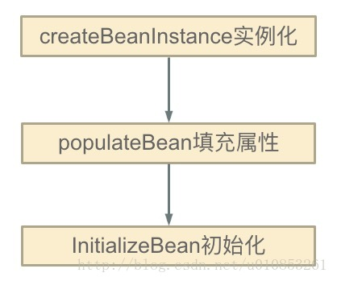

> 参考网址：<http://cmsblogs.com/?p=2887>

#### 目录

* [1. 什么是循环依赖](#1)
* [2. 解决循环依赖](#2)
  * [2.1 getSingleton](#2.1)
  * [2.2 addSingletonFactory](#2.2)
  * [2.3 addSingleton](#2.3)
* [3. 总结](#3)

****

&nbsp;&nbsp;  这里分析**循环依赖处理**。其实，循环依赖并不仅仅只是在 `#doCreateBean(...)` 方法中处理，而是在整个加载 `bean` 的过程中都有涉及。所以，本文内容并不仅仅只局限于 `#doCreateBean(...)` 方法，而是从整个 `Bean` 的加载过程进行分析 

<span id = "1" ></span>
# 1. 什么是循环依赖

&nbsp;&nbsp;  循环依赖，其实就是**循环引用**，就是两个或者两个以上的 `bean` 互相引用对方，最终形成一个闭环，如 A 依赖 B，B 依赖 C，C 依赖 A 

.<center></center>

&nbsp;&nbsp;  循环依赖，其实就是一个**死循环**的过程，在初始化 A 的时候发现引用了 B，这时就会去初始化 B，然后又发现 B 引用 C，跑去初始化 C，初始化 C 的时候发现引用了 A，则又会去初始化 A，依次循环永不退出，除非有**终结条件** 

 &nbsp;&nbsp; `Spring` 循环依赖的**场景**有两种 

*  构造器的循环依赖 
*  `field` 属性的循环依赖 

 &nbsp;&nbsp; 对于构造器的循环依赖，`Spring` 是无法解决的，只能抛出 `BeanCurrentlyInCreationException` 异常表示循环依赖，**所以下面我们分析的都是基于 field 属性的循环依赖** 

&nbsp;&nbsp; 在 [《【【Spring 5.0.x】—— 12. IoC 之 Bean 的加载》]() 中提到，`Spring` 只解决 `scope` 为 `singleton` 的循环依赖。对于`scope` 为 `prototype` 的 `bean` ，`Spring` 无法解决，直接抛出 `BeanCurrentlyInCreationException` 异常。

&nbsp;&nbsp; 为什么 `Spring` 不处理 `prototype bean` 呢？其实如果理解 `Spring` 是如何解决 `singleton bean` 的循环依赖就明白了。

<span id = "2" ></span>
# 2. 解决循环依赖

<span id = "2.1" ></span>
## 2.1 getSingleton

 &nbsp;&nbsp; 我们先从加载 `bean` 最初始的方法 `AbstractBeanFactory` 的 `#doGetBean(final String name, final Class requiredType, final Object[] args, boolean typeCheckOnly)` 方法开始 

 &nbsp;&nbsp; 在 `#doGetBean(...)` 方法中，首先会根据 `beanName` 从单例 `bean` 缓存中获取，**如果不为空则直接返回** 

```java
// org.springframework.beans.factory.support.AbstractBeanFactory.java

// 从缓存中或者实例工厂中获取 Bean 对象
Object sharedInstance = getSingleton(beanName);
```

&nbsp;&nbsp;  调用 `#getSingleton(String beanName, boolean allowEarlyReference)` 方法，从单例缓存中获取 

```java
// org.springframework.beans.factory.support.DefaultSingletonBeanRegistry.java

@Nullable
protected Object getSingleton(String beanName, boolean allowEarlyReference) {
	// 从单例缓冲中加载 bean
	Object singletonObject = this.singletonObjects.get(beanName);
	// 缓存中的 bean 为空，且当前 bean 正在创建
	if (singletonObject == null && isSingletonCurrentlyInCreation(beanName)) {
		// 加锁
		synchronized (this.singletonObjects) {
			// 从 earlySingletonObjects 获取
			singletonObject = this.earlySingletonObjects.get(beanName);
			// earlySingletonObjects 中没有，且允许提前创建
			if (singletonObject == null && allowEarlyReference) {
				// 从 singletonFactories 中获取对应的 ObjectFactory
				ObjectFactory<?> singletonFactory = this.singletonFactories.get(beanName);
				if (singletonFactory != null) {
					// 获得 bean
					singletonObject = singletonFactory.getObject();
					// 添加 bean 到 earlySingletonObjects 中
					this.earlySingletonObjects.put(beanName, singletonObject);
					// 从 singletonFactories 中移除对应的 ObjectFactory
					this.singletonFactories.remove(beanName);
				}
			}
		}
	}
	return singletonObject;
}
```

&nbsp;&nbsp;  这个方法主要是从**三个缓存**中获取，分别是：`singletonObjects`、`earlySingletonObjects`、`singletonFactories` 。三者定义如下 

```java
// org.springframework.beans.factory.support.DefaultSingletonBeanRegistry.java

/**
 * Cache of singleton objects: bean name to bean instance.
 *
 * 单例对象的cache
 *
 * 存放的是单例 bean 的映射。
 *
 * 对应关系为 bean name --> bean instance
 */
private final Map<String, Object> singletonObjects = new ConcurrentHashMap<>(256);

/**
 * Cache of singleton factories: bean name to ObjectFactory.
 *
 * 单例对象工厂的cache
 *
 * 存放的是 ObjectFactory，可以理解为创建单例 bean 的 factory 。
 *
 * 对应关系是 bean name --> ObjectFactory
 **/
private final Map<String, ObjectFactory<?>> singletonFactories = new HashMap<>(16);

/**
 * Cache of early singleton objects: bean name to bean instance.
 *
 * 提前曝光的单例对象的Cache
 *
 * 存放的是早期的 bean，对应关系也是 bean name --> bean instance。
 *
 * 它与 {@link #singletonObjects} 区别在于 earlySingletonObjects 中存放的 bean 不一定是完整。
 *
 * 从 {@link #getSingleton(String)} 方法中，我们可以了解，bean 在创建过程中就已经加入到 earlySingletonObjects 中了。
 * 所以当在 bean 的创建过程中，就可以通过 getBean() 方法获取。
 *
 * 这个 Map 也是【循环依赖】的关键所在。
 */
private final Map<String, Object> earlySingletonObjects = new HashMap<>(16);
```

*  `singletonObjects` ：单例对象的 `Cache `
*  `singletonFactories` ： 单例对象工厂的 `Cache `
*  `earlySingletonObjects` ：**提前曝光**的单例对象的 `Cache ` 

&nbsp;&nbsp;  这就是 `Spring` 解决 `singleton bean` 的关键因素所在，他们被称为**三级缓存** 

*  第一级为 `singletonObjects` 
*  第二级为 `earlySingletonObjects` 
*  第三级为 `singletonFactories` 

&nbsp;&nbsp;  这里，我们已经通过 `#getSingleton(String beanName, boolean allowEarlyReference)` 方法，看到他们是如何配合的。详细分析该方法之前，提下其中的 `#isSingletonCurrentlyInCreation(String beanName)` 方法和 `allowEarlyReference` 变量 

*  `#isSingletonCurrentlyInCreation(String beanName)` 方法：判断当前 `singleton bean` 是否处于**创建中**。`bean` 处于创建中，也就是说 **`bean` 在初始化但是没有完成初始化**，有一个这样的过程其实和 `Spring` 解决 `bean` 循环依赖的理念相辅相成。**因为 Spring 解决 singleton bean 的核心就在于提前曝光 bean** 
*  `allowEarlyReference` 变量：从字面意思上面理解就是允许提前拿到引用。其实真正的意思是，是否允许从 `singletonFactories` 缓存中通过 `#getObject()` 方法，拿到对象。为什么会有这样一个字段呢？**原因就在于 `singletonFactories` 才是 Spring 解决 singleton bean 的诀窍所在** 

&nbsp;&nbsp;  `#getSingleton(String beanName, boolean allowEarlyReference)` 方法，整个过程如下 

*  首先，从一级缓存 `singletonObjects` 获取 
*  如果没有且当前指定的 `beanName` 正在创建，就再从二级缓存 `earlySingletonObjects` 中获取
*  如果还是没有获取到且允许 `singletonFactories` 通过 `#getObject()` 获取，则从三级缓存 `singletonFactories` 获取。如果获取到，则通过其 `#getObject()` 方法，获取对象，并将其加入到二级缓存 `earlySingletonObjects` 中，并从三级缓存 `singletonFactories` 删除  

```java
// org.springframework.beans.factory.support.DefaultSingletonBeanRegistry.java

// 获得 bean
singletonObject = singletonFactory.getObject();
// 添加 bean 到 earlySingletonObjects 中
this.earlySingletonObjects.put(beanName, singletonObject);
// 从 singletonFactories 中移除对应的 ObjectFactory
this.singletonFactories.remove(beanName);
```

&nbsp;&nbsp;  这样，就从三级缓存**升级**到二级缓存了 

&nbsp;&nbsp;  二级缓存存在的**意义**，就是缓存三级缓存中的 `ObjectFactory` 的 `#getObject()` 方法的执行结果，提早曝光的**单例** `Bean` 对象 

<span id = "2.2" ></span>
## 2.2 addSingletonFactory

 &nbsp;&nbsp; 上面是从缓存中获取，但是缓存中的数据从哪里添加进来的呢？一直往下跟会发现在 `AbstractAutowireCapableBeanFactory` 的 `#doCreateBean(final String beanName, final RootBeanDefinition mbd, final Object[] args)` 方法中，有这么一段代码 

```java
// org.springframework.beans.factory.support.AbstractAutowireCapableBeanFactory.java

// <4> 解决单例模式的循环依赖
boolean earlySingletonExposure = (mbd.isSingleton()// 单例模式
		&& this.allowCircularReferences // 允许提前暴露 bean
		&& isSingletonCurrentlyInCreation(beanName));// 当前单例 bean 是否正在被创建
if (earlySingletonExposure) {
	if (logger.isDebugEnabled()) {
		logger.debug("Eagerly caching bean '" + beanName +
				"' to allow for resolving potential circular references");
	}
	// 提前将创建的 bean 实例加入到 singletonFactories 中
	// 这里是为了后期避免循环依赖
	addSingletonFactory(beanName, () -> getEarlyBeanReference(beanName, mbd, bean));
}
```

&nbsp;&nbsp;  当一个 `Bean` 满足三个条件时，则调用 `#addSingletonFactory(...)` 方法，将它添加到**缓存**中

*  单例 
* 允许提前暴露 `bean`
*  当前 `bean` 正在创建中 

&nbsp;&nbsp;  `#addSingletonFactory(String beanName, ObjectFactory singletonFactory)` 方法 

```java
// org.springframework.beans.factory.support.DefaultSingletonBeanRegistry.java

protected void addSingletonFactory(String beanName, ObjectFactory<?> singletonFactory) {
	Assert.notNull(singletonFactory, "Singleton factory must not be null");
	synchronized (this.singletonObjects) {
		if (!this.singletonObjects.containsKey(beanName)) {
			this.singletonFactories.put(beanName, singletonFactory);
			this.earlySingletonObjects.remove(beanName);
			this.registeredSingletons.add(beanName);
		}
	}
}
```

&nbsp;&nbsp;  从这段代码我们可以看出，`singletonFactories` 这个三级缓存才是解决 `Spring Bean` 循环依赖的诀窍所在。同时这段代码发生在 `#createBeanInstance(...)` 方法之后，也就是说这个 `bean` 其实已经被创建出来了，**但是它还不是很完美（没有进行属性填充和初始化），但是对于其他依赖它的对象而言已经足够了（可以根据对象引用定位到堆中对象），能够被认出来了**。所以 `Spring` 在这个时候，选择将该对象提前曝光出来让大家认识认识 

<span id = "2.3" ></span>
## 2.3 addSingleton

 到这里我们发现三级缓存 `singletonFactories` 和 二级缓存 `earlySingletonObjects` 中的值都有出处了，那一级缓存在哪里设置的呢？在类 `DefaultSingletonBeanRegistry` 中，可以发现这个 `#addSingleton(String beanName, Object singletonObject)` 方法 

```java
// org.springframework.beans.factory.support.DefaultSingletonBeanRegistry.java

protected void addSingleton(String beanName, Object singletonObject) {
	synchronized (this.singletonObjects) {
		this.singletonObjects.put(beanName, singletonObject);
		this.singletonFactories.remove(beanName);
		this.earlySingletonObjects.remove(beanName);
		this.registeredSingletons.add(beanName);
	}
}
```

&nbsp;&nbsp;  这个方法添加至一级缓存，同时从二级、三级缓存中删除

 &nbsp;&nbsp; 这个方法在我们创建 `bean` 的链路中有哪个地方引用呢？在 `#doGetBean(...)` 方法中，处理不同 `scope` 时，如果是 `singleton`，则调用 `#getSingleton(...)` 方法 

.<center></center> 

&nbsp;&nbsp;  此处的 `#getSingleton(String beanName, ObjectFactory singletonFactory)` 方法，在 `DefaultSingletonBeanRegistry`类中实现，和 [「2.1 getSingleton」](#2.1) **不同** 

```java
// org.springframework.beans.factory.support.DefaultSingletonBeanRegistry.java

public Object getSingleton(String beanName, ObjectFactory<?> singletonFactory) {
	Assert.notNull(beanName, "Bean name must not be null");
	// 全局加锁
	synchronized (this.singletonObjects) {
		// <1> 从缓存中检查一遍
		// 因为 singleton 模式其实就是复用已经创建的 bean 所以这步骤必须检查
		Object singletonObject = this.singletonObjects.get(beanName);
		//  为空，开始加载过程
		if (singletonObject == null) {
			if (this.singletonsCurrentlyInDestruction) {
				throw new BeanCreationNotAllowedException(beanName,
						"Singleton bean creation not allowed while singletons of this factory are in destruction " +
						"(Do not request a bean from a BeanFactory in a destroy method implementation!)");
			}
			if (logger.isDebugEnabled()) {
				logger.debug("Creating shared instance of singleton bean '" + beanName + "'");
			}
			// <2> 加载前置处理
			beforeSingletonCreation(beanName);
			boolean newSingleton = false;
			boolean recordSuppressedExceptions = (this.suppressedExceptions == null);
			if (recordSuppressedExceptions) {
				this.suppressedExceptions = new LinkedHashSet<>();
			}
			try {
				// <3> 初始化 bean
				// 这个过程其实是调用 createBean() 方法
				singletonObject = singletonFactory.getObject();
				newSingleton = true;
			}
			catch (IllegalStateException ex) {
				// Has the singleton object implicitly appeared in the meantime ->
				// if yes, proceed with it since the exception indicates that state.
				singletonObject = this.singletonObjects.get(beanName);
				if (singletonObject == null) {
					throw ex;
				}
			}
			catch (BeanCreationException ex) {
				if (recordSuppressedExceptions) {
					for (Exception suppressedException : this.suppressedExceptions) {
						ex.addRelatedCause(suppressedException);
					}
				}
				throw ex;
			}
			finally {
				if (recordSuppressedExceptions) {
					this.suppressedExceptions = null;
				}
				// <4> 后置处理
				afterSingletonCreation(beanName);
			}
			// <5> 加入缓存中
			if (newSingleton) {
				addSingleton(beanName, singletonObject);
			}
		}
		return singletonObject;
	}
}
```

<span id = "3" ></span>
# 3. 总结

 `Spring` 关于 `singleton bean` 循环依赖已经分析完毕了。所以我们基本上可以确定 `Spring` 解决循环依赖的方案 

*  `Spring` 在创建 `bean` 的时候并不是等它完全完成，而是在创建过程中将创建中的 `bean` 的 `ObjectFactory` 提前曝光（即加入到 `singletonFactories` 缓存中）
*  这样，一旦下一个 `bean` 创建的时候需要依赖 `bean` ，则直接使用 `ObjectFactory` 的 `#getObject()` 方法来获取了，也就是 [「2.1 getSingleton」](#2.1) 中的方法中的代码片段了  

&nbsp;&nbsp;  到这里，关于 `Spring` 解决 `bean` 循环依赖就已经分析完毕了。最后来描述下就上面那个循环依赖 `Spring` 解决的过程

*   首先 A 完成初始化第一步并将自己提前曝光出来（通过 `ObjectFactory` 将自己提前曝光），在初始化的时候，发现自己依赖对象 B，此时就会去尝试 get(B)，这个时候发现 B 还没有被创建出来 
*  然后 B 就走创建流程，在 B 初始化的时候，同样发现自己依赖 C，C 也没有被创建出来 
*  这个时候 C 又开始初始化进程，但是在初始化的过程中发现自己依赖 A，于是尝试 get(A)，这个时候由于 A 已经添加至缓存中（一般都是添加至三级缓存 `singletonFactories` ），通过 `ObjectFactory` 提前曝光，所以可以通过 `ObjectFactory#getObject()` 方法来拿到 A 对象，C 拿到 A 对象后顺利完成初始化，然后将自己添加到一级缓存中 
*  回到 B ，B 也可以拿到 C 对象，完成初始化，A 可以顺利拿到 B 完成初始化。到这里整个链路就已经完成了初始化过程了 

.<center></center>