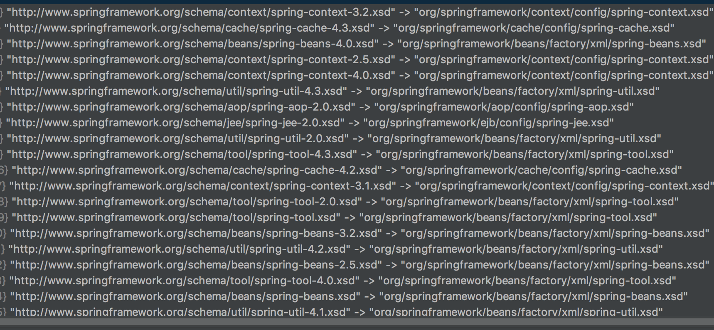

> 参考网址：<http://cmsblogs.com/?p=2695>


#### 目录

* [1. DocumentLoader](#1)
  * [1.1 DefaultDocumentLoader](#1.1)
* [2. EntityResolver](#2)
  * [2.1 子类](#2.1)
  * [2.2 作用](#2.2)
  * [2.3 DelegatingEntityResolver](#2.3)
  * [2.4 BeansDtdResolver](#2.4)
  * [2.5 PluggableSchemaResolver](#2.5)
  * [2.6 ResourceEntityResolver](#2.6)
  * [2.7 自定义 EntityResolver](#2.7)
* [3. 说明](#3)

****

&nbsp;&nbsp; 在 `XmlBeanDefinitionReader#doLoadDocument(InputSource inputSource, Resource resource)` 方法，中做了两件事情：

* 调用`#getValidationModeForResource(Resource resource)`方法，获取指定资源（`xml`）的验证模式。（见[【Spring 5.0.x】—— 4. IoC 之获取验证模型]()）


- 调用` DocumentLoader#loadDocument(InputSource inputSource, EntityResolver entityResolver, ErrorHandler errorHandler, int validationMode, boolean namespaceAware)`方法，获取 `XML Document` 实例。

&nbsp;&nbsp; 下面我们来分析`Spring`是怎么获取 `XML Document` 实例的

<span id="1"></span>
# 1. DocumentLoader

&nbsp;&nbsp; `Spring`中将**解析`Resource`,获取`Document`的过程**委托给了`DocumentLoader`去执行，这里`DocumentLoader`是个接口，真正的执行的是`DocumentLoader`的默认实现类`org.springframework.beans.factory.xml.DefaultDocumentLoader`。

&nbsp;&nbsp; `DefaultDocumentLoader`是怎么解析的呢？

1. 首先，调用 #`createDocumentBuilderFactory(...)` 方法，创建 `javax.xml.parsers.DocumentBuilderFactory` 对象
2. 然后，调用 `#createDocumentBuilder(DocumentBuilderFactory factory, EntityResolver entityResolver,ErrorHandler errorHandler)` 方法，创建 `javax.xml.parsers.DocumentBuilder` 对象
3. 最后，调用 `DocumentBuilder#parse(InputSource)` 方法，解析 `InputSource` ，返回`Document` 对象。

 &nbsp;&nbsp; 获取 `Document` 的策略，由接口 `org.springframework.beans.factory.xml.DocumentLoader` 定义 。定义如下:

>  定义从资源文件加载到转换为 `Document` 的功能。 

```java
// org.springframework.beans.factory.xml.DocumentLoader.java

public interface DocumentLoader {

	Document loadDocument(
			InputSource inputSource, EntityResolver entityResolver,
			ErrorHandler errorHandler, int validationMode, boolean namespaceAware)
			throws Exception;

}
```

&nbsp;&nbsp; 参数解析

* `inputSource` 方法参数，加载 `Document` 的 `Resource` 资源。

* `entityResolver` 方法参数，**解析文件的解析器**。

* `errorHandler` 方法参数，处理加载 `Document` 对象的过程的错误。

* `validationMode` 方法参数，**验证模式**。

* `namespaceAware` 方法参数，**命名空间支持**。如果要提供对 `XML` 名称空间的支持，则需要值为 `true` 。

<span id="1.1"></span>
## 1.1 DefaultDocumentLoader

 &nbsp;&nbsp; 该方法由 `DocumentLoader` 的默认实现类 `org.springframework.beans.factory.xml.DefaultDocumentLoader` 实现。

```java
// org.springframework.beans.factory.xml.DefaultDocumentLoader.java

@Override
public Document loadDocument(InputSource inputSource, EntityResolver entityResolver,
		ErrorHandler errorHandler, int validationMode, boolean namespaceAware) throws Exception {
	// <1> 创建 DocumentBuilderFactory
	DocumentBuilderFactory factory = createDocumentBuilderFactory(validationMode, namespaceAware);
	if (logger.isTraceEnabled()) {
		logger.trace("Using JAXP provider [" + factory.getClass().getName() + "]");
	}
	// <2> 创建 DocumentBuilder
	DocumentBuilder builder = createDocumentBuilder(factory, entityResolver, errorHandler);
	// <3> 解析 XML InputSource 返回 Document 对象
	return builder.parse(inputSource);
}
```

*  `<1>`处，首先，调用 #`createDocumentBuilderFactory(...)` 方法，创建 `javax.xml.parsers.DocumentBuilderFactory` 对象。 

```java
// org.springframework.beans.factory.xml.DefaultDocumentLoader.java

/**
 * JAXP attribute used to configure the schema language for validation.
 */
private static final String SCHEMA_LANGUAGE_ATTRIBUTE = "http://java.sun.com/xml/jaxp/properties/schemaLanguage";

/**
 * 创建DocumentBuilderFactory
 */
protected DocumentBuilderFactory createDocumentBuilderFactory(int validationMode, boolean namespaceAware)
		throws ParserConfigurationException {

	// 创建 DocumentBuilderFactory
	DocumentBuilderFactory factory = DocumentBuilderFactory.newInstance();

	// 设置命名空间支持
	factory.setNamespaceAware(namespaceAware);

	if (validationMode != XmlValidationModeDetector.VALIDATION_NONE) {
		// 开启校验
		factory.setValidating(true);

		// XSD 模式下，设置 factory 的属性
		if (validationMode == XmlValidationModeDetector.VALIDATION_XSD) {
			// XSD 模式下，强制设置命名空间支持
			factory.setNamespaceAware(true);
			try {
				// 设置 属性SCHEMA_LANGUAGE_ATTRIBUTE
				factory.setAttribute(SCHEMA_LANGUAGE_ATTRIBUTE, XSD_SCHEMA_LANGUAGE);
			}
			catch (IllegalArgumentException ex) {
				ParserConfigurationException pcex = new ParserConfigurationException(
						"Unable to validate using XSD: Your JAXP provider [" + factory +
						"] does not support XML Schema. Are you running on Java 1.4 with Apache Crimson? " +
						"Upgrade to Apache Xerces (or Java 1.5) for full XSD support.");
				pcex.initCause(ex);
				throw pcex;
			}
		}
	}

	return factory;
}
```

*  `<2>`处，然后，调用 `#createDocumentBuilder(DocumentBuilderFactory factory, EntityResolver entityResolver,ErrorHandler errorHandler)` 方法，创建 `javax.xml.parsers.DocumentBuilder` 对象。 

```java
// org.springframework.beans.factory.xml.DefaultDocumentLoader.java

/**
 * 创建 DocumentBuilder
 */
protected DocumentBuilder createDocumentBuilder(DocumentBuilderFactory factory,
		@Nullable EntityResolver entityResolver, @Nullable ErrorHandler errorHandler)
		throws ParserConfigurationException {

	// 创建 DocumentBuilder 对象
	DocumentBuilder docBuilder = factory.newDocumentBuilder();
	if (entityResolver != null) {
		// <x> 设置 EntityResolver 属性
		docBuilder.setEntityResolver(entityResolver);
	}
	if (errorHandler != null) {
		// 设置 ErrorHandler 属性
		docBuilder.setErrorHandler(errorHandler);
	}
	return docBuilder;
}
```

&nbsp;&nbsp;  在 `x` 处，设置 `DocumentBuilder` 的 **EntityResolver** 属性。关于它，在 [「2. EntityResolver」](#2) 会详细解析。 

*   最后，调用 `DocumentBuilder#parse(InputSource)` 方法，解析 `InputSource` ，返回`Document` 对象。 

<span id="2"></span>
# 2. EntityResolver

 &nbsp;&nbsp; 通过 `DocumentLoader#loadDocument(...)` 方法来获取 `Document` 对象时，有一个方法参数 `entityResolver` 。该参数是通过 `XmlBeanDefinitionReader#getEntityResolver()` 方法来获取的。

 `#getEntityResolver()` 方法，返回指定的解析器，如果没有指定，则构造一个未指定的默认解析器。  

```java
// org.springframework.beans.factory.xml.XmlBeanDefinitionReader.java

/**
 * EntityResolver 解析器
 */
@Nullable
private EntityResolver entityResolver;

protected EntityResolver getEntityResolver() {
	if (this.entityResolver == null) {
		ResourceLoader resourceLoader = getResourceLoader();
		if (resourceLoader != null) {
			this.entityResolver = new ResourceEntityResolver(resourceLoader);
		}
		else {
			this.entityResolver = new DelegatingEntityResolver(getBeanClassLoader());
		}
	}
	return this.entityResolver;
}
```

* 如果 `ResourceLoader` 不为 `null`，则根据指定的 `ResourceLoader` 创建一个 `ResourceEntityResolver` 对象。
* 如果 `ResourceLoader` 为 `null` ，则创建 一个 `DelegatingEntityResolver` 对象。该 `Resolver `委托给默认的 `BeansDtdResolver` 和 `PluggableSchemaResolver` 。

<span id="2.1"></span>
## 2.1 子类

&nbsp;&nbsp;  上面的方法，一共涉及**四个** `EntityResolver` 的子类

*  `org.springframework.beans.factory.xm.BeansDtdResolver` ：实现 `EntityResolver` 接口，`pring Bean dtd` 解码器，用来从 `classpath` 或者 `jar` 文件中加载 `dtd` 。

```java
  // org.springframework.beans.factory.xm.BeansDtdResolver.java
  private static final String DTD_EXTENSION = ".dtd";
  
  private static final String DTD_NAME = "spring-beans";
```

* `org.springframework.beans.factory.xml.PluggableSchemaResolver` ，实现 `EntityResolver` 接口，读取 `classpath` 下的所有 `"META-INF/spring.schemas"` 成一个 `namespaceURI` 与 `Schema` 文件地址的 `map` 。 
  
```java
  // org.springframework.beans.factory.xml.PluggableSchemaResolver.java
  
  /**
   * 默认 schemaMappingsLocation 地址
   */
  public static final String DEFAULT_SCHEMA_MAPPINGS_LOCATION = "META-INF/spring.schemas";
  
  @Nullable
  private final ClassLoader classLoader;
  
  /**
   * Schema 文件地址
   */
  private final String schemaMappingsLocation;
  
  /**
   * namespaceURI 与 Schema 文件地址的映射集合
   */
  @Nullable
  private volatile Map<String, String> schemaMappings;
```

*  `org.springframework.beans.factory.xml.DelegatingEntityResolver` ：实现 `EntityResolver `接口，分别代理 `dtd` 的 `BeansDtdResolver` 和 `xml schemas` 的 `PluggableSchemaResolver` 。 

```java
// org.springframework.beans.factory.xml.DelegatingEntityResolver.java

/**
 * DTD文件后缀
 */
public static final String DTD_SUFFIX = ".dtd";

/**
 * xsd文件后缀
 */
public static final String XSD_SUFFIX = ".xsd";


/**
 * DTD 解析器
 */
private final EntityResolver dtdResolver;

/**
 * xsd 解析器
 */
private final EntityResolver schemaResolver;

/**
 * 默认
 */
public DelegatingEntityResolver(@Nullable ClassLoader classLoader) {
	this.dtdResolver = new BeansDtdResolver();
	this.schemaResolver = new PluggableSchemaResolver(classLoader);
}

/**
 * 自定义
 */
public DelegatingEntityResolver(EntityResolver dtdResolver, EntityResolver schemaResolver) {
	Assert.notNull(dtdResolver, "'dtdResolver' is required");
	Assert.notNull(schemaResolver, "'schemaResolver' is required");
	this.dtdResolver = dtdResolver;
	this.schemaResolver = schemaResolver;
}
```

* `org.springframework.beans.factory.xml.ResourceEntityResolver` ：继承自 `DelegatingEntityResolver` 类，通过 `ResourceLoader` 来解析实体的引用。 

```java
// org.springframework.beans.factory.xml.ResourceEntityResolver.java

private final ResourceLoader resourceLoader;

public ResourceEntityResolver(ResourceLoader resourceLoader) {
	super(resourceLoader.getClassLoader());
	this.resourceLoader = resourceLoader;
}
```

<span id="2.2"></span>
## 2.2 作用

 &nbsp;&nbsp; 解析一个`XML`，`SAX` 首先读取该 `XML` 文档上的声明，根据声明去寻找相应的 `DTD` 定义，以便对文档进行一个验证。默认的寻找规则，即通过网络（实现上就是声明的`DTD`的`URI`地址）来下载相应的`DTD`声明，并进行认证。下载的过程是一个漫长的过程，而且当网络中断或不可用时，这里会报错，就是因为相应的`DTD`声明没有被找到的原因。

 &nbsp;&nbsp; `EntityResolver` 的作用是项目本身就可以提供一个如何寻找 `DTD` 声明的方法，即由程序来实现寻找 `DTD` 声明的过程，比如我们将 `DTD` 文件放到项目中某处，在实现时直接将此文档读取并返回给 `SAX `即可。这样就避免了通过网络来寻找相应的声明。

> **通过实现`EntityResolver` ，应用可以自定义如何寻找【验证文件】的逻辑**。 

&nbsp;&nbsp;  `org.xml.sax.EntityResolver` 接口定义如下：

```java
// org.xml.sax.EntityResolver.java

public interface EntityResolver {

    public abstract InputSource resolveEntity (String publicId, String systemId)
        throws SAXException, IOException;

}
```

&nbsp;&nbsp; 接口方法接收两个参数 `publicId` 和 `systemId` ，并返回 `InputSource` 对象。两个参数声明如下：

* `publicId` ：被引用的外部实体的公共标识符，如果没有提供，则返回 `null` 。
* `systemId` ：被引用的外部实体的系统标识符。

&nbsp;&nbsp;  这两个参数的实际内容和具体的验证模式的关系如下： 

* `XSD` 验证模式
* `publicId`：null
  * `systemId`：http://www.springframework.org/schema/beans/spring-beans.xsd
* `DTD` 验证模式
  * `publicId`：-//SPRING//DTD BEAN 2.0//EN
  * `systemId`：http://www.springframework.org/dtd/spring-beans.dtd

<span id="2.3"></span>
## 2.3 DelegatingEntityResolver

 &nbsp;&nbsp; `Spring` 中使用 `DelegatingEntityResolver` 为 `EntityResolver` 的实现类。`#resolveEntity(String publicId, String systemId)` 方法 。

```java
// org.springframework.beans.factory.xml.DelegatingEntityResolver.java

@Override
@Nullable
public InputSource resolveEntity(@Nullable String publicId, @Nullable String systemId)
		throws SAXException, IOException {

	if (systemId != null) {
		if (systemId.endsWith(DTD_SUFFIX)) {
			// 如果是 DTD 验证模式，则使用 BeansDtdResolver 来进行解析
			return this.dtdResolver.resolveEntity(publicId, systemId);
		}
		else if (systemId.endsWith(XSD_SUFFIX)) {
			// 如果是 XSD 验证模式，则使用 PluggableSchemaResolver 来进行解析
			return this.schemaResolver.resolveEntity(publicId, systemId);
		}
	}

	return null;
}
```

* 如果是 `DTD` 验证模式，则使用 `BeansDtdResolver` 来进行解析
* 如果是 `XSD` 验证模式，则使用 `PluggableSchemaResolver` 来进行解析

<span id="2.4"></span>
## 2.4 BeansDtdResolver

 &nbsp;&nbsp; `BeansDtdResolver` 的解析过程如下

 ```java
 // org.springframework.beans.factory.xml.BeansDtdResolver.java
 
 /**
 * DTD 文件的后缀
 */
private static final String DTD_EXTENSION = ".dtd";
/**
 * Spring Bean DTD 的文件名
 */
private static final String DTD_NAME = "spring-beans";

@Override
@Nullable
public InputSource resolveEntity(String publicId, @Nullable String systemId) throws IOException {
    if (logger.isTraceEnabled()) {
        logger.trace("Trying to resolve XML entity with public ID [" + publicId +
                "] and system ID [" + systemId + "]");
    }
    // 必须以 .dtd 结尾
    if (systemId != null && systemId.endsWith(DTD_EXTENSION)) {
        // 获取最后一个 / 的位置
        int lastPathSeparator = systemId.lastIndexOf('/');
        // 获取 spring-beans 的位置
        int dtdNameStart = systemId.indexOf(DTD_NAME, lastPathSeparator);
        if (dtdNameStart != -1) { // 找到
            String dtdFile = DTD_NAME + DTD_EXTENSION;
            if (logger.isTraceEnabled()) {
                logger.trace("Trying to locate [" + dtdFile + "] in Spring jar on classpath");
            }
            try {
                // 创建 ClassPathResource 对象
                Resource resource = new ClassPathResource(dtdFile, getClass());
                // 创建 InputSource 对象，并设置 publicId、systemId 属性
                InputSource source = new InputSource(resource.getInputStream());
                source.setPublicId(publicId);
                source.setSystemId(systemId);
                if (logger.isTraceEnabled()) {
                    logger.trace("Found beans DTD [" + systemId + "] in classpath: " + dtdFile);
                }
                return source;
            }
            catch (IOException ex) {
                if (logger.isDebugEnabled()) {
                    logger.debug("Could not resolve beans DTD [" + systemId + "]: not found in classpath", ex);
                }
            }
        }
    }

    // 使用默认行为，从网络上下载
    return null;
}
 ```

&nbsp;&nbsp;  从上面的代码中，我们可以看到，加载 `DTD` 类型的 `BeansDtdResolver#resolveEntity(...)` 过程，只是对 `systemId` 进行了简单的校验（从最后一个 `/` 开始，内容中是否包含 `spring-beans`），然后构造一个 `InputSource` 对象，并设置 `publicId`、`systemId` 属性，然后返回。 

<span id="2.5"></span>
## 2.5 PluggableSchemaResolver

&nbsp;&nbsp;  `PluggableSchemaResolver` 的解析过程如下

```java
// org.springframework.beans.factory.xml.PluggableSchemaResolver.java

@Nullable
private final ClassLoader classLoader;

/**
 * Schema 文件地址
 */
private final String schemaMappingsLocation;

/**
 * namespaceURI 与 Schema 文件地址的映射集合
 */
@Nullable
private volatile Map<String, String> schemaMappings;

@Override
@Nullable
public InputSource resolveEntity(@Nullable String publicId, @Nullable String systemId) throws IOException {
	if (logger.isTraceEnabled()) {
		logger.trace("Trying to resolve XML entity with public id [" + publicId +
				"] and system id [" + systemId + "]");
	}

	if (systemId != null) {
		// 获得 Resource 所在位置
		String resourceLocation = getSchemaMappings().get(systemId);
		if (resourceLocation == null && systemId.startsWith("https:")) {
			// Retrieve canonical http schema mapping even for https declaration
			resourceLocation = getSchemaMappings().get("http:" + systemId.substring(6));
		}
		if (resourceLocation != null) {
			// 创建 ClassPathResource
			Resource resource = new ClassPathResource(resourceLocation, this.classLoader);
			try {
				// 创建 InputSource 对象，并设置 publicId、systemId 属性
				InputSource source = new InputSource(resource.getInputStream());
				source.setPublicId(publicId);
				source.setSystemId(systemId);
				if (logger.isDebugEnabled()) {
					logger.debug("Found XML schema [" + systemId + "] in classpath: " + resourceLocation);
				}
				return source;
			}
			catch (FileNotFoundException ex) {
				if (logger.isDebugEnabled()) {
					logger.debug("Could not find XML schema [" + systemId + "]: " + resource, ex);
				}
			}
		}
	}

	// 使用默认行为
	return null;
}
```

*  首先调用 `#getSchemaMappings()` 方法，获取一个**映射表**(`systemId` 与其在本地的对照关系)。 

```java
// org.springframework.beans.factory.xml.PluggableSchemaResolver.java

private Map<String, String> getSchemaMappings() {
    Map<String, String> schemaMappings = this.schemaMappings;
    // 双重检查锁，实现 schemaMappings 单例
    if (schemaMappings == null) {
        synchronized (this) {
            schemaMappings = this.schemaMappings;
            if (schemaMappings == null) {
                if (logger.isTraceEnabled()) {
                    logger.trace("Loading schema mappings from [" + this.schemaMappingsLocation + "]");
                }
                try {
                    // 以 Properties 的方式，读取 schemaMappingsLocation
                    Properties mappings = PropertiesLoaderUtils.loadAllProperties(this.schemaMappingsLocation, this.classLoader);
                    if (logger.isTraceEnabled()) {
                        logger.trace("Loaded schema mappings: " + mappings);
                    }
                    // 将 mappings 初始化到 schemaMappings 中
                    schemaMappings = new ConcurrentHashMap<>(mappings.size());
                    CollectionUtils.mergePropertiesIntoMap(mappings, schemaMappings);
                    this.schemaMappings = schemaMappings;
                } catch (IOException ex) {
                    throw new IllegalStateException(
                            "Unable to load schema mappings from location [" + this.schemaMappingsLocation + "]", ex);
                }
            }
        }
    }
    return schemaMappings;
}
```

&nbsp;&nbsp; 映射表如下:

.<center></center>

* 然后，根据传入的 `systemId` 获取该 `systemId` 在本地的路径 `resourceLocation` 
* 最后，根据 `resourceLocation` ，构造 `InputSource` 对象

<span id="2.6"></span>
## 2.6 ResourceEntityResolver

&nbsp;&nbsp;  `ResourceEntityResolver` 的解析过程如下:

```java
// org.springframework.beans.factory.xml.ResourceEntityResolver.java

private final ResourceLoader resourceLoader;

@Override
@Nullable
public InputSource resolveEntity(String publicId, @Nullable String systemId) throws SAXException, IOException {
    // 调用父类的方法，进行解析
    InputSource source = super.resolveEntity(publicId, systemId);
    // 解析失败，resourceLoader 进行解析
    if (source == null && systemId != null) {
        // 获得 resourcePath ，即 Resource 资源地址
        String resourcePath = null;
        try {
            String decodedSystemId = URLDecoder.decode(systemId, "UTF-8"); // 使用 UTF-8 ，解码 systemId
            String givenUrl = new URL(decodedSystemId).toString(); // 转换成 URL 字符串
            // 解析文件资源的相对路径（相对于系统根路径）
            String systemRootUrl = new File("").toURI().toURL().toString();
            // Try relative to resource base if currently in system root.
            if (givenUrl.startsWith(systemRootUrl)) {
                resourcePath = givenUrl.substring(systemRootUrl.length());
            }
        } catch (Exception ex) {
            // Typically a MalformedURLException or AccessControlException.
            if (logger.isDebugEnabled()) {
                logger.debug("Could not resolve XML entity [" + systemId + "] against system root URL", ex);
            }
            // No URL (or no resolvable URL) -> try relative to resource base.
            resourcePath = systemId;
        }
        if (resourcePath != null) {
            if (logger.isTraceEnabled()) {
                logger.trace("Trying to locate XML entity [" + systemId + "] as resource [" + resourcePath + "]");
            }
            // 获得 Resource 资源
            Resource resource = this.resourceLoader.getResource(resourcePath);
            // 创建 InputSource 对象
            source = new InputSource(resource.getInputStream());
            // 设置 publicId 和 systemId 属性
            source.setPublicId(publicId);
            source.setSystemId(systemId);
            if (logger.isDebugEnabled()) {
                logger.debug("Found XML entity [" + systemId + "]: " + resource);
            }
        }
    }
    return source;
}
```

* 首先，调用**父类**的方法，进行解析。
* 如果失败，使用 `resourceLoader` ，尝试读取 `systemId` 对应的 `Resource` 资源。

<span id="2.7"></span>
## 2.7 自定义 EntityResolver

 &nbsp;&nbsp; `#getEntityResolver()` 方法返回 `EntityResolvers`对象。那么怎么进行自定义 `EntityResolver` 呢?

&nbsp;&nbsp; **应用程序需要实现自定义处理外部实体，则必须实现此接口(`EntityResolvers`)**，并使用 `#setEntityResolver(EntityResolver entityResolver)` 方法，向 `SAX` 驱动器注册一个 `EntityResolver` 实例。 

```java
public class MyResolver implements EntityResolver {

    @Override
    public InputSource resolveEntity(String publicId, String systemId) {
        // 实现自己的逻辑
        return null;
    }

}
```

<span id="3"></span>
# 3. 说明

&nbsp;&nbsp; 这里主要讲`EntityResolver `,而没有讲怎么**获取 Document 对象**，这是为什么呢？因为从 `XML` 中获取 `Document` 对象，已经有 `javax.xml` 库进行解析，我们只需要将`Resource`找到并交给`javax.xml`就行。而 `EntityResolver` 的重点，是在于如何获取【验证文件】，从而验证用户写的 `XML` 是否通过验证。