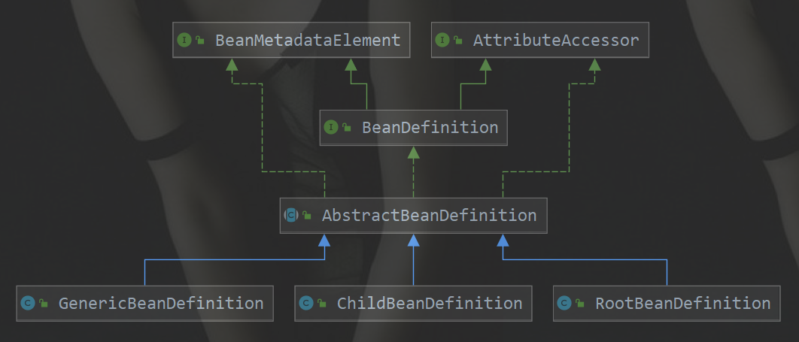

> 参考网址：<http://cmsblogs.com/?p=2731>

#### 目录

* [1. processBeanDefinition](#1)
* [2. parseBeanDefinitionElement](#2)
  * [2.1 parseBeanDefinitionElement](#2.1)
  * [2.2 createBeanDefinition](#2.2)
* [3. BeanDefinition](#3)
  * [3.1 BeanDefinition 的父关系](#3.1)
  * [3.2 BeanDefinition 的子关系](#3.2)
* [4.  Bean 标签属性](#4)
  * [4.1 基本属性：parseBeanDefinitionAttributes](#4.1)
  * [4.2 标签子元素](#4.2)
    * [4.2.1 meta 子元素：parseMetaElements](#4.2.1)
      * [4.2.1.1 addMetadataAttribute](#4.2.1.1)
      * [4.2.1.2  getAttribute](#4.2.1.2)
    * [4.2.2 lookup-method 子元素：parseLookupOverrideSubElements](#4.2.2)
      * [4.2.2.1 示例](#4.2.2.1)
      * [4.2.2.2 parseLookupOverrideSubElements](#4.2.2.2)
    * [4.2.3 replace-method 子元素：parseReplacedMethodSubElements](#4.2.3)
      * [4.2.3.1 示例](#4.2.3.1)
      * [4.2.3.2 parseReplacedMethodSubElements](#4.2.3.2)
    * [4.2.4 constructor-arg 子元素](#4.2.4)
      * [4.2.4.1 示例](#4.2.4.1)
      * [4.2.4.2 parseConstructorArgElements](#4.2.4.2)
      * [4.2.4.3 parseConstructorArgElement](#4.2.4.3)
      * [4.2.4.4 parsePropertyValue](#4.2.4.4)
      * [4.2.4.5 parsePropertySubElement](#4.2.4.5)
    * [4.2.5 property 子元素](#4.2.5)
      * [4.2.5.1 示例](#4.2.5.1)
      * [4.2.5.2 parsePropertyElements](#4.2.5.2)
      * [4.2.5.3 parsePropertyElement](#4.2.5.3)
    * [4.2.6 qualifier 子元素](#4.2.6)
      * [4.2.6.1 parseQualifierElement](#4.2.6.1)
  * [4.3 自定义标签](#4.3)
    * [4.3.1 decorateBeanDefinitionIfRequired](#4.3.1)
    * [4.3.2 decorateIfRequired](#4.3.2)
* [5. 总结](#5)

****

&nbsp;&nbsp; [【【Spring 5.0.x】—— 6. IoC 之注册 BeanDefinitions]() 中分析到，`Spring` 中有两种解析 `Bean` 的方式：

* 如果根节点或者子节点采用默认命名空间的话，则调用 `#parseDefaultElement(...)` 方法，进行**默认**标签解析
* 否则，调用 `BeanDefinitionParserDelegate#parseCustomElement(...)` 方法，进行**自定义**解析。

```java
// org.springframework.beans.factory.xml.DefaultBeanDefinitionDocumentReader.java

public static final String IMPORT_ELEMENT = "import";
public static final String ALIAS_ATTRIBUTE = "alias";
public static final String BEAN_ELEMENT = BeanDefinitionParserDelegate.BEAN_ELEMENT;
public static final String NESTED_BEANS_ELEMENT = "beans";

private void parseDefaultElement(Element ele, BeanDefinitionParserDelegate delegate) {
	if (delegate.nodeNameEquals(ele, IMPORT_ELEMENT)) {
		// 对 <import> 标签进行处理
		importBeanDefinitionResource(ele);
	}
	else if (delegate.nodeNameEquals(ele, ALIAS_ELEMENT)) {
		// 对 <alias> 标签进行处理
		processAliasRegistration(ele);
	}
	else if (delegate.nodeNameEquals(ele, BEAN_ELEMENT)) {
		// 对 <bean> 标签进行处理
		processBeanDefinition(ele, delegate);
	}
	else if (delegate.nodeNameEquals(ele, NESTED_BEANS_ELEMENT)) {
		// 对 <beans> 标签进行处理
		doRegisterBeanDefinitions(ele);
	}
}
```

&nbsp;&nbsp; 默认标签的解析是在 `#parseDefaultElement(...)`方法中进行的，分别对4种不同的标签(  `import`、`alias`、`bean`、`beans` )做了不同的处理。下面我们从默认标签的`bean`标签开始。

<span id="1"></span>

# 1. processBeanDefinition

 &nbsp;&nbsp; 在方法 `#parseDefaultElement(...)` 方法中，如果遇到标签为 `bean` 时，则调用 `#processBeanDefinition(Element ele, BeanDefinitionParserDelegate delegate)` 方法，进行 `bean` 标签的解析及注册。 

```java
// org.springframework.beans.factory.xml.DefaultBeanDefinitionDocumentReader.java

/**
 * 进行 bean 标签解析
 */
protected void processBeanDefinition(Element ele, BeanDefinitionParserDelegate delegate) {
	/*
	 * <1> 委托BeanDefinitionParserDelegate进行解析
	 * 如果解析成功，则返回 BeanDefinitionHolder 对象。BeanDefinitionHolder 包含了配置文件配置的各种属性（id,name,class,alias）
	 * 如果解析失败，则返回 null
	 */
	BeanDefinitionHolder bdHolder = delegate.parseBeanDefinitionElement(ele);
	if (bdHolder != null) {
		// <2> 进行自定义标签处理
		bdHolder = delegate.decorateBeanDefinitionIfRequired(ele, bdHolder);
		try {
			// <3> 进行 BeanDefinition 的注册
			BeanDefinitionReaderUtils.registerBeanDefinition(bdHolder, getReaderContext().getRegistry());
		}
		catch (BeanDefinitionStoreException ex) {
			getReaderContext().error("Failed to register bean definition with name '" +
					bdHolder.getBeanName() + "'", ele, ex);
		}
		// <4> 发出响应事件，通知相关的监听器，已完成该 Bean 标签的解析。
		getReaderContext().fireComponentRegistered(new BeanComponentDefinition(bdHolder));
	}
}
```

整个过程分为四个步骤：

1. 调用`BeanDefinitionParserDelegate#parseBeanDefinitionElement(Element ele, BeanDefinitionParserDelegate delegate)`方法，进行元素解析。

   * 如果解析**失败**，则返回 `null`，错误由 `ProblemReporter` 处理
   * 如果解析**成功**，则返回 `BeanDefinitionHolder` 实例 `bdHolder` 。`BeanDefinitionHolder` **包含了配置文件配置的各种属性（`id`,`name`,`class`,`alias`）**
   * 详细解析，见 [「2. parseBeanDefinitionElement」](#2) 
2. 若实例 `bdHolder` 不为空，则调用 `BeanDefinitionParserDelegate#decorateBeanDefinitionIfRequired(Element ele, BeanDefinitionHolder bdHolder)` 方法，进行**自定义标签处理**。
3. 解析完成后，则调用 `BeanDefinitionReaderUtils#registerBeanDefinition(BeanDefinitionHolder definitionHolder, BeanDefinitionRegistry registry)` 方法，对 `bdHolder` 进行 `BeanDefinition` 的注册。
4. 发出响应事件，通知相关的监听器，完成 Bean 标签解析。

<span id="2"></span>

# 2. parseBeanDefinitionElement

 &nbsp;&nbsp; `BeanDefinitionParserDelegate#parseBeanDefinitionElement(Element ele, BeanDefinitionParserDelegate delegate)` 方法，进行 `<bean>` 元素解析 

```java
// org.springframework.beans.factory.xml.BeanDefinitionParserDelegate.java

@Nullable
public BeanDefinitionHolder parseBeanDefinitionElement(Element ele) {
	return parseBeanDefinitionElement(ele, null);
}

@Nullable
public BeanDefinitionHolder parseBeanDefinitionElement(Element ele, @Nullable BeanDefinition containingBean) {

	// <1> 解析 id 和 name 属性
	String id = ele.getAttribute(ID_ATTRIBUTE);
	String nameAttr = ele.getAttribute(NAME_ATTRIBUTE);

	// <1> 计算别名集合
	List<String> aliases = new ArrayList<>();
	if (StringUtils.hasLength(nameAttr)) {
		String[] nameArr = StringUtils.tokenizeToStringArray(nameAttr, MULTI_VALUE_ATTRIBUTE_DELIMITERS);
		aliases.addAll(Arrays.asList(nameArr));
	}

	// <3.1> beanName ，优先，使用 id
	String beanName = id;

	// <3.2> beanName ，其次，使用 aliases 的第一个
	if (!StringUtils.hasText(beanName) && !aliases.isEmpty()) {
		beanName = aliases.remove(0);
		if (logger.isDebugEnabled()) {
			logger.debug("No XML 'id' specified - using '" + beanName +
					"' as bean name and " + aliases + " as aliases");
		}
	}

	if (containingBean == null) {
		// <2> 检查 beanName 的唯一性
		checkNameUniqueness(beanName, aliases, ele);
	}

	// <4> 解析属性，构造 AbstractBeanDefinition 对象
	AbstractBeanDefinition beanDefinition = parseBeanDefinitionElement(ele, beanName, containingBean);
	if (beanDefinition != null) {
		// <3.3> beanName ，再次，使用 beanName 生成规则
		if (!StringUtils.hasText(beanName)) {
			try {
				if (containingBean != null) {
					// <3.3> 生成唯一的 beanName
					beanName = BeanDefinitionReaderUtils.generateBeanName(
							beanDefinition, this.readerContext.getRegistry(), true);
				}
				else {
					// <3.3> 生成唯一的 beanName
					beanName = this.readerContext.generateBeanName(beanDefinition);

					String beanClassName = beanDefinition.getBeanClassName();
					if (beanClassName != null &&
							beanName.startsWith(beanClassName) && beanName.length() > beanClassName.length() &&
							!this.readerContext.getRegistry().isBeanNameInUse(beanClassName)) {
						aliases.add(beanClassName);
					}
				}
				if (logger.isDebugEnabled()) {
					logger.debug("Neither XML 'id' nor 'name' specified - " +
							"using generated bean name [" + beanName + "]");
				}
			}
			catch (Exception ex) {
				error(ex.getMessage(), ele);
				return null;
			}
		}
		String[] aliasesArray = StringUtils.toStringArray(aliases);

		// <5> 创建 BeanDefinitionHolder 对象
		return new BeanDefinitionHolder(beanDefinition, beanName, aliasesArray);
	}

	return null;
}
```

 &nbsp;&nbsp; 这里还没有对 `bean` 标签进行解析，只是在解析动作之前做了一些功能架构，主要的工作有：

*  `<1>` 处，解析 `id`、`name` 属性，确定 `aliases` 集合 

*  `<2>` 处，检测 `beanName` 是否唯一

  ```java
  // org.springframework.beans.factory.xml.BeanDefinitionParserDelegate.java
  
  /**
   * 已使用 Bean 名字的集合
   */
  private final Set<String> usedNames = new HashSet<>();
  
  /**
   * 检测 beanName 是否唯一
   */
  protected void checkNameUniqueness(String beanName, List<String> aliases, Element beanElement) {
  	String foundName = null;
  
  	if (StringUtils.hasText(beanName) && this.usedNames.contains(beanName)) {
  		foundName = beanName;
  	}
  	if (foundName == null) {
  		foundName = CollectionUtils.findFirstMatch(this.usedNames, aliases);
  	}
  	// 若已使用，使用 problemReporter 提示错误
  	if (foundName != null) {
  		error("Bean name '" + foundName + "' is already used in this <beans> element", beanElement);
  	}
  
  	// 添加到 usedNames 集合
  	this.usedNames.add(beanName);
  	this.usedNames.addAll(aliases);
  }
  ```

  &nbsp;&nbsp;  这里有必要说下 `beanName` 的命名规则 

  * `<3.1>` 处，如果 `id` 不为空，则 `beanName = id` 。
  * `<3.2>` 处，如果 `id` 为空，但是 `aliases` 不空，则 `beanName` 为 `aliases` 的**第一个**元素
  * `<3.3>` 处，如果两者都为空，则根据**默认规则**来设置 `beanName` 。

*  `<4>` 处，调用 `#parseBeanDefinitionElement(Element ele, String beanName, BeanDefinition containingBean)` 方法，对属性进行解析并封装成 `AbstractBeanDefinition` 实例 `beanDefinition` 。见 [「2.1 parseBeanDefinitionElement」](#2.1) 。 

*  `<5>` 处，根据所获取的信息（`beanName`、`aliases`、`beanDefinition`）构造 `BeanDefinitionHolder` 实例对象并返回。其中，`BeanDefinitionHolder` 的简化代码如下： 

  ```java
  // org.springframework.beans.factory.config.BeanDefinitionHolder.java
  
  /**
   * BeanDefinition 对象
   */
  private final BeanDefinition beanDefinition;
  
  /**
   * Bean 名字
   */
  private final String beanName;
  
  /**
   * 别名集合
   */
  @Nullable
  private final String[] aliases;
  ```

<span id="2.1"></span>
## 2.1 parseBeanDefinitionElement

 &nbsp;&nbsp; `#parseBeanDefinitionElement(Element ele, String beanName, BeanDefinition containingBean)` 方法，对属性进行解析并封装成 `AbstractBeanDefinition` 实例

```java
// org.springframework.beans.factory.xml.BeanDefinitionParserDelegate.java

@Nullable
public AbstractBeanDefinition parseBeanDefinitionElement(
		Element ele, String beanName, @Nullable BeanDefinition containingBean) {

	this.parseState.push(new BeanEntry(beanName));

	// 解析 class 属性
	String className = null;
	if (ele.hasAttribute(CLASS_ATTRIBUTE)) {
		className = ele.getAttribute(CLASS_ATTRIBUTE).trim();
	}

	// 解析 parent 属性
	String parent = null;
	if (ele.hasAttribute(PARENT_ATTRIBUTE)) {
		parent = ele.getAttribute(PARENT_ATTRIBUTE);
	}

	try {
		// 创建用于承载属性的 AbstractBeanDefinition 实例
		AbstractBeanDefinition bd = createBeanDefinition(className, parent);

		// 解析默认 bean 的各种属性
		parseBeanDefinitionAttributes(ele, beanName, containingBean, bd);
		bd.setDescription(DomUtils.getChildElementValueByTagName(ele, DESCRIPTION_ELEMENT));

		/*
		 * 下面是解析 <bean>......</bean> 内部的子元素，
    	 * 解析出来以后的信息都放到 bd 的属性中
		 */

		// 解析元数据 <meta />
		parseMetaElements(ele, bd);
		// 解析 lookup-method 属性 <lookup-method />
		parseLookupOverrideSubElements(ele, bd.getMethodOverrides());
		// 解析 replaced-method 属性 <replaced-method />
		parseReplacedMethodSubElements(ele, bd.getMethodOverrides());

		// 解析构造函数参数 <constructor-arg />
		parseConstructorArgElements(ele, bd);
		// 解析 property 子元素 <property />
		parsePropertyElements(ele, bd);
		// 解析 qualifier 子元素 <qualifier />
		parseQualifierElements(ele, bd);

		bd.setResource(this.readerContext.getResource());
		bd.setSource(extractSource(ele));

		return bd;
	}
	catch (ClassNotFoundException ex) {
		error("Bean class [" + className + "] not found", ele, ex);
	}
	catch (NoClassDefFoundError err) {
		error("Class that bean class [" + className + "] depends on not found", ele, err);
	}
	catch (Throwable ex) {
		error("Unexpected failure during bean definition parsing", ele, ex);
	}
	finally {
		this.parseState.pop();
	}

	return null;
}
```

 &nbsp;&nbsp; 至此，`bean` 标签的所有属性我们都可以看到其解析的过程，也就说到这里我们已经解析一个基本可用的 `BeanDefinition` 。 

<span id="2.2"></span>
## 2.2 createBeanDefinition

&nbsp;&nbsp;  `#createBeanDefinition(String className, String parentName)` 方法，创建 `AbstractBeanDefinition` 对象。 

```java
// org.springframework.beans.factory.xml.BeanDefinitionParserDelegate.java

protected AbstractBeanDefinition createBeanDefinition(@Nullable String className, @Nullable String parentName)
		throws ClassNotFoundException {

	return BeanDefinitionReaderUtils.createBeanDefinition(
			parentName, className, this.readerContext.getBeanClassLoader());
}
```

&nbsp;&nbsp;  委托 `BeanDefinitionReaderUtils` 创建

```java
// org.springframework.beans.factory.support.BeanDefinitionReaderUtils.java

public static AbstractBeanDefinition createBeanDefinition(
		@Nullable String parentName, @Nullable String className, @Nullable ClassLoader classLoader) throws ClassNotFoundException {

	// 创建 GenericBeanDefinition 对象
	GenericBeanDefinition bd = new GenericBeanDefinition();

	// 设置 parentName
	bd.setParentName(parentName);
	if (className != null) {
		if (classLoader != null) {
			// 设置 beanClass
			bd.setBeanClass(ClassUtils.forName(className, classLoader));
		}
		else {
			// 设置 beanClassName
			bd.setBeanClassName(className);
		}
	}
	return bd;
}
```

&nbsp;&nbsp;  该方法主要是，创建 `GenericBeanDefinition` 对象，并设置 `parentName`、`className`、`beanClass` 属性。 

<span id="3"></span>
# 3. BeanDefinition

 `org.springframework.beans.factory.config.BeanDefinition `，是一个接口， 它描述了一个 `Bean` 实例的**定义**，包括**属性值、构造方法值和继承自它的类的更多信息** 。

```java
// org.springframework.beans.factory.config.BeanDefinition.java

/**
 * 单例 singleton
 */
String SCOPE_SINGLETON = ConfigurableBeanFactory.SCOPE_SINGLETON;

/**
 * 原型 prototype
 */
String SCOPE_PROTOTYPE = ConfigurableBeanFactory.SCOPE_PROTOTYPE;


int ROLE_APPLICATION = 0;
int ROLE_SUPPORT = 1;
int ROLE_INFRASTRUCTURE = 2;

void setParentName(@Nullable String parentName);
@Nullable
String getParentName();

void setBeanClassName(@Nullable String beanClassName);
@Nullable
String getBeanClassName();

void setScope(@Nullable String scope);
@Nullable
String getScope();

void setLazyInit(boolean lazyInit);
boolean isLazyInit();

void setDependsOn(@Nullable String... dependsOn);
@Nullable
String[] getDependsOn();

void setAutowireCandidate(boolean autowireCandidate);
boolean isAutowireCandidate();

void setPrimary(boolean primary);
boolean isPrimary();

void setFactoryBeanName(@Nullable String factoryBeanName);
@Nullable
String getFactoryBeanName();

void setFactoryMethodName(@Nullable String factoryMethodName);
@Nullable
String getFactoryMethodName();

ConstructorArgumentValues getConstructorArgumentValues();
default boolean hasConstructorArgumentValues() {
	return !getConstructorArgumentValues().isEmpty();
}

MutablePropertyValues getPropertyValues();
default boolean hasPropertyValues() {
	return !getPropertyValues().isEmpty();
}

void setInitMethodName(@Nullable String initMethodName);
@Nullable
String getInitMethodName();

void setDestroyMethodName(@Nullable String destroyMethodName);
@Nullable
String getDestroyMethodName();

void setRole(int role);
int getRole();

void setDescription(@Nullable String description);
@Nullable
String getDescription();

boolean isSingleton();

boolean isPrototype();

boolean isAbstract();

@Nullable
String getResourceDescription();

@Nullable
BeanDefinition getOriginatingBeanDefinition();
```

&nbsp;&nbsp; `<bean>`元素标签拥有的**各种配置属性（class,scope,lazy-init）**，`BeanDefinition`接口中都提供了**相应的`beanClass`、`scope`、`lazyInit`属性**，`BeanDefinition`和`<bean>`中的属性是**一一对应**的。

<span id="3.1"></span>
## 3.1 BeanDefinition 的父关系

&nbsp;&nbsp; `BeanDefinition` 继承 `AttributeAccessor` 和 `BeanMetadataElement` 接口。两个接口定义如下：

* `org.springframework.cor.AttributeAccessor` 接口，定义了**与其它对象的（元数据）进行连接和访问的约定，即对属性的修改，包括获取、设置、删除**。

```java
// org.springframework.core.AttributeAccessor.java

public interface AttributeAccessor {

	void setAttribute(String name, @Nullable Object value);

	@Nullable
	Object getAttribute(String name);

	@Nullable
	Object removeAttribute(String name);

	boolean hasAttribute(String name);

	String[] attributeNames();

}
```

*  `org.springframework.beans.BeanMetadataElement` 接口，`Bean` **元对象持有的配置元素**可以通过 `#getSource()` 方法来获取。 

```java
// org.springframework.beans.BeanMetadataElement.java

public interface BeanMetadataElement {

	@Nullable
	Object getSource();

}
```

<span id="3.2"></span>
## 3.2 BeanDefinition 的子关系

.<center></center>

我们常用的三个实现类有：

* `org.springframework.beans.factory.support.ChildBeanDefinition`
* `org.springframework.beans.factory.support.RootBeanDefinition`
* `org.springframework.beans.factory.support.GenericBeanDefinition`
* `ChildBeanDefinition`、`RootBeanDefinition`、`GenericBeanDefinition` 三者都继承 `AbstractBeanDefinition` 抽象类，即 `AbstractBeanDefinition` 对三个子类的共同的类信息进行抽象。
* 如果配置文件中定义了父 `<bean>` 和 子 `<bean>` ，则父 `<bean>` 用 `RootBeanDefinition` 表示，子 `<bean>` 用 `ChildBeanDefinition `表示，而没有父 `<bean>` 的就使用`RootBeanDefinition` 表示。
* `GenericBeanDefinition` 为一站式服务类。

<span id="4"></span>
# 4.  Bean 标签属性

&nbsp;&nbsp; 继续解析我们的`<bean>`标签，创建 `GenericBeanDefinition` 实例用来承载`<bean>`标签的属性后，我们需要解析**各种属性并设置**。解析又分为 **基本属性与子元素**。

<span id="4.1"></span>
## 4.1 基本属性：parseBeanDefinitionAttributes

&nbsp;&nbsp; 调用 `#parseBeanDefinitionAttributes(Element ele, String beanName, BeanDefinition containingBean, AbstractBeanDefinition bd)` 方法，该方法将创建好的 `GenericBeanDefinition` 实例当做参数，对 `bean` 标签的所有**基本属性**进行解析。

```java
// org.springframework.beans.factory.xml.BeanDefinitionParserDelegate.java

public AbstractBeanDefinition parseBeanDefinitionAttributes(Element ele, String beanName,
		@Nullable BeanDefinition containingBean, AbstractBeanDefinition bd) {

	// 解析 scope 属性
	if (ele.hasAttribute(SINGLETON_ATTRIBUTE)) {
		error("Old 1.x 'singleton' attribute in use - upgrade to 'scope' declaration", ele);
	}else if (ele.hasAttribute(SCOPE_ATTRIBUTE)) {
		bd.setScope(ele.getAttribute(SCOPE_ATTRIBUTE));
	}else if (containingBean != null) {
		// 和父类 scope 一样
		bd.setScope(containingBean.getScope());
	}

	// 解析 abstract 属性
	if (ele.hasAttribute(ABSTRACT_ATTRIBUTE)) {
		bd.setAbstract(TRUE_VALUE.equals(ele.getAttribute(ABSTRACT_ATTRIBUTE)));
	}

	// 解析 lazy-init 属性
	String lazyInit = ele.getAttribute(LAZY_INIT_ATTRIBUTE);
	if (isDefaultValue(lazyInit)) {
		lazyInit = this.defaults.getLazyInit();
	}
	bd.setLazyInit(TRUE_VALUE.equals(lazyInit));

	// 解析 autowire 属性
	String autowire = ele.getAttribute(AUTOWIRE_ATTRIBUTE);
	bd.setAutowireMode(getAutowireMode(autowire));

	// 解析 depends-on 属性
	if (ele.hasAttribute(DEPENDS_ON_ATTRIBUTE)) {
		String dependsOn = ele.getAttribute(DEPENDS_ON_ATTRIBUTE);
		bd.setDependsOn(StringUtils.tokenizeToStringArray(dependsOn, MULTI_VALUE_ATTRIBUTE_DELIMITERS));
	}

	// 解析 autowire-candidate 属性
	String autowireCandidate = ele.getAttribute(AUTOWIRE_CANDIDATE_ATTRIBUTE);
	if (isDefaultValue(autowireCandidate)) {
		String candidatePattern = this.defaults.getAutowireCandidates();
		if (candidatePattern != null) {
			String[] patterns = StringUtils.commaDelimitedListToStringArray(candidatePattern);
			bd.setAutowireCandidate(PatternMatchUtils.simpleMatch(patterns, beanName));
		}
	}else {
		bd.setAutowireCandidate(TRUE_VALUE.equals(autowireCandidate));
	}

	// 解析 primary 标签
	if (ele.hasAttribute(PRIMARY_ATTRIBUTE)) {
		bd.setPrimary(TRUE_VALUE.equals(ele.getAttribute(PRIMARY_ATTRIBUTE)));
	}

	// 解析 init-method 属性
	if (ele.hasAttribute(INIT_METHOD_ATTRIBUTE)) {
		String initMethodName = ele.getAttribute(INIT_METHOD_ATTRIBUTE);
		bd.setInitMethodName(initMethodName);
	}
	else if (this.defaults.getInitMethod() != null) {
		bd.setInitMethodName(this.defaults.getInitMethod());
		bd.setEnforceInitMethod(false);
	}

	// 解析 destroy-method 属性
	if (ele.hasAttribute(DESTROY_METHOD_ATTRIBUTE)) {
		String destroyMethodName = ele.getAttribute(DESTROY_METHOD_ATTRIBUTE);
		bd.setDestroyMethodName(destroyMethodName);
	}
	else if (this.defaults.getDestroyMethod() != null) {
		bd.setDestroyMethodName(this.defaults.getDestroyMethod());
		bd.setEnforceDestroyMethod(false);
	}

	// 解析 factory-method 属性
	if (ele.hasAttribute(FACTORY_METHOD_ATTRIBUTE)) {
		bd.setFactoryMethodName(ele.getAttribute(FACTORY_METHOD_ATTRIBUTE));
	}
	if (ele.hasAttribute(FACTORY_BEAN_ATTRIBUTE)) {
		bd.setFactoryBeanName(ele.getAttribute(FACTORY_BEAN_ATTRIBUTE));
	}

	return bd;
}
```

<span id="4.2"></span>
## 4.2 标签子元素

&nbsp;&nbsp; 上面已经完成了对 `<bean>` 标签基本属性的解析工作。下面我们分析**子元素**的解析。

<span id="4.2.1"></span>
### 4.2.1 meta 子元素：parseMetaElements

&nbsp;&nbsp;  `<meta>`子元素标签表示元数据，定义如下

>  **meta** ：元数据。当需要使用里面的信息时可以通过 key 获取。 

 &nbsp;&nbsp; `<meta>` 所声明的 `key` 并不会在 `Bean` 中体现，只是一个**额外的声明**，当我们需要使用里面的信息时，通过调用 `BeanDefinition` 的 `#getAttribute(String name)` 方法来获取。 通过调用 `BeanDefinitionParserDelegate#parseMetaElements(lement ele, BeanMetadataAttributeAccessor attributeAccessor)` 对该子元素完成解析

```java
// org.springframework.beans.factory.xml.BeanDefinitionParserDelegate.java

/**
 * 解析meta标签
 * @param ele
 * @param attributeAccessor
 */
public void parseMetaElements(Element ele, BeanMetadataAttributeAccessor attributeAccessor) {
	NodeList nl = ele.getChildNodes();
	// 遍历子节点
	for (int i = 0; i < nl.getLength(); i++) {
		Node node = nl.item(i);
		/* <meta key="special-data" value="sprecial stragey" /> */
		// 提取 标签名为 meta
		if (isCandidateElement(node) && nodeNameEquals(node, META_ELEMENT)) {
			Element metaElement = (Element) node;
            // key
			String key = metaElement.getAttribute(KEY_ATTRIBUTE);
            // value
			String value = metaElement.getAttribute(VALUE_ATTRIBUTE);
			// 创建 BeanMetadataAttribute 对象
			BeanMetadataAttribute attribute = new BeanMetadataAttribute(key, value);
			attribute.setSource(extractSource(metaElement));
			// 添加到 BeanMetadataAttributeAccessor(BeanDefinition) 中
			attributeAccessor.addMetadataAttribute(attribute);
		}
	}
}
```

 &nbsp;&nbsp; 解析过程较为简单，获取相应的 `key - value` 构建 `BeanMetadataAttribute` 对象，然后调用 `BeanMetadataAttributeAccessor#addMetadataAttribute(BeanMetadataAttribute)` 方法，添加 `BeanMetadataAttribute` 加入到 `AbstractBeanDefinition` 中。

> AbstractBeanDefinition 继承 BeanMetadataAttributeAccessor 类
> BeanMetadataAttributeAccessor 继承 AttributeAccessorSupport 类。 

<span id="4.2.1.1"></span>
#### 4.2.1.1 addMetadataAttribute

 &nbsp;&nbsp; 调用 `BeanMetadataAttributeAccessor#addMetadataAttribute(BeanMetadataAttribute)` 方法，添加 `BeanMetadataAttribute` 加入到 `AbstractBeanDefinition` 中。 

```java
// org.springframework.beans.BeanMetadataAttributeAccessor.java

public void addMetadataAttribute(BeanMetadataAttribute attribute) {
	super.setAttribute(attribute.getName(), attribute);
}
```

&nbsp;&nbsp;  委托 `AttributeAccessorSupport` 实现 

```java
// org.springframework.core.AttributeAccessorSupport.java

private final Map<String, Object> attributes = new LinkedHashMap<>();

@Override
public void setAttribute(String name, @Nullable Object value) {
	Assert.notNull(name, "Name must not be null");
	if (value != null) {
		this.attributes.put(name, value);
	} else {
		removeAttribute(name);
	}
}
```

 &nbsp;&nbsp; `org.springframework.core.AttributeAccessorSupport` ，是**接口 `AttributeAccessor` 的实现者**。 `AttributeAccessor` 接口定义了与**其他对象的元数据进行连接和访问的约定**，可以通过该接口对属性进行**获取、设置、删除**操作。 

<span id="4.2.1.2"></span>
#### 4.2.1.2  getAttribute

 &nbsp;&nbsp; 设置元数据后，则可以通过调用  ``BeanMetadataAttributeAccessor#getAttribute(String name)` 方法来获取属性。 

```java
// org.springframework.beans.BeanMetadataAttributeAccessor.java

@Override
@Nullable
public Object getAttribute(String name) {
	BeanMetadataAttribute attribute = (BeanMetadataAttribute) super.getAttribute(name);
	return (attribute != null ? attribute.getValue() : null);
}
```

&nbsp;&nbsp; 同样是通过委托 `AttributeAccessorSupport` 实现

```java
// org.springframework.core.AttributeAccessorSupport.java

private final Map<String, Object> attributes = new LinkedHashMap<>();

@Override
@Nullable
public Object getAttribute(String name) {
	Assert.notNull(name, "Name must not be null");
	return this.attributes.get(name);
}
```

<span id="4.2.2"></span>
### 4.2.2 lookup-method 子元素：parseLookupOverrideSubElements

&nbsp;&nbsp; `lookup-method`子元素我们通常称为**获取器注入**，定义如下

>  获取器注入，是把一个方法声明为返回某种类型的 `bean` 但实际要返回的 `bean` 是在配置文件里面配置的。该方法可以用于设计一些可插拔的功能上，解除程序依赖。 

<span id="4.2.2.1"></span>
#### 4.2.2.1 示例

下面我们先来看个示例

```java
public interface Car {

    void display();

}

public class Bmw implements Car{

    @Override
    public void display() {
        System.out.println("我是 BMW");
    }

}

public class Hongqi implements Car{

    @Override
    public void display() {
        System.out.println("我是 hongqi");
    }

}

public abstract class Display {

    public void display(){
        getCar().display();
    }
    
    public abstract Car getCar();

}

public static void main(String[] args) {
    ApplicationContext context = new ClassPathXmlApplicationContext("classpath:spring.xml");
    Display display = (Display) context.getBean("display");
    display.display();
}
```

&nbsp;&nbsp; `XML`配置如下

```java
<bean id="hongqi"  class="com.test.Hongqi" />
<bean id="bmw"  class="com.test.Bmw" />    
<bean id="display" class="com.test.Display">
    <lookup-method name="getCar" bean="hongqi"/>
</bean>
```

&nbsp;&nbsp; 运行结果为

```java
我是 hongqi
```

&nbsp;&nbsp; 如果将`lookup-method`子元素里的`bean`替换为 `bean="bmw" `，运行结果变为

```java
我是 BMW
```

<span id="4.2.2.2"></span>
#### 4.2.2.2 parseLookupOverrideSubElements

&nbsp;&nbsp; 通过上面的示例， 我们初步了解了 `looku-method` 子元素提供的功能了。其解析通过 `#parseLookupOverrideSubElements(Element beanEle, MethodOverrides overrides)` 方法

```java
// org.springframework.beans.factory.xml.BeanDefinitionParserDelegate.java

/**
 * 解析 子元素 lookup-method
 */
public void parseLookupOverrideSubElements(Element beanEle, MethodOverrides overrides) {
	NodeList nl = beanEle.getChildNodes();

	// 遍历子节点
	for (int i = 0; i < nl.getLength(); i++) {
		Node node = nl.item(i);

		/*
		 * <bean id="display" class="com.test.Display">
		 *   <lookup-method name="getCar" bean="hongqi"/>
		 * </bean>
		 */
		// 提取 标签名为 lookup-method
		if (isCandidateElement(node) && nodeNameEquals(node, LOOKUP_METHOD_ELEMENT)) {
			Element ele = (Element) node;
			// name
			String methodName = ele.getAttribute(NAME_ATTRIBUTE);
			// bean
			String beanRef = ele.getAttribute(BEAN_ELEMENT);
			// 创建 LookupOverride 对象
			LookupOverride override = new LookupOverride(methodName, beanRef);
			override.setSource(extractSource(ele));
			// 添加到 MethodOverrides 中
			overrides.addOverride(override);
		}
	}
}
```

&nbsp;&nbsp;  解析过程和 `meta` 子元素没有多大区别，同样是解析 `methodName`、`beanRef` 构造一个 `LookupOverride` 对象，然后记录到 `AbstractBeanDefinition` 中的 `methodOverrides` 属性中。

<span id="4.2.3"></span>
### 4.2.3 replace-method 子元素：parseReplacedMethodSubElements

`replace-method` 标签使用方法和 `lookup-method` 标签差不多，只不过替代方法的类需要实现 `org.springframework.beans.factory.support.MethodReplacer` 接口 。定义如下

>  可以在运行时调用新的方法替换现有的方法，还能动态的更新原有方法的逻辑。 

<span id="4.2.3.1"></span>
#### 4.2.3.1 示例

```java
public class Method {

    public void display(){
        System.out.println("我是原始方法");
    }

}

public class MethodReplace implements MethodReplacer {

    @Override
    public Object reimplement(Object obj, Method method, Object[] args) throws Throwable {
        System.out.println("我是替换方法");
        return null;
    }

}

public static void main(String[] args) {
    ApplicationContext context = new ClassPathXmlApplicationContext("classpath:spring.xml");
    Method method = (Method) context.getBean("method");
    method.display();
}
```

&nbsp;&nbsp; `XML`配置

```java
<bean id="methodReplace" class="com.test.MethodReplace"/>

<bean id="method" class="com.test.Method"/>
```

&nbsp;&nbsp; 运行结果

```java
我是原始方法
```

&nbsp;&nbsp; 增加 `replaced-method` 子元素

```java
<bean id="methodReplace" class="com.test.MethodReplace"/>

<bean id="method" class="com.test.Method">
    <replaced-method name="display" replacer="methodReplace"/>
</bean>
```

&nbsp;&nbsp; 运行结果变为

```java
我是替换方法
```

<span id="4.2.3.2"></span>
#### 4.2.3.2 parseReplacedMethodSubElements

&nbsp;&nbsp; 上面的示例演示了 `replaced-method` 子元素的用法，其解析通过 `#parseReplacedMethodSubElements(Element beanEle, MethodOverrides overrides)` 方法 

```java
// org.springframework.beans.factory.xml.BeanDefinitionParserDelegate.java

/**
 * 解析 子元素 replaced-method
 */
public void parseReplacedMethodSubElements(Element beanEle, MethodOverrides overrides) {
	NodeList nl = beanEle.getChildNodes();

	// 遍历子节点
	for (int i = 0; i < nl.getLength(); i++) {
		Node node = nl.item(i);

		/*
		 * <bean id="method" class="com.test.Method">
		 *   <replaced-method name="display" replacer="methodReplace"/>
		 * </bean>
		 */
		// 提取 标签名为 replace-method
		if (isCandidateElement(node) && nodeNameEquals(node, REPLACED_METHOD_ELEMENT)) {
			Element replacedMethodEle = (Element) node;
			// name
			String name = replacedMethodEle.getAttribute(NAME_ATTRIBUTE);
			// replacer
			String callback = replacedMethodEle.getAttribute(REPLACER_ATTRIBUTE);

			// 创建 ReplaceOverride 对象
			ReplaceOverride replaceOverride = new ReplaceOverride(name, callback);
			// arg-type 子标签
			List<Element> argTypeEles = DomUtils.getChildElementsByTagName(replacedMethodEle, ARG_TYPE_ELEMENT);
			for (Element argTypeEle : argTypeEles) {
				// arg-type 子标签的 match 属性
				String match = argTypeEle.getAttribute(ARG_TYPE_MATCH_ATTRIBUTE);
				match = (StringUtils.hasText(match) ? match : DomUtils.getTextValue(argTypeEle));
				if (StringUtils.hasText(match)) {
					replaceOverride.addTypeIdentifier(match);
				}
			}
			replaceOverride.setSource(extractSource(replacedMethodEle));
			// 添加到 MethodOverrides 中
			overrides.addOverride(replaceOverride);
		}
	}
}
```

&nbsp;&nbsp;  该子元素和 `lookup-method` 标签的解析过程差不多，同样是提取 `name` 和 `replacer` 属性构建 `ReplaceOverride` 对象，然后记录到 `AbstractBeanDefinition` 中的 `methodOverrides` 属性中。

<span id="4.2.4"></span>
### 4.2.4 constructor-arg 子元素

&nbsp;&nbsp; `constructor-arg`子元素主要用来解析构造函数。

<span id="4.2.4.1"></span>
#### 4.2.4.1 示例

```java
public class StudentService {

    private String name;

    private Integer age;

    private BookService bookService;

    StudentService(String name, Integer age, BookService bookService){

        this.name = name;

        this.age = age;

        this.bookService = bookService;

    }

}
```

&nbsp;&nbsp; `XML`配置

```java
<bean id="bookService" class="com.test.BookService"/>
    
<bean id="studentService" class="com.test.StudentService">
    <constructor-arg index="0" value="java"/>
    <constructor-arg name="age" value="20"/>
    <constructor-arg name="bookService" ref="bookService"/>
</bean>
```

 &nbsp;&nbsp; StudentService 定义一个构造函数，配置文件中使用 `constructor-arg` 元素对其配置，该元素可以实现对 StudentService 自动寻找对应的构造函数，并在初始化的时候将值当做参数进行设置。

<span id="4.2.4.2"></span>
#### 4.2.4.2 parseConstructorArgElements

&nbsp;&nbsp;  `#parseConstructorArgElements(Element beanEle, BeanDefinition bd)` 方法，完成 `constructor-arg` 子元素的解析 

```java
// org.springframework.beans.factory.xml.BeanDefinitionParserDelegate.java

/**
 * 解析 子元素 constructor-arg
 */
public void parseConstructorArgElements(Element beanEle, BeanDefinition bd) {
	NodeList nl = beanEle.getChildNodes();
	for (int i = 0; i < nl.getLength(); i++) {
		Node node = nl.item(i);
        // 标签名为 constructor-arg
		if (isCandidateElement(node) && nodeNameEquals(node, CONSTRUCTOR_ARG_ELEMENT)) {
			// 解析 constructor-arg
			parseConstructorArgElement((Element) node, bd);
		}
	}
}
```

&nbsp;&nbsp;  遍历所有子元素，如果为 `constructor-arg` 标签，则调用 `#parseConstructorArgElement(Element ele, BeanDefinition bd)` 方法，进行解析。 

<span id="4.2.4.3"></span>
#### 4.2.4.3 parseConstructorArgElement

```java
// org.springframework.beans.factory.xml.BeanDefinitionParserDelegate.java

private final ParseState parseState = new ParseState();

/**
 * 解析 constructor-arg 子元素
 */
public void parseConstructorArgElement(Element ele, BeanDefinition bd) {
	// 提取 index、type、name 属性值
	String indexAttr = ele.getAttribute(INDEX_ATTRIBUTE);
	String typeAttr = ele.getAttribute(TYPE_ATTRIBUTE);
	String nameAttr = ele.getAttribute(NAME_ATTRIBUTE);
	if (StringUtils.hasLength(indexAttr)) {
		// 如果有 index
		try {
			int index = Integer.parseInt(indexAttr);
			if (index < 0) {
				error("'index' cannot be lower than 0", ele);
			}else {
				try {
					// <1>
					this.parseState.push(new ConstructorArgumentEntry(index));
					// <2> 解析 ele 对应属性元素
					Object value = parsePropertyValue(ele, bd, null);
					// <3> 根据解析的属性元素构造一个 ValueHolder 对象
					ConstructorArgumentValues.ValueHolder valueHolder = new ConstructorArgumentValues.ValueHolder(value);
					if (StringUtils.hasLength(typeAttr)) {
						valueHolder.setType(typeAttr);
					}
					if (StringUtils.hasLength(nameAttr)) {
						valueHolder.setName(nameAttr);
					}
					valueHolder.setSource(extractSource(ele));
					// 不允许重复指定相同参数(index相同)
					if (bd.getConstructorArgumentValues().hasIndexedArgumentValue(index)) {
						error("Ambiguous constructor-arg entries for index " + index, ele);
					}else {
						// <4> 加入到 indexedArgumentValues 中
						bd.getConstructorArgumentValues().addIndexedArgumentValue(index, valueHolder);
					}
				}
				finally {
					this.parseState.pop();
				}
			}
		}
		catch (NumberFormatException ex) {
			error("Attribute 'index' of tag 'constructor-arg' must be an integer", ele);
		}
	}else {
		// 如果没有 index，则忽略属性，自动寻找
		try {
			// <1>
			this.parseState.push(new ConstructorArgumentEntry());
			// <2> 解析 ele 对应属性元素
			Object value = parsePropertyValue(ele, bd, null);
			// <3> 根据解析的属性元素构造一个 ValueHolder 对象
			ConstructorArgumentValues.ValueHolder valueHolder = new ConstructorArgumentValues.ValueHolder(value);
			if (StringUtils.hasLength(typeAttr)) {
				valueHolder.setType(typeAttr);
			}
			if (StringUtils.hasLength(nameAttr)) {
				valueHolder.setName(nameAttr);
			}
			valueHolder.setSource(extractSource(ele));
			// <4> 加入到 indexedArgumentValues 中
			bd.getConstructorArgumentValues().addGenericArgumentValue(valueHolder);
		}
		finally {
			this.parseState.pop();
		}
	}
}
```

 &nbsp;&nbsp; 首先获取 `index`、`type`、`name` 三个属性值，然后根据是否存在 `index` 来区分，执行后续逻辑。其实两者逻辑都**差不多**，总共分为如下几个步骤（以有 `index` 为例）

1. 在 `<1>` 处，构造 `ConstructorArgumentEntry` 对象并将其加入到 `ParseState` 队列中。**`ConstructorArgumentEntry` 表示构造函数的参数**。
2. 在 `<2>` 处，调用 `#parsePropertyValue(Element ele, BeanDefinition bd, String propertyName)` 方法，解析 `constructor-arg` 子元素，返回结果值。见 [「4.2.4.4 parsePropertyValue」](#4.2.4.4) 。
3. 在 `<3>` 处，根据解析的结果值，构造`ConstructorArgumentValues.ValueHolder` 实例对象，并将 `type`、`name` 设置到 `ValueHolder` 中
4. 在 `<4>` 处，最后，将` ValueHolder` 实例对象添加到 `indexedArgumentValues` 集合中。

&nbsp;&nbsp; 无 `index` 的处理逻辑差不多，只有几点不同：

* 构造 `ConstructorArgumentEntry` 对象时是调用**无参**构造函数
* 最后是将 `ValueHolder` 实例添加到 `genericArgumentValues` 集合中。

<span id="4.2.4.4"></span>
#### 4.2.4.4 parsePropertyValue

&nbsp;&nbsp; 调用 `#parsePropertyValue(Element ele, BeanDefinition bd, String propertyName)` 方法，解析 `constructor-arg` 子元素，返回结果值。

```java
// org.springframework.beans.factory.xml.BeanDefinitionParserDelegate.java

@Nullable
public Object parsePropertyValue(Element ele, BeanDefinition bd, @Nullable String propertyName) {
	String elementName = (propertyName != null ?
			"<property> element for property '" + propertyName + "'" :
			"<constructor-arg> element");

	// <1> 查找子节点中，是否有 ref、value、list 等元素
	NodeList nl = ele.getChildNodes();
	Element subElement = null;
	for (int i = 0; i < nl.getLength(); i++) {
		Node node = nl.item(i);
		// meta 、description 不处理
		if (node instanceof Element && !nodeNameEquals(node, DESCRIPTION_ELEMENT) &&
				!nodeNameEquals(node, META_ELEMENT)) {
			if (subElement != null) {
				error(elementName + " must not contain more than one sub-element", ele);
			}else {
				subElement = (Element) node;
			}
		}
	}
	// <1> 是否有 ref 属性
	boolean hasRefAttribute = ele.hasAttribute(REF_ATTRIBUTE);
	// <1> 是否有 value 属性
	boolean hasValueAttribute = ele.hasAttribute(VALUE_ATTRIBUTE);
	// <1> 多个元素存在，报错，存在冲突
	if ((hasRefAttribute && hasValueAttribute) || // 1. ref 和 value 都存在
			((hasRefAttribute || hasValueAttribute) && subElement != null)) {// 2. ref 和 value 存在一，并且有子元素存在

		error(elementName +
				" is only allowed to contain either 'ref' attribute OR 'value' attribute OR sub-element", ele);
	}

	if (hasRefAttribute) {
		// <2> 将 ref 属性值，构造为 RuntimeBeanReference 实例对象
		String refName = ele.getAttribute(REF_ATTRIBUTE);
		if (!StringUtils.hasText(refName)) {
			error(elementName + " contains empty 'ref' attribute", ele);
		}
		RuntimeBeanReference ref = new RuntimeBeanReference(refName);
		ref.setSource(extractSource(ele));
		return ref;
	}else if (hasValueAttribute) {
		// <3> 将 value 属性值，构造为 TypedStringValue 实例对象
		TypedStringValue valueHolder = new TypedStringValue(ele.getAttribute(VALUE_ATTRIBUTE));
		valueHolder.setSource(extractSource(ele));
		return valueHolder;
	}else if (subElement != null) {
		// <4> 解析子元素
		return parsePropertySubElement(subElement, bd);
	}else {
		// 都没有，保错
		error(elementName + " must specify a ref or value", ele);
		return null;
	}
}
```

1. 在 `<1>` 处，提取 `constructor-arg` 的子元素、`ref` 属性值和 `value` 属性值，对其进行判断。以下两种情况是不允许存在的：
   1. `ref `和 `value` 属性同时存在 。
   2. 存在 `ref` 或者 `value` 且又有子元素。
   
2. 在 `<2>` 处，若存在 `ref` 属性，则获取其值并将其封装进 `org.springframework.beans.factory.config.RuntimeBeanReference` 实例对象中。

3. 在 `<3>` 处，若存在 `value` 属性，则获取其值并将其封装进 `org.springframework.beans.factory.config.TypedStringValue` 实例对象中。

4. 在 `<4>` 处，如果**子元素不为空**，则调用 `#parsePropertySubElement(Element ele, BeanDefinition bd) `方法，对子元素进一步解析。见 [4.2.4.5「 parsePropertySubElement」](#4.2.4.5)

<span id="4.2.4.5"></span>
#### 4.2.4.5 parsePropertySubElement

 &nbsp;&nbsp; 对于 `constructor-arg` 子元素的嵌套子元素，需要调用 `#parsePropertySubElement(Element ele, BeanDefinition bd)` 方法，进一步处理。

```java
// org.springframework.beans.factory.xml.BeanDefinitionParserDelegate.java

@Nullable
public Object parsePropertySubElement(Element ele, @Nullable BeanDefinition bd) {
	return parsePropertySubElement(ele, bd, null);
}

@Nullable
public Object parsePropertySubElement(Element ele, @Nullable BeanDefinition bd, @Nullable String defaultValueType) {
	if (!isDefaultNamespace(ele)) {
		return parseNestedCustomElement(ele, bd);
	}else if (nodeNameEquals(ele, BEAN_ELEMENT)) {
		// bean 标签
		BeanDefinitionHolder nestedBd = parseBeanDefinitionElement(ele, bd);
		if (nestedBd != null) {
			nestedBd = decorateBeanDefinitionIfRequired(ele, nestedBd, bd);
		}
		return nestedBd;
	}else if (nodeNameEquals(ele, REF_ELEMENT)) {
		// ref 标签
		String refName = ele.getAttribute(BEAN_REF_ATTRIBUTE);
		boolean toParent = false;
		if (!StringUtils.hasLength(refName)) {
			// A reference to the id of another bean in a parent context.
			refName = ele.getAttribute(PARENT_REF_ATTRIBUTE);
			toParent = true;
			if (!StringUtils.hasLength(refName)) {
				error("'bean' or 'parent' is required for <ref> element", ele);
				return null;
			}
		}
		if (!StringUtils.hasText(refName)) {
			error("<ref> element contains empty target attribute", ele);
			return null;
		}
		RuntimeBeanReference ref = new RuntimeBeanReference(refName, toParent);
		ref.setSource(extractSource(ele));
		return ref;
	}else if (nodeNameEquals(ele, IDREF_ELEMENT)) {
		// idref 标签
		return parseIdRefElement(ele);
	}else if (nodeNameEquals(ele, VALUE_ELEMENT)) {
		// value 标签
		return parseValueElement(ele, defaultValueType);
	}else if (nodeNameEquals(ele, NULL_ELEMENT)) {
		// null 标签
		TypedStringValue nullHolder = new TypedStringValue(null);
		nullHolder.setSource(extractSource(ele));
		return nullHolder;
	}else if (nodeNameEquals(ele, ARRAY_ELEMENT)) {
		// array 标签
		return parseArrayElement(ele, bd);
	}else if (nodeNameEquals(ele, LIST_ELEMENT)) {
		// list 标签
		return parseListElement(ele, bd);
	}else if (nodeNameEquals(ele, SET_ELEMENT)) {
		// set 标签
		return parseSetElement(ele, bd);
	}else if (nodeNameEquals(ele, MAP_ELEMENT)) {
		// map 标签
		return parseMapElement(ele, bd);
	}else if (nodeNameEquals(ele, PROPS_ELEMENT)) {
		// props 标签
		return parsePropsElement(ele);
	}else {
		// 未知标签
		error("Unknown property sub-element: [" + ele.getNodeName() + "]", ele);
		return null;
	}
}
```

<span id="4.2.5"></span>
### 4.2.5 property 子元素

<span id="4.2.5.1"></span>
#### 4.2.5.1 示例

```java
<bean id="studentService" class="com.test.StudentService">
    <property name="name" value="java"/>
    <property name="age" value="18"/>
</bean>
```

<span id="4.2.5.2"></span>
#### 4.2.5.2 parsePropertyElements

 &nbsp;&nbsp; 对于 `property` 子元素的解析，`Spring` 调用 `parsePropertyElements(Element beanEle, BeanDefinition bd)` 方法。 

```java
// org.springframework.beans.factory.xml.BeanDefinitionParserDelegate.java

public void parsePropertyElements(Element beanEle, BeanDefinition bd) {
	NodeList nl = beanEle.getChildNodes();
	for (int i = 0; i < nl.getLength(); i++) {
		Node node = nl.item(i);
        // property 标签
		if (isCandidateElement(node) && nodeNameEquals(node, PROPERTY_ELEMENT)) { 
			parsePropertyElement((Element) node, bd);
		}
	}
}
```

 &nbsp;&nbsp; 和 `constructor-arg` 子元素差不多，同样是“提取”( 遍历 )所有的 `property` 的子元素，然后调用 `#parsePropertyElement((Element ele, BeanDefinition b)` 进行解析。 

<span id="4.2.5.3"></span>
#### 4.2.5.3 parsePropertyElement

```java
// org.springframework.beans.factory.xml.BeanDefinitionParserDelegate.java

public void parsePropertyElement(Element ele, BeanDefinition bd) {
	// 获取 name 属性
	String propertyName = ele.getAttribute(NAME_ATTRIBUTE);
	if (!StringUtils.hasLength(propertyName)) {
		error("Tag 'property' must have a 'name' attribute", ele);
		return;
	}
	this.parseState.push(new PropertyEntry(propertyName));
	try {
		// 如果存在相同的 name ，报错
		if (bd.getPropertyValues().contains(propertyName)) {
			error("Multiple 'property' definitions for property '" + propertyName + "'", ele);
			return;
		}
		// 解析属性值
		Object val = parsePropertyValue(ele, bd, propertyName);
		// 创建 PropertyValue 对象
		PropertyValue pv = new PropertyValue(propertyName, val);
		parseMetaElements(ele, pv);
		pv.setSource(extractSource(ele));
		// 添加到 PropertyValue 集合中
		bd.getPropertyValues().addPropertyValue(pv);
	}finally {
		this.parseState.pop();
	}
}
```

&nbsp;&nbsp; 与解析 `constructor-arg` 子元素步骤差不多：

* 调用 `#parsePropertyElement((Element ele, BeanDefinition b)` 方法， 解析子元素属性值。
* 然后，根据该值构造 `PropertyValue` 实例对象。
* 最后，将 `PropertyValue` 添加到 `BeanDefinition` 中的 `MutablePropertyValues` 中。

<span id="4.2.6"></span>
### 4.2.6 qualifier 子元素

<span id="4.2.6.1"></span>
#### 4.2.6.1 parseQualifierElement

 &nbsp;&nbsp; `#parseQualifierElement(Element ele, AbstractBeanDefinition bd)` 方法，完成 `qualifier` 子元素的解析

```java
// org.springframework.beans.factory.xml.BeanDefinitionParserDelegate.java

public void parseQualifierElements(Element beanEle, AbstractBeanDefinition bd) {
	NodeList nl = beanEle.getChildNodes();
	for (int i = 0; i < nl.getLength(); i++) {
		Node node = nl.item(i);
		// qualifier 标签
		if (isCandidateElement(node) && nodeNameEquals(node, QUALIFIER_ELEMENT)) {
			// 解析 qualifier
			parseQualifierElement((Element) node, bd);
		}
	}
}

public void parseQualifierElement(Element ele, AbstractBeanDefinition bd) {
	// 解析 type 属性
	String typeName = ele.getAttribute(TYPE_ATTRIBUTE);
	if (!StringUtils.hasLength(typeName)) {
		// 必须有 type
		error("Tag 'qualifier' must have a 'type' attribute", ele);
		return;
	}
	this.parseState.push(new QualifierEntry(typeName));
	try {
		// 创建 AutowireCandidateQualifier 对象
		AutowireCandidateQualifier qualifier = new AutowireCandidateQualifier(typeName);
		qualifier.setSource(extractSource(ele));
		// 解析 value 属性，并设置到 AutowireCandidateQualifier 中
		String value = ele.getAttribute(VALUE_ATTRIBUTE);
		if (StringUtils.hasLength(value)) {
			qualifier.setAttribute(AutowireCandidateQualifier.VALUE_KEY, value);
		}

		// 遍历子节点
		NodeList nl = ele.getChildNodes();
		for (int i = 0; i < nl.getLength(); i++) {
			Node node = nl.item(i);
			// attribute 标签
			if (isCandidateElement(node) && nodeNameEquals(node, QUALIFIER_ATTRIBUTE_ELEMENT)) {
				Element attributeEle = (Element) node;
				// attribute 标签的 value 属性
				String attributeName = attributeEle.getAttribute(KEY_ATTRIBUTE);
				// attribute 标签的 value 属性
				String attributeValue = attributeEle.getAttribute(VALUE_ATTRIBUTE);
				if (StringUtils.hasLength(attributeName) && StringUtils.hasLength(attributeValue)) {
					// 创建 BeanMetadataAttribute 对象
					BeanMetadataAttribute attribute = new BeanMetadataAttribute(attributeName, attributeValue);
					attribute.setSource(extractSource(attributeEle));
					// 添加到 attributes 中
					qualifier.addMetadataAttribute(attribute);
				}else {
					error("Qualifier 'attribute' tag must have a 'name' and 'value'", attributeEle);
					return;
				}
			}
		}
		// 添加到 qualifiers 中
		bd.addQualifier(qualifier);
	}finally {
		this.parseState.pop();
	}
}
```

<span id="4.3"></span>
## 4.3 自定义标签

 &nbsp;&nbsp; 调用 `BeanDefinitionParserDelegate#decorateBeanDefinitionIfRequired(Element ele, BeanDefinitionHolder definitionHolder)` 方法，完成**自定义标签**元素的解析 

<span id="4.3.1"></span>
### 4.3.1 decorateBeanDefinitionIfRequired

```java
// org.springframework.beans.factory.xml.BeanDefinitionParserDelegate.java

public BeanDefinitionHolder decorateBeanDefinitionIfRequired(Element ele, BeanDefinitionHolder originalDef) {
	return decorateBeanDefinitionIfRequired(ele, originalDef, null);
}

public BeanDefinitionHolder decorateBeanDefinitionIfRequired(
		Element ele, BeanDefinitionHolder originalDef, @Nullable BeanDefinition containingBd) {

	BeanDefinitionHolder finalDefinition = originalDef;

	// <1> 遍历属性，查看是否有适用于装饰的【属性】
	NamedNodeMap attributes = ele.getAttributes();
	for (int i = 0; i < attributes.getLength(); i++) {
		Node node = attributes.item(i);
		finalDefinition = decorateIfRequired(node, finalDefinition, containingBd);
	}

	// <2> 遍历子节点，查看是否有适用于修饰的【子节点】
	NodeList children = ele.getChildNodes();
	for (int i = 0; i < children.getLength(); i++) {
		Node node = children.item(i);
		if (node.getNodeType() == Node.ELEMENT_NODE) {
			finalDefinition = decorateIfRequired(node, finalDefinition, containingBd);
		}
	}
	return finalDefinition;
}
```

&nbsp;&nbsp;  `<1>` 和 `<2>` 处，都是遍历，前者遍历的是属性( `attributes` )，后者遍历的是子节点( `childNodes` )，最终调用的都是 `#decorateIfRequired(Node node, BeanDefinitionHolder originalDef, BeanDefinition containingBd)` 方法，**装饰对应的节点( Node )**。见 [「4.3.2 decorateIfRequired」](#4.3.2)  

<span id="4.3.2"></span>
### 4.3.2 decorateIfRequired

&nbsp;&nbsp;  `#decorateIfRequired(Node node, BeanDefinitionHolder originalDef, BeanDefinition containingBd)` 方法，**装饰对应的节点( Node )**。 

```java
// org.springframework.beans.factory.xml.BeanDefinitionParserDelegate.java

public BeanDefinitionHolder decorateIfRequired(
		Node node, BeanDefinitionHolder originalDef, @Nullable BeanDefinition containingBd) {

	// <1> 获取自定义标签的命名空间
	String namespaceUri = getNamespaceURI(node);

	// <2> 过滤掉默认命名标签
	if (namespaceUri != null && !isDefaultNamespace(namespaceUri)) {
		// <2> 获取相应的处理器
		NamespaceHandler handler = this.readerContext.getNamespaceHandlerResolver().resolve(namespaceUri);
		if (handler != null) {
			// <3> 进行装饰处理
			BeanDefinitionHolder decorated =
					handler.decorate(node, originalDef, new ParserContext(this.readerContext, this, containingBd));
			if (decorated != null) {
				return decorated;
			}
		}
		else if (namespaceUri.startsWith("http://www.springframework.org/")) {
			error("Unable to locate Spring NamespaceHandler for XML schema namespace [" + namespaceUri + "]", node);
		}
		else {
			// A custom namespace, not to be handled by Spring - maybe "xml:...".
			if (logger.isDebugEnabled()) {
				logger.debug("No Spring NamespaceHandler found for XML schema namespace [" + namespaceUri + "]");
			}
		}
	}
	return originalDef;
}
```

* 在 `<1>` 处，首先获取自定义标签的命名空间。
* 在 `<2>` 处，如果**不是默认的命名空间**，则根据该命名空间获取相应的处理器。
* 在 `<3>` 处，如果处理器存在，则进行装饰处理。

 &nbsp;&nbsp; 上述过程的详细解析，见 [【Spring 5.0.x】—— 11. IoC 之注册 BeanDefinitions：解析 自定义 标签》]() 一文。 

<span id="5"></span>
# 5. 总结

&nbsp;&nbsp; 至此，`BeanDefinition` 的解析过程已经全部完成了，下面做一个简要的总结：

&nbsp;&nbsp; 解析 `BeanDefinition` 的入口在 `DefaultBeanDefinitionDocumentReader` 的`#parseBeanDefinitions(Element root, BeanDefinitionParserDelegate delegate)` 方法。该方法会根据**命令空间来判断标签是默认标签还是自定义标签**，其中：

* 默认标签，由 `#parseDefaultElement(Element ele, BeanDefinitionParserDelegate delegate)` 方法来实现
* 自定义标签，由 `BeanDefinitionParserDelegate` 的 `#parseCustomElement(Element ele, @Nullable BeanDefinition containingBd)` 方法来实现。

&nbsp;&nbsp; 在默认标签解析中，会根据标签名称的不同进行 `import`、`alias`、`bean`、`beans` 四大标签进行处理。其中 `bean` 标签的解析为核心，它由 `processBeanDefinition(Element ele, BeanDefinitionParserDelegate delegate)` 方法实现。

`processBeanDefinition(Element ele, BeanDefinitionParserDelegate delegate)` 方法，开始进入解析核心工作，分为三步：

1. 解析默认标签的**默认**标签：`BeanDefinitionParserDelegate#parseBeanDefinitionElement(Element ele, ...)` 方法。该方法会依次解析 `<bean>` 标签的**属性、各个子元素**，解析完成后返回一个 `GenericBeanDefinition` 实例对象。

2. 解析默认标签下的**自定义**标签：`BeanDefinitionParserDelegate#decorateBeanDefinitionIfRequired(Element ele, BeanDefinitionHolder definitionHolder)` 方法。

3. 注册解析的 `BeanDefinition`：`BeanDefinitionReaderUtils#registerBeanDefinition(BeanDefinitionHolder definitionHolder, BeanDefinitionRegistry registry)` 方法。

   .<center></center>